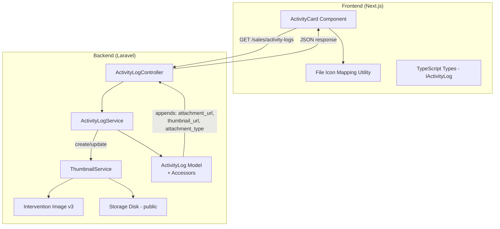
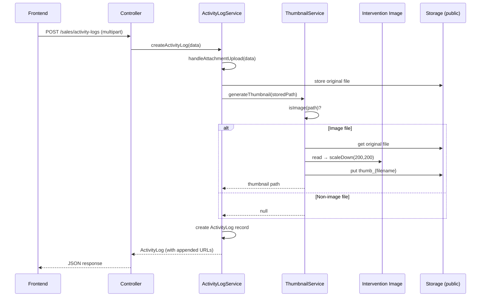

# Design Document: Activity Attachment Thumbnail

## Overview

Fitur ini menambahkan kemampuan thumbnail generation dan preview attachment pada timeline Sales Activities. Saat ini, field `attachment` pada `activity_logs` menyimpan path relatif file tetapi tidak ditampilkan di frontend sama sekali.

**Solusi yang dirancang:**

1. **Backend (Laravel):** Membuat `ThumbnailService` yang menggunakan Intervention Image v3 untuk generate thumbnail (max 200×200px) saat gambar diupload. Service ini diintegrasikan ke `ActivityLogService`. Model `ActivityLog` ditambahkan accessor untuk `attachment_url`, `thumbnail_url`, dan `attachment_type` yang di-append ke setiap API response.

2. **Frontend (Next.js):** Memperluas `IActivityLog` type dengan field baru (`attachment_url`, `thumbnail_url`, `attachment_type`). `ActivityCard` dimodifikasi untuk menampilkan thumbnail preview (clickable, buka full-size di tab baru) untuk gambar, atau file icon badge untuk non-gambar. Skeleton loading ditambahkan untuk thumbnail.

**Keputusan desain utama:**

- Menggunakan konvensi `thumb_` prefix daripada kolom database terpisah — menghindari migration dan menjaga schema tetap sederhana
- Thumbnail di-generate secara synchronous saat upload (bukan queue) karena ukuran file dibatasi 5MB dan proses resize cepat
- File icon mapping menggunakan utility function terpisah agar mudah di-extend

## Architecture



### Alur Upload Attachment



## Components and Interfaces

### Backend Components

#### 1. ThumbnailService (`app/Services/Sales/ThumbnailService.php`)

Service class baru yang bertanggung jawab untuk generate, delete, dan manage thumbnail.

```php
class ThumbnailService
{
    // MIME types yang dianggap sebagai gambar
    private const IMAGE_MIMES = ['image/jpeg', 'image/png', 'image/gif', 'image/webp'];

    /**
     * Generate thumbnail dari file yang sudah tersimpan di storage.
     * Return path thumbnail relatif, atau null jika bukan gambar.
     */
    public function generateThumbnail(string $storedPath): ?string;

    /**
     * Hapus thumbnail file dari storage.
     */
    public function deleteThumbnail(string $storedPath): void;

    /**
     * Cek apakah file adalah gambar berdasarkan MIME type.
     */
    public function isImage(string $storedPath): bool;

    /**
     * Buat path thumbnail dari path original (tambah prefix thumb_).
     */
    public function getThumbnailPath(string $originalPath): string;
}
```

#### 2. ActivityLogService (modifikasi `app/Services/Sales/ActivityLogService.php`)

Method `handleAttachmentUpload` dimodifikasi untuk memanggil `ThumbnailService`:

```php
// Perubahan pada handleAttachmentUpload:
// 1. Setelah store original → panggil ThumbnailService::generateThumbnail()
// 2. Saat delete old attachment → panggil ThumbnailService::deleteThumbnail()
```

#### 3. ActivityLog Model (modifikasi `app/Models/ActivityLog.php`)

Tambah accessor dan `$appends`:

```php
protected $appends = ['attachment_url', 'thumbnail_url', 'attachment_type'];

public function getAttachmentUrlAttribute(): ?string;   // Full public URL via Storage::url()
public function getThumbnailUrlAttribute(): ?string;     // Full public URL untuk thumb_ file
public function getAttachmentTypeAttribute(): ?string;   // 'image' | 'file' | null
```

### Frontend Components

#### 4. IActivityLog Type (modifikasi `activity-logs.types.ts`)

```typescript
export interface IActivityLog {
  // ... existing fields ...
  attachment_url: string | null;
  thumbnail_url: string | null;
  attachment_type: "image" | "file" | null;
}
```

#### 5. ActivityCard (modifikasi `activity-card.tsx`)

Tambah section attachment preview antara description dan relative time:

```typescript
// Pseudocode struktur baru:
// - Jika attachment_type === 'image' && thumbnail_url:
//     Render <a href={attachment_url} target="_blank">
//       <Image src={thumbnail_url} /> dengan skeleton loading
//     </a>
// - Jika attachment_type === 'file' && attachment_url:
//     Render file icon badge dengan extension label
// - Jika tidak ada attachment: render nothing
```

#### 6. File Icon Mapping Utility (baru: `activity-card-file-icons.ts`)

```typescript
interface FileIconConfig {
  icon: LucideIcon;
  label: string;
  bgColor: string;
  iconColor: string;
}

function getFileIconConfig(attachmentUrl: string): FileIconConfig;
// Mapping: pdf → FileText (red), doc/docx → FileText (blue),
//          xls/xlsx → FileText (green), default → File (gray)
```

#### 7. next.config.ts (modifikasi)

Sudah ada entry untuk `localhost:8000/storage/**`. Perlu ditambahkan entry untuk production hostname jika ada. Untuk development, konfigurasi existing sudah cukup.

## Data Models

### ActivityLog (existing table — tidak perlu migration)

| Field        | Type             | Keterangan                              |
| ------------ | ---------------- | --------------------------------------- |
| `attachment` | `string \| null` | Path relatif file di storage (existing) |

**Tidak ada perubahan schema database.** Thumbnail path diturunkan dari `attachment` path menggunakan konvensi `thumb_` prefix.

### Konvensi Penyimpanan File

```
storage/app/public/sales/activity-logs/
├── {random_hash}.jpg          ← original attachment
├── thumb_{random_hash}.jpg    ← generated thumbnail (max 200x200)
├── {random_hash}.pdf          ← non-image attachment (no thumbnail)
```

### Computed Fields (via Model Accessors)

| Field             | Type                        | Derivasi                                                                                                      |
| ----------------- | --------------------------- | ------------------------------------------------------------------------------------------------------------- |
| `attachment_url`  | `string \| null`            | `Storage::url($this->attachment)` jika attachment ada                                                         |
| `thumbnail_url`   | `string \| null`            | `Storage::url('thumb_' prefix path)` jika file thumbnail exists                                               |
| `attachment_type` | `'image' \| 'file' \| null` | Berdasarkan extension file: jpeg/png/gif/webp → `'image'`, lainnya → `'file'`, null jika tidak ada attachment |

## Correctness Properties

_A property is a characteristic or behavior that should hold true across all valid executions of a system — essentially, a formal statement about what the system should do. Properties serve as the bridge between human-readable specifications and machine-verifiable correctness guarantees._

### Property 1: Thumbnail dimension constraint

_For any_ image with arbitrary width and height, the generated thumbnail SHALL have both dimensions ≤ 200 pixels, and the aspect ratio of the thumbnail SHALL equal the aspect ratio of the original image (within a rounding tolerance of ±1 pixel).

**Validates: Requirements 1.1**

### Property 2: Thumbnail path derivation

_For any_ valid storage file path, `getThumbnailPath(path)` SHALL return a path in the same directory where the filename is prefixed with `thumb_`. Formally: `dirname(getThumbnailPath(p)) === dirname(p)` and `basename(getThumbnailPath(p)) === 'thumb_' + basename(p)`.

**Validates: Requirements 1.2**

### Property 3: Image classification correctness

_For any_ file, `isImage()` SHALL return `true` if and only if the file's MIME type is one of `image/jpeg`, `image/png`, `image/gif`, `image/webp`. For any file where `isImage()` returns `false`, `generateThumbnail()` SHALL return `null` without creating any thumbnail file.

**Validates: Requirements 1.3, 4.1**

### Property 4: URL accessor correctness

_For any_ ActivityLog record: if `attachment` is `null`, then `attachment_url`, `thumbnail_url`, and `attachment_type` SHALL all be `null`. If `attachment` is a non-null path with an image extension, then `attachment_url` SHALL be a valid URL containing the path, `thumbnail_url` SHALL be a valid URL containing the `thumb_`-prefixed path (when thumbnail file exists), and `attachment_type` SHALL be `'image'`. If `attachment` is a non-null path with a non-image extension, then `attachment_url` SHALL be a valid URL containing the path, `thumbnail_url` SHALL be `null`, and `attachment_type` SHALL be `'file'`.

**Validates: Requirements 2.1, 2.2, 2.3, 2.4, 2.5**

### Property 5: File icon mapping correctness

_For any_ file URL string, `getFileIconConfig()` SHALL return a config with: `label === 'PDF'` for `.pdf` extensions, `label === 'DOC'` for `.doc`/`.docx` extensions, `label === 'XLS'` for `.xls`/`.xlsx` extensions, and `label === 'FILE'` for any other or missing extension. Each known type SHALL have a distinct icon color.

**Validates: Requirements 4.2, 4.3**

## Error Handling

### Backend Error Handling

| Skenario                                              | Handling                                                                                     | Response                                                |
| ----------------------------------------------------- | -------------------------------------------------------------------------------------------- | ------------------------------------------------------- |
| Thumbnail generation gagal (Intervention Image error) | Catch exception, log error via `Log::error()`, lanjutkan simpan activity log tanpa thumbnail | Activity log tersimpan normal, `thumbnail_url` = `null` |
| File upload gagal (disk full, permission error)       | Exception propagate ke controller                                                            | 500 error via `ApiResponse::error()`                    |
| File tidak ditemukan saat delete thumbnail            | `Storage::delete()` sudah handle gracefully (return false)                                   | Tidak ada error, proses lanjut                          |
| Invalid MIME type detection                           | Fallback ke extension-based check                                                            | File tetap tersimpan sebagai non-image                  |

### Frontend Error Handling

| Skenario                                     | Handling                            | UI                                          |
| -------------------------------------------- | ----------------------------------- | ------------------------------------------- |
| Thumbnail image gagal load (broken URL, 404) | Next.js `<Image>` `onError` handler | Tampilkan generic image placeholder icon    |
| `thumbnail_url` null untuk image type        | Fallback ke file icon display       | Tampilkan file icon badge seperti non-image |
| `attachment_url` null                        | Tidak render attachment section     | Tidak ada perubahan UI                      |

## Testing Strategy

### Backend Testing (PHP/PHPUnit)

**Unit Tests:**

- `ThumbnailServiceTest`: Test `generateThumbnail()`, `deleteThumbnail()`, `isImage()`, `getThumbnailPath()` dengan berbagai file types
- `ActivityLogModelTest`: Test accessor `attachment_url`, `thumbnail_url`, `attachment_type` dengan berbagai state
- `ActivityLogServiceTest`: Test integrasi `handleAttachmentUpload` dengan ThumbnailService (mock)
- Error handling: Test bahwa thumbnail failure tidak menggagalkan activity log creation

**Property-Based Tests (menggunakan PHPUnit data providers sebagai pengganti PBT library):**

Karena ekosistem PHP tidak memiliki PBT library yang mature dan widely-used seperti QuickCheck/fast-check, property-based testing untuk backend akan diimplementasikan menggunakan PHPUnit data providers dengan dataset yang cukup besar untuk mencakup edge cases. Setiap property test harus menjalankan minimum 100 iterasi.

- Property 1: Thumbnail dimension constraint — generate random image sizes, verify output
- Property 2: Thumbnail path derivation — generate random paths, verify prefix logic
- Property 3: Image classification — generate random MIME types, verify classification
- Property 4: URL accessor correctness — generate random attachment states, verify accessor output

**Tag format:** `Feature: activity-attachment-thumbnail, Property {number}: {property_text}`

### Frontend Testing (TypeScript/Vitest + fast-check)

**Unit Tests:**

- `ActivityCard` rendering: Test image attachment, file attachment, dan no attachment states
- Click handler: Verify thumbnail link opens in new tab
- Skeleton loading state

**Property-Based Tests (menggunakan fast-check):**

Minimum 100 iterasi per property test.

- Property 5: File icon mapping — generate random file URLs, verify correct icon config returned

**Tag format:** `Feature: activity-attachment-thumbnail, Property {number}: {property_text}`

### Integration Tests

- End-to-end upload flow: Upload gambar → verify thumbnail created → verify API response contains correct URLs
- Update flow: Update attachment → verify old files deleted → verify new thumbnail created
- Non-image upload: Upload PDF → verify no thumbnail → verify correct API response

### Test Configuration

- Backend: PHPUnit dengan data providers untuk property tests
- Frontend: Vitest + `fast-check` untuk property-based tests
- Minimum 100 iterasi per property test
