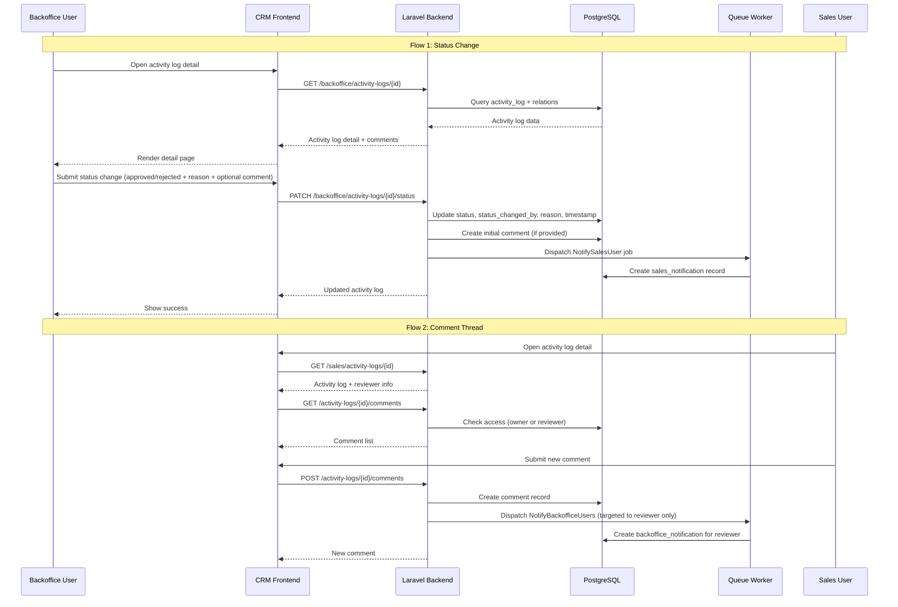
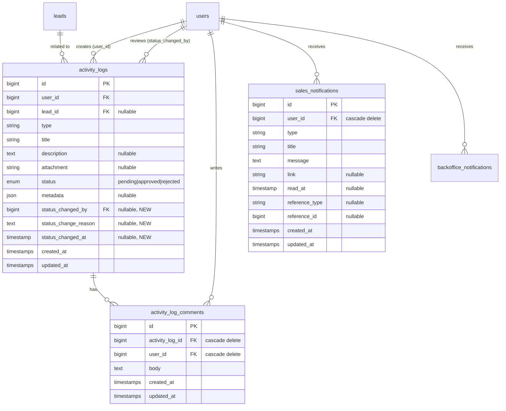

# Design Document: Activity Log Review

## Overview

Fitur Activity Log Review menambahkan kemampuan bagi Backoffice/Admin user untuk melihat, mereview, dan mengubah status seluruh activity log yang dibuat oleh sales user. Fitur ini juga menyediakan comment thread antara backoffice reviewer dan sales owner, serta notifikasi dua arah (backoffice ↔ sales) dengan deep link ke halaman detail.

### Scope

**Backend (Laravel — lingkar-id-backend):**

- Migration: tambah kolom review tracking di `activity_logs`, buat tabel `activity_log_comments` dan `sales_notifications`
- Model: `ActivityLogComment`, `SalesNotification`, update `ActivityLog`
- Service: `BackofficeActivityLogService`, `ActivityLogCommentService`
- Job: `NotifySalesUser` (notifikasi ke sales user individual)
- Controller + FormRequest + Routes untuk backoffice activity log management dan comment CRUD
- Update existing `Sales\ActivityLogService` untuk include reviewer info

**Frontend (Next.js — lingkar-crm):**

- Service layer: backoffice activity log types + API calls, comment types + API calls
- Backoffice activity log list page (`/dashboard/activity-logs`)
- Backoffice activity log detail page (`/dashboard/activity-logs/{id}`)
- Sales activity log detail page (`/sales-activities/{id}`)
- Reusable `CommentThread` component
- Notification deep link handling
- Routing + sidebar updates

### Key Design Decisions

| Decision                                                                        | Rationale                                                                                                                                     |
| ------------------------------------------------------------------------------- | --------------------------------------------------------------------------------------------------------------------------------------------- |
| Buat tabel `sales_notifications` baru mengikuti pola `backoffice_notifications` | Sales user belum punya mekanisme notifikasi. Mengikuti pola yang sudah ada menjaga konsistensi arsitektur.                                    |
| Buat job `NotifySalesUser` terpisah dari `NotifyBackofficeUsers`                | `NotifyBackofficeUsers` broadcast ke semua admin/backoffice. Notifikasi sales harus targeted ke satu user spesifik.                           |
| Comment access control di service layer, bukan middleware                       | Access control bergantung pada data (siapa owner, siapa reviewer) yang hanya diketahui setelah query. Service layer adalah tempat yang tepat. |
| Notifikasi backoffice untuk comment reply ditargetkan ke reviewer saja          | Berbeda dari `NotifyBackofficeUsers` yang broadcast ke semua. Comment reply hanya relevan untuk reviewer yang bersangkutan.                   |
| `CommentThread` sebagai reusable component                                      | Digunakan di backoffice detail dan sales detail dengan behavior yang sama.                                                                    |
| Deep link via field `link` di notification record                               | Mengikuti pola existing `backoffice_notifications.link`. Frontend tinggal navigate ke URL yang tersimpan.                                     |

---

## Architecture

### System Flow



### Route Structure

```
Backend Routes (api.php):

# Backoffice Activity Log Management
GET    /v1/backoffice/activity-logs              → BackofficeActivityLogController@index
GET    /v1/backoffice/activity-logs/{id}         → BackofficeActivityLogController@show
PATCH  /v1/backoffice/activity-logs/{id}/status  → BackofficeActivityLogController@updateStatus

# Shared Comment Routes (accessible by both backoffice and sales with access control)
GET    /v1/activity-logs/{id}/comments           → ActivityLogCommentController@index
POST   /v1/activity-logs/{id}/comments           → ActivityLogCommentController@store

# Sales Notifications (new)
GET    /v1/sales/notifications                   → Sales\NotificationController@index
GET    /v1/sales/notifications/unread-count      → Sales\NotificationController@unreadCount
PATCH  /v1/sales/notifications/{id}/read         → Sales\NotificationController@markAsRead
PATCH  /v1/sales/notifications/read-all          → Sales\NotificationController@markAllAsRead
```

```
Frontend Routes:

/dashboard/activity-logs          → Backoffice activity log list (table)
/dashboard/activity-logs/{id}     → Backoffice activity log detail + status update + comments
/sales-activities/{id}            → Sales activity log detail + reviewer info + comments
```

---

## Components and Interfaces

### Backend Components

#### 1. Migrations

**`add_review_fields_to_activity_logs_table`**

```php
// Adds to activity_logs table:
$table->foreignId('status_changed_by')->nullable()->constrained('users')->nullOnDelete();
$table->text('status_change_reason')->nullable();
$table->timestamp('status_changed_at')->nullable();
```

**`create_activity_log_comments_table`**

```php
Schema::create('activity_log_comments', function (Blueprint $table) {
    $table->id();
    $table->foreignId('activity_log_id')->constrained('activity_logs')->cascadeOnDelete();
    $table->foreignId('user_id')->constrained('users')->cascadeOnDelete();
    $table->text('body');
    $table->timestamps();
    $table->index('activity_log_id');
});
```

**`create_sales_notifications_table`**

```php
// Same schema as backoffice_notifications:
// id, user_id (FK), type, title, message (text), link (nullable),
// read_at (nullable timestamp), reference_type, reference_id, timestamps
// Indexes: type, [user_id, read_at]
```

#### 2. Models

**`ActivityLogComment`**

```php
class ActivityLogComment extends Model {
    protected $fillable = ['activity_log_id', 'user_id', 'body'];

    public function activityLog() → belongsTo(ActivityLog)
    public function user() → belongsTo(User)
}
```

**`SalesNotification`** (mirrors `BackofficeNotification`)

```php
class SalesNotification extends Model {
    const TYPE_STATUS_CHANGE = 'status_change';
    const TYPE_NEW_COMMENT = 'new_comment';

    protected $fillable = ['user_id', 'type', 'title', 'message', 'link', 'read_at', 'reference_type', 'reference_id'];
    protected $casts = ['read_at' => 'datetime'];

    public function user() → belongsTo(User)
    public function scopeUnread($query) → whereNull('read_at')
}
```

**`ActivityLog` (updated)**

```php
// New relations:
public function statusChangedBy() → belongsTo(User, 'status_changed_by')
public function comments() → hasMany(ActivityLogComment)

// Updated $fillable to include: status_changed_by, status_change_reason, status_changed_at
// Updated $casts to include: status_changed_at → datetime
```

#### 3. Services

**`BackofficeActivityLogService`**

```php
class BackofficeActivityLogService {
    use ApiPaginationTrait;

    // List all activity logs (all sales users), paginated
    // Supports: search (title/description), status filter, type filter
    // Eager loads: user, lead, statusChangedBy
    public function getAllActivityLogs(): LengthAwarePaginator

    // Get single activity log with all relations
    public function getActivityLogById(string $id): ActivityLog

    // Update status: pending → approved/rejected
    // Records: status_changed_by, status_change_reason, status_changed_at
    // Optionally creates initial comment
    // Dispatches NotifySalesUser for the activity log owner
    public function updateStatus(ActivityLog $activityLog, array $data): ActivityLog
}
```

**`ActivityLogCommentService`**

```php
class ActivityLogCommentService {
    // Check if user has comment access (is owner OR is reviewer)
    public function checkAccess(ActivityLog $activityLog, User $user): bool

    // List comments for an activity log (ordered by created_at asc)
    // Eager loads: user (with role)
    public function getComments(ActivityLog $activityLog): Collection

    // Create a comment
    // Dispatches notification to the other party
    public function createComment(ActivityLog $activityLog, User $user, string $body): ActivityLogComment
}
```

**`Sales\NotificationService`** (mirrors `Backoffice\NotificationService`)

```php
class SalesNotificationService {
    use ApiPaginationTrait;

    public function getMyNotifications(): LengthAwarePaginator
    public function getUnreadCount(): int
    public function markAsRead(SalesNotification $notification): SalesNotification
    public function markAllAsRead(): int
}
```

#### 4. Jobs

**`NotifySalesUser`** (new job, targeted to single user)

```php
class NotifySalesUser implements ShouldQueue {
    public function __construct(
        public int $userId,      // target sales user
        public string $type,
        public string $title,
        public string $message,
        public ?string $link,
        public ?string $referenceType,
        public ?int $referenceId,
    ) {}

    public function handle(): void {
        SalesNotification::create([...]);
    }
}
```

#### 5. Controllers & FormRequests

**`BackofficeActivityLogController`**

```php
// index() → paginatedResponse from service
// show(string $id) → ApiResponse::success
// updateStatus(UpdateActivityLogStatusRequest $request, ActivityLog $activityLog) → ApiResponse::success
```

**`UpdateActivityLogStatusRequest`**

```php
// Rules:
// status: required|in:approved,rejected
// reason: required|string|max:1000
// comment: nullable|string|max:2000
```

**`ActivityLogCommentController`** (shared, under auth:sanctum)

```php
// index(ActivityLog $activityLog) → checks access, returns comments
// store(StoreActivityLogCommentRequest $request, ActivityLog $activityLog) → checks access, creates comment
```

**`StoreActivityLogCommentRequest`**

```php
// Rules:
// body: required|string|max:2000
```

**`Sales\NotificationController`** (mirrors Backoffice\NotificationController)

```php
// index(), unreadCount(), markAsRead(), markAllAsRead()
```

#### 6. Update Existing Sales ActivityLogService

Update `getActivityLogById()` to eager load `statusChangedBy` relation and include `status_change_reason`, `status_changed_at` in the response. The `ActivityLog` model already appends computed attributes; the new fields are regular columns that will be included automatically once added to `$fillable`.

### Frontend Components

#### 1. Service Layer

**`src/services/backoffice/activity-logs/`**

```typescript
// activity-logs.types.ts
interface IBackofficeActivityLog extends IActivityLog {
  user: { id: number; name: string };
  status_changed_by_user: { id: number; name: string } | null;
  status_change_reason: string | null;
  status_changed_at: string | null;
}

interface IBackofficeActivityLogParams extends IPaginationParams {
  search?: string;
  status?: ActivityLogStatus;
  type?: ActivityLogType;
}

interface IUpdateStatusPayload {
  status: "approved" | "rejected";
  reason: string;
  comment?: string;
}

// activity-logs.service.ts
const backofficeActivityLogsService = {
  list: (params) => api.get("/backoffice/activity-logs", { params }),
  detail: (id) => api.get(`/backoffice/activity-logs/${id}`),
  updateStatus: (id, payload) =>
    api.patch(`/backoffice/activity-logs/${id}/status`, payload),
};
```

**`src/services/shared/comments/`**

```typescript
// comments.types.ts
interface IActivityLogComment {
  id: number;
  activity_log_id: number;
  user_id: number;
  body: string;
  user: { id: number; name: string; role: string };
  created_at: string;
}

interface ICreateCommentPayload {
  body: string;
}

// comments.service.ts
const commentsService = {
  list: (activityLogId) => api.get(`/activity-logs/${activityLogId}/comments`),
  create: (activityLogId, payload) =>
    api.post(`/activity-logs/${activityLogId}/comments`, payload),
};
```

**`src/services/sales/notifications/`** (mirrors backoffice notifications service)

```typescript
// Same pattern as src/services/backoffice/notifications/
const salesNotificationsService = {
  list,
  unreadCount,
  markAsRead,
  markAllAsRead,
};
```

#### 2. Pages

**Backoffice Activity Log List (`/dashboard/activity-logs/page.tsx`)**

- Uses `useTableData` hook with `backofficeActivityLogsService.list`
- `TableCard` with columns: Sales Name, Title, Type (badge), Status (badge), Lead, Created Date
- `SearchInput` + `FilterPopup` for status and type filters
- Each row links to `/dashboard/activity-logs/{id}`

**Backoffice Activity Log Detail (`/dashboard/activity-logs/[id]/page.tsx`)**

- Uses `useDetailData` hook with `backofficeActivityLogsService.detail`
- `DetailCard` with sections:
  - Activity info (title, type, description, attachment, lead, sales user)
  - Status section: if pending → status update form (FormSelect + FormTextarea + Button); if reviewed → read-only display of status, reason, reviewer, timestamp
  - Comment thread (only shown when status ≠ pending)

**Sales Activity Log Detail (`/sales-activities/[id]/page.tsx`)**

- Uses `useDetailData` hook with existing `activityLogsService` (updated to include reviewer info)
- `DetailCard` with sections:
  - Activity info
  - Review info (reviewer name, reason, timestamp) — shown when reviewed
  - Comment thread (only shown when status ≠ pending)

#### 3. Reusable Components

**`CommentThread` component (`src/app/components/ui/CommentThread/`)**

```typescript
interface CommentThreadProps {
  activityLogId: number;
  currentUserId: number;
  hasAccess: boolean; // determined by parent page
}
```

- Fetches comments via `commentsService.list(activityLogId)`
- Displays each comment with: avatar initial, name, role badge, body, relative timestamp
- Comment input form at bottom (FormTextarea + Button)
- Optimistic UI: append comment immediately, refetch on success
- Uses `date-fns` with `id` locale for relative timestamps (consistent with NotificationBell)

#### 4. Routing & Navigation Updates

**`src/config/routing.ts`** — add:

```typescript
const ACTIVITY_LOGS_SERVICES = {
  activityLogs: "/dashboard/activity-logs",
  activityLogDetail: (id: number) => `/dashboard/activity-logs/${id}`,
};

// Update SALES_ACTIVITIES_SERVICES:
const SALES_ACTIVITIES_SERVICES = {
  salesActivities: "/sales-activities",
  salesActivitiesCreate: "/sales-activities/create",
  salesActivityDetail: (id: number) => `/sales-activities/${id}`,
};
```

**Sidebar** — add "Activity Logs" item under Sales Management group for backoffice users:

```typescript
const SALES_MANAGEMENT_NAV: NavEntry = {
  label: "Sales Management",
  icon: TrendingUp,
  items: [
    { label: "Leads", href: PATHS.leads, icon: Users2 },
    { label: "Sales Members", href: PATHS.salesMembers, icon: UserSquare2 },
    { label: "Activity Logs", href: PATHS.activityLogs, icon: FileText }, // NEW
  ],
};
```

**ActivityCard** — update to link to detail page:

- Wrap card content in a `Link` to `/sales-activities/{id}`

**NotificationBell** — update click handler:

- When a notification has a `link` field, navigate to that URL on click (in addition to marking as read)

---

## Data Models

### Entity Relationship Diagram



### API Response Shapes

**GET /backoffice/activity-logs** (list item):

```json
{
  "id": 1,
  "user_id": 5,
  "lead_id": 3,
  "type": "request_lead_assign",
  "title": "Request assign lead PT ABC",
  "description": "...",
  "attachment_url": "http://...",
  "thumbnail_url": "http://...",
  "attachment_type": "image",
  "status": "pending",
  "metadata": {},
  "status_changed_by": null,
  "status_change_reason": null,
  "status_changed_at": null,
  "user": { "id": 5, "name": "Sales User A" },
  "lead": { "id": 3, "name": "PT ABC", "lead_id": "LD-003" },
  "status_changed_by_user": null,
  "created_at": "2026-05-01T10:00:00Z",
  "updated_at": "2026-05-01T10:00:00Z"
}
```

**GET /activity-logs/{id}/comments** (comment item):

```json
{
  "id": 1,
  "activity_log_id": 1,
  "user_id": 2,
  "body": "Sudah saya approve, silakan follow up.",
  "user": {
    "id": 2,
    "name": "Admin User",
    "role": "admin"
  },
  "created_at": "2026-05-01T11:00:00Z",
  "updated_at": "2026-05-01T11:00:00Z"
}
```

---

## Correctness Properties

_A property is a characteristic or behavior that should hold true across all valid executions of a system — essentially, a formal statement about what the system should do. Properties serve as the bridge between human-readable specifications and machine-verifiable correctness guarantees._

### Property 1: Activity log list returns all records in descending order

_For any_ set of activity logs created by multiple sales users, the backoffice list endpoint SHALL return all activity log records, and the returned list SHALL be ordered by `created_at` descending (most recent first).

**Validates: Requirements 1.1**

### Property 2: Activity log list includes user and lead relations

_For any_ activity log in the list response, the response item SHALL include the sales user's name, and if the activity log has an associated lead, the lead information SHALL be present.

**Validates: Requirements 1.2**

### Property 3: Search filter returns only matching results

_For any_ search query string and set of activity logs, all items returned by the list endpoint SHALL contain the search string in either the title or description field (case-insensitive).

**Validates: Requirements 1.3**

### Property 4: Enum filters return only matching results

_For any_ status filter value (pending, approved, rejected) or type filter value (general_note, request_lead_assign, request_update_lead_status), all items returned by the list endpoint SHALL have the specified status or type value respectively.

**Validates: Requirements 1.4, 1.5**

### Property 5: Status change records all review fields correctly

_For any_ activity log in pending status, when a backoffice user submits a valid status change with a reason and optional comment, the activity log SHALL be updated with: the new status value, the backoffice user's ID in `status_changed_by`, the provided reason in `status_change_reason`, and a non-null timestamp in `status_changed_at`. If an initial comment was provided, an `ActivityLogComment` record SHALL be created.

**Validates: Requirements 2.1, 2.2, 2.3, 2.4, 4.1**

### Property 6: Non-pending activity logs reject status changes

_For any_ activity log whose status is not `pending` (i.e., `approved` or `rejected`), a status change request SHALL be rejected with a 422 error.

**Validates: Requirements 2.5**

### Property 7: Reviewed activity log includes reviewer information

_For any_ activity log that has been reviewed (status ≠ pending), the detail response SHALL include the reviewer's name (from `status_changed_by` relation), the `status_change_reason`, and the `status_changed_at` timestamp.

**Validates: Requirements 3.1, 3.2**

### Property 8: Comment creation produces correct record with user info

_For any_ valid comment body submitted by an authorized user, the system SHALL create an `ActivityLogComment` record with the correct `activity_log_id`, `user_id`, and `body`. The response SHALL include the commenter's name and role.

**Validates: Requirements 4.3, 4.4**

### Property 9: Comment list returns chronological order

_For any_ activity log with multiple comments, the comment list endpoint SHALL return all comments ordered by `created_at` ascending (oldest first).

**Validates: Requirements 4.2**

### Property 10: Comment access control restricts to owner and reviewer

_For any_ user attempting to access comments on an activity log, the system SHALL grant access if and only if the user is the sales owner (`user_id`) of the activity log OR the reviewer (`status_changed_by`). All other users SHALL receive a 403 Forbidden error for both listing and creating comments.

**Validates: Requirements 5.1, 5.2, 5.3, 5.4**

### Property 11: Cascading delete removes associated comments

_For any_ activity log with one or more comments, when the activity log is deleted, all associated `ActivityLogComment` records SHALL also be deleted.

**Validates: Requirements 6.3**

### Property 12: Status change notification targets sales owner with correct link

_For any_ status change on an activity log, the system SHALL create exactly one `SalesNotification` record for the sales user who owns the activity log. The notification SHALL include a `link` field containing `/sales-activities/{id}`.

**Validates: Requirements 7.1, 7.4**

### Property 13: Comment notification targets the other party with correct link

_For any_ new comment on an activity log: if the commenter is the sales owner, the system SHALL create a `BackofficeNotification` for the reviewer only (not all backoffice users), with link `/dashboard/activity-logs/{id}`. If the commenter is the reviewer, the system SHALL create a `SalesNotification` for the sales owner, with link `/sales-activities/{id}`.

**Validates: Requirements 7.2, 7.3, 7.4, 7.7**

---

## Error Handling

### Backend Error Handling

| Scenario                                   | HTTP Status | Message                                                                   |
| ------------------------------------------ | ----------- | ------------------------------------------------------------------------- |
| Activity log not found                     | 404         | "Activity log tidak ditemukan."                                           |
| Status change on non-pending log           | 422         | "Activity log yang sudah diproses tidak dapat diubah statusnya."          |
| Status change without reason               | 422         | Validation error (field: reason)                                          |
| Comment on pending activity log            | 422         | "Komentar hanya dapat ditambahkan pada activity log yang sudah direview." |
| Comment access denied (not owner/reviewer) | 403         | "Anda tidak memiliki akses untuk komentar pada activity log ini."         |
| Comment list access denied                 | 403         | "Anda tidak memiliki akses untuk melihat komentar pada activity log ini." |
| Invalid status value                       | 422         | Validation error (field: status, must be approved or rejected)            |
| Comment body too long (>2000 chars)        | 422         | Validation error (field: body)                                            |

### Frontend Error Handling

- **API errors**: Caught by axios interceptor, displayed via toast notification (consistent with existing pattern)
- **401 Unauthorized**: Silent refresh via `api.ts` interceptor, redirect to login if refresh fails
- **403 Forbidden**: Hide comment thread section, show "Tidak ada akses" message if user navigates directly
- **404 Not Found**: Show empty state with "Activity log tidak ditemukan" message
- **422 Validation**: Display field-level errors on the form (status update form, comment form)
- **Network errors**: Show retry button (consistent with existing error states in sales activities page)

---

## Testing Strategy

### Backend Testing

**Unit Tests (example-based):**

- Migration: verify columns exist after migration
- FormRequest validation rules (required fields, enum values, max length)
- Model relations (statusChangedBy, comments)
- Controller response shapes

**Property-Based Tests:**

- Use [Pest](https://pestphp.com/) with custom data generators for property tests
- Minimum 100 iterations per property
- Each test tagged with property reference comment

| Property    | Test Description                                                          |
| ----------- | ------------------------------------------------------------------------- |
| Property 1  | Generate N random activity logs, verify list returns all in desc order    |
| Property 3  | Generate random logs + search strings, verify filter correctness          |
| Property 4  | Generate random logs with mixed statuses/types, verify enum filter        |
| Property 5  | Generate random pending logs + valid payloads, verify all fields recorded |
| Property 6  | Generate random non-pending logs, verify 422 rejection                    |
| Property 10 | Generate random users + activity logs, verify access control matrix       |
| Property 11 | Generate logs with random comments, delete log, verify cascade            |
| Property 12 | Generate status changes, verify notification targeting + link             |
| Property 13 | Generate comments from both sides, verify notification targeting + link   |

**Integration Tests:**

- Full HTTP request cycle for each endpoint
- Notification dispatch verification (queue fake)
- Access control end-to-end (login as different roles, verify access)

### Frontend Testing

**Unit Tests (example-based):**

- Service functions: verify correct API URLs and payload shapes
- CommentThread component: render with mock data, verify elements present
- Status update form: verify form validation and submission
- Conditional rendering: comment thread hidden when pending, shown when reviewed

**Integration Tests:**

- Page rendering with mock API responses
- Navigation: notification click → detail page
- Form submission flow: status update → success → UI update

### Test Configuration

- Backend: `php artisan test` with Pest
- Frontend: `npx tsc --noEmit` for type checking
- Property tests: minimum 100 iterations, tagged with `Feature: activity-log-review, Property N: {description}`
