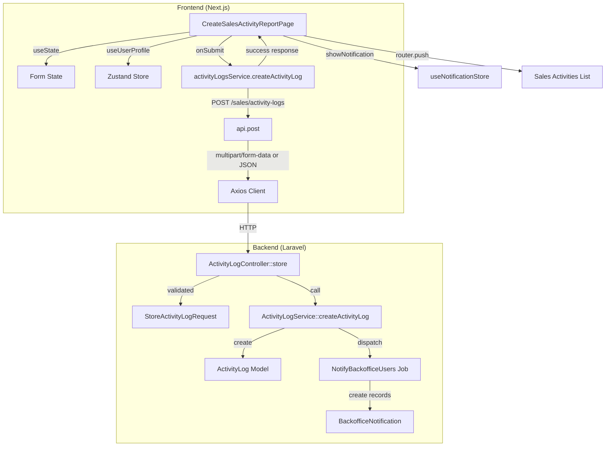
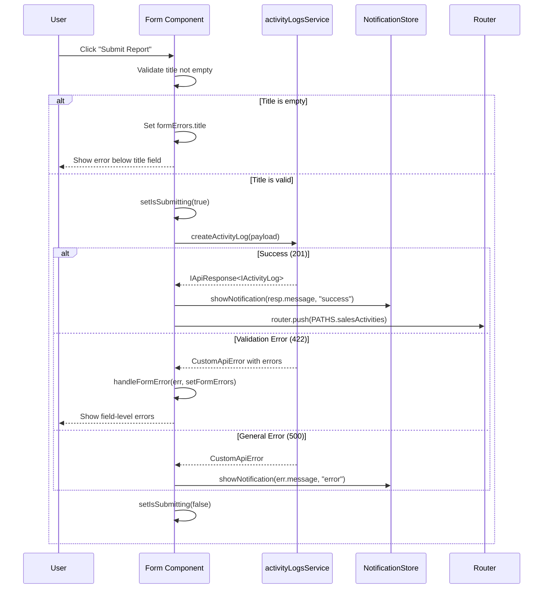

# Design Document: Activity Report Create Form Enhancement

## Overview

Fitur ini menyempurnakan halaman "Create Activity Report" (`/sales-activities/create`) agar menjadi form yang berfungsi penuh. Saat ini halaman tersebut hanya berupa template UI tanpa logika submit. Enhancement ini mencakup:

1. **Service layer**: Menambahkan fungsi `createActivityLog` pada `activityLogsService` untuk mengirim data ke `POST /sales/activity-logs`
2. **Conditional field**: Field "Requested Sales Member ID" otomatis terisi `sales_id` user yang login (read-only) saat tipe `request_lead_assign` dipilih
3. **Form submission**: Integrasi penuh dengan error handling, toast notification, dan navigasi setelah sukses
4. **Type correction**: Memperbaiki tipe `sales_id` pada `IUserAuth` dari `number | null` menjadi `string | null`
5. **Backend verification**: Memastikan `NotifyBackofficeUsers` job ter-dispatch saat activity log dibuat

### Keputusan Desain

- **Tidak menggunakan library form** (react-hook-form, formik): Mengikuti pola yang sudah ada di project — semua form menggunakan `useState` + `handleChange` pattern (lihat `client-members/create`, `leads/create`, dll.)
- **FormData untuk file upload**: Karena form mendukung attachment (file), service function harus mendeteksi keberadaan file dan mengirim sebagai `multipart/form-data` alih-alih JSON
- **Zustand store untuk user profile**: `useUserProfile` store sudah tersedia dan menyimpan data user termasuk `sales_id` — tidak perlu fetch ulang

## Architecture



### Data Flow

1. User mengisi form → state dikelola via `useState`
2. Saat tipe `request_lead_assign` dipilih → `metadata.requested_sales_id` diisi otomatis dari `useUserProfile().profile.sales_id`
3. User klik Submit → `activityLogsService.createActivityLog(payload)` dipanggil
4. Service function membangun `FormData` (jika ada file) atau JSON payload → kirim via `api.post`
5. Backend memvalidasi via `StoreActivityLogRequest` → `ActivityLogService` membuat record + dispatch notification job
6. Response sukses → toast + redirect ke list page
7. Response error 422 → field-level errors ditampilkan via `handleFormError`

## Components and Interfaces

### 1. Service Layer: `activityLogsService.createActivityLog`

**File:** `src/services/sales/activity-logs/activity-logs.service.ts`

```typescript
/** Payload type for creating an activity log */
export interface ICreateActivityLogPayload {
  lead_id?: string;
  type: ActivityLogType;
  title: string;
  description?: string;
  attachment?: File | null;
  metadata?: {
    requested_status?: string;
    requested_sales_id?: string;
  };
}

export const activityLogsService = {
  // ... existing getActivityLogs

  /** POST /sales/activity-logs — create a new activity log */
  createActivityLog: async (
    payload: ICreateActivityLogPayload
  ): Promise<IApiResponse<IActivityLog>> => {
    // If attachment file exists, send as multipart/form-data
    if (payload.attachment instanceof File) {
      const formData = new FormData();
      formData.append("type", payload.type);
      formData.append("title", payload.title);
      if (payload.lead_id) formData.append("lead_id", payload.lead_id);
      if (payload.description)
        formData.append("description", payload.description);
      formData.append("attachment", payload.attachment);
      if (payload.metadata?.requested_status) {
        formData.append(
          "metadata[requested_status]",
          payload.metadata.requested_status
        );
      }
      if (payload.metadata?.requested_sales_id) {
        formData.append(
          "metadata[requested_sales_id]",
          payload.metadata.requested_sales_id
        );
      }
      return await api.post("/sales/activity-logs", formData, {
        headers: { "Content-Type": "multipart/form-data" },
      });
    }

    // Otherwise send as JSON
    return await api.post("/sales/activity-logs", payload);
  },
};
```

**Rationale:** Mengikuti pola service layer yang sudah ada — thin wrapper di atas `api.post`. Deteksi `File` instance untuk menentukan content type.

### 2. Type Correction: `IUserAuth.sales_id`

**File:** `src/services/auth/auth.types.ts`

```typescript
export interface IUserAuth {
  // ... existing fields
  sales_id: string | null; // Changed from: number | null
  // ...
}
```

**Rationale:** Backend menyimpan `sales_id` sebagai string (format "SLS-XXXX"). Field ini tidak di-cast ke integer di Laravel model, sehingga API mengembalikan string. Frontend type harus sesuai.

### 3. Form Component: `CreateSalesActivityReportPage`

**File:** `src/app/(dashboard)/sales-activities/create/page.tsx`

Komponen ini sudah ada sebagai template. Perubahan yang diperlukan:

| Aspek            | Sebelum               | Sesudah                                       |
| ---------------- | --------------------- | --------------------------------------------- |
| Submit handler   | `console.warn` only   | Calls `activityLogsService.createActivityLog` |
| Sales ID field   | Editable text input   | Read-only, auto-populated from store          |
| Error handling   | None                  | `handleFormError` + toast                     |
| Success flow     | None                  | Toast + `router.push(PATHS.salesActivities)`  |
| Title validation | None                  | Client-side empty check                       |
| Imports          | Missing service/store | Adds service, stores, utils                   |

**Component Dependencies:**

- `activityLogsService` — untuk submit
- `useUserProfile` — untuk mendapatkan `sales_id`
- `useNotificationStore` — untuk toast notifications
- `handleFormError` — untuk error handling
- `PATHS` — untuk navigasi

### 4. Form State Interface

```typescript
interface ActivityReportForm {
  lead_id: string;
  type: ActivityLogType; // Changed from plain string
  title: string;
  description: string;
  attachment: File | null;
  metadata: {
    requested_status: string;
    requested_sales_id: string;
  };
}
```

### 5. Submission Flow



## Data Models

### Frontend Types

**`ICreateActivityLogPayload`** (baru) — di `activity-logs.types.ts`:

| Field                         | Type              | Required | Notes                                                               |
| ----------------------------- | ----------------- | -------- | ------------------------------------------------------------------- |
| `lead_id`                     | `string`          | No       | ID lead terkait                                                     |
| `type`                        | `ActivityLogType` | Yes      | `general_note`, `request_lead_assign`, `request_update_lead_status` |
| `title`                       | `string`          | Yes      | Judul activity report                                               |
| `description`                 | `string`          | No       | Deskripsi detail                                                    |
| `attachment`                  | `File \| null`    | No       | File lampiran (max 5MB, jpeg/png/jpg/pdf/doc/docx)                  |
| `metadata`                    | `object`          | No       | Data tambahan berdasarkan tipe                                      |
| `metadata.requested_status`   | `string`          | No       | Untuk tipe `request_update_lead_status`                             |
| `metadata.requested_sales_id` | `string`          | No       | Untuk tipe `request_lead_assign`                                    |

**`IUserAuth.sales_id`** (koreksi tipe):

| Field      | Sebelum          | Sesudah          |
| ---------- | ---------------- | ---------------- |
| `sales_id` | `number \| null` | `string \| null` |

### Backend Models (Existing — No Changes)

**`ActivityLog`** model sudah mendukung semua field yang diperlukan. **`StoreActivityLogRequest`** sudah memvalidasi payload termasuk `metadata.requested_sales_id` (validasi `exists:users,id`).

**Catatan penting:** Backend memvalidasi `metadata.requested_sales_id` dengan rule `exists:users,id` — ini berarti field ini mengharapkan **user ID (integer)**, bukan `sales_id` string. Namun, berdasarkan requirements, form mengirim `sales_id` (string format "SLS-XXXX"). Ini perlu diperhatikan saat implementasi — kemungkinan backend perlu disesuaikan atau frontend mengirim user ID sebagai fallback. Untuk design ini, kita mengikuti requirements yang menyatakan field diisi dengan `sales_id` dari user profile.

## Correctness Properties

_A property is a characteristic or behavior that should hold true across all valid executions of a system — essentially, a formal statement about what the system should do. Properties serve as the bridge between human-readable specifications and machine-verifiable correctness guarantees._

### Property 1: Title whitespace rejection

_For any_ string composed entirely of whitespace characters (including empty string, spaces, tabs, newlines), the form SHALL reject submission and the activity log service SHALL NOT be called.

**Validates: Requirements 3.7**

## Error Handling

### Client-Side Validation

| Validasi       | Kondisi               | Pesan Error                                   |
| -------------- | --------------------- | --------------------------------------------- |
| Title required | `title.trim() === ""` | "Title wajib diisi" (atau pesan dari backend) |

### API Error Handling

Mengikuti pola yang sudah ada di project (`handleFormError` dari `@lib/utils`):

1. **HTTP 422 (Validation Error)**: `handleFormError` mengekstrak `errors` object dari response dan memetakan ke `formErrors` state → ditampilkan di bawah masing-masing field
2. **HTTP 500 (Server Error)**: `showNotification(err.message, "error")` menampilkan toast error
3. **HTTP 401 (Unauthorized)**: Ditangani otomatis oleh Axios interceptor (silent refresh → redirect ke login)

### Error Flow

```typescript
const handleSubmit = async (e: React.FormEvent) => {
  e.preventDefault();
  setFormErrors({});

  // Client-side validation
  if (!form.title.trim()) {
    setFormErrors({ title: "Title wajib diisi" });
    return;
  }

  try {
    setIsSubmitting(true);
    const resp = await activityLogsService.createActivityLog(payload);
    showNotification(resp.message, "success");
    router.push(PATHS.salesActivities);
  } catch (err: unknown) {
    // handleFormError handles 422 field errors
    handleFormError(err, setFormErrors);
    // For general errors, show toast
    if (isApiError(err) && !err.errors) {
      showNotification(err.message, "error");
    }
  } finally {
    setIsSubmitting(false);
  }
};
```

## Testing Strategy

### Pendekatan Testing

Fitur ini terutama melibatkan **UI form interaction**, **service layer integration**, dan **backend verification**. Berdasarkan analisis prework:

- Mayoritas acceptance criteria bersifat **example-based** (kondisi spesifik, bukan universal property)
- Hanya 1 property yang cocok untuk PBT: validasi whitespace pada title
- Backend notification adalah **integration test**

### Unit Tests (Example-Based)

| Test Case                                           | Validates    | Approach                                           |
| --------------------------------------------------- | ------------ | -------------------------------------------------- |
| Service sends POST to correct endpoint              | Req 1.1      | Mock `api.post`, verify URL and payload            |
| Service sends multipart/form-data when file present | Req 1.2      | Mock `api.post`, verify FormData and headers       |
| Service sends JSON when no file                     | Req 1.2      | Mock `api.post`, verify JSON payload               |
| Sales ID field shown only for `request_lead_assign` | Req 2.1, 2.2 | Render component, toggle type, check DOM           |
| Sales ID field auto-populated from store            | Req 2.3      | Mock store with sales_id, verify field value       |
| Sales ID field is read-only                         | Req 2.4      | Check readOnly attribute on input                  |
| Sales ID shows placeholder when null                | Req 2.5      | Mock store with null sales_id, verify placeholder  |
| Successful submit → toast + redirect                | Req 3.2, 3.3 | Mock service success, verify notification + router |
| Validation errors displayed per field               | Req 3.4      | Mock 422 response, verify error messages           |
| General error → error toast                         | Req 3.5      | Mock 500 response, verify error notification       |
| Submit button disabled during submission            | Req 3.6      | Trigger submit, check button disabled state        |
| Payload includes metadata.requested_status          | Req 3.8      | Set type + status, submit, verify payload          |
| Payload includes metadata.requested_sales_id        | Req 3.9      | Set type to request_lead_assign, verify payload    |
| IUserAuth.sales_id typed as string                  | Req 4.1, 4.2 | TypeScript compilation (`npx tsc --noEmit`)        |

### Property-Based Test

| Property                   | Validates | Library    | Min Iterations |
| -------------------------- | --------- | ---------- | -------------- |
| Title whitespace rejection | Req 3.7   | fast-check | 100            |

**Tag format:** `Feature: activity-report-create, Property 1: Title whitespace rejection`

**Konfigurasi:** Menggunakan `fast-check` (sudah tersedia di ekosistem JavaScript/TypeScript). Generate string acak yang hanya terdiri dari whitespace characters, verifikasi form menolak submit.

### Integration Tests (Backend)

| Test Case                                           | Validates | Approach                                               |
| --------------------------------------------------- | --------- | ------------------------------------------------------ |
| NotifyBackofficeUsers job dispatched on create      | Req 5.1   | Laravel `Queue::fake()`, create log, assert dispatched |
| Notification created for all admin/backoffice users | Req 5.2   | Run job, query BackofficeNotification records          |
| Notification contains correct content               | Req 5.3   | Verify title/message format in notification record     |

### Verification Commands

```bash
# Frontend
npx tsc --noEmit                    # Type checking (Req 4.1, 4.2)
# npm run test (when test runner configured)

# Backend
docker exec lingkarid.local php artisan test --filter=ActivityLog
```
