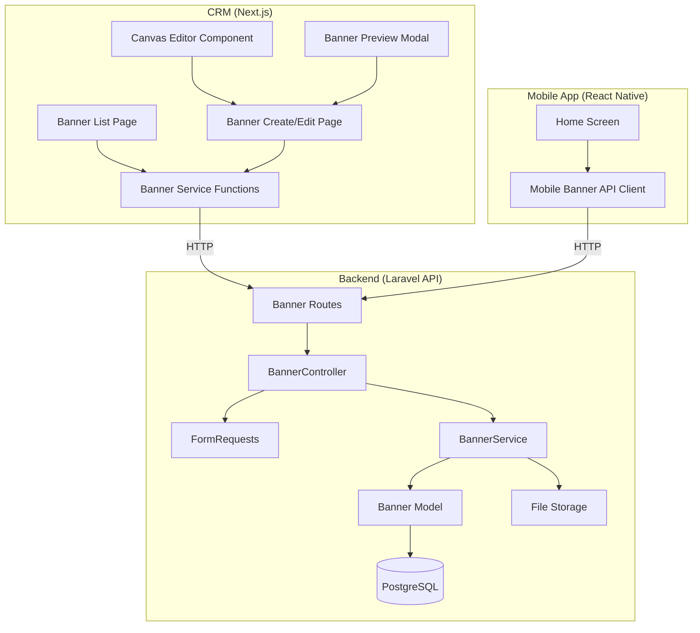
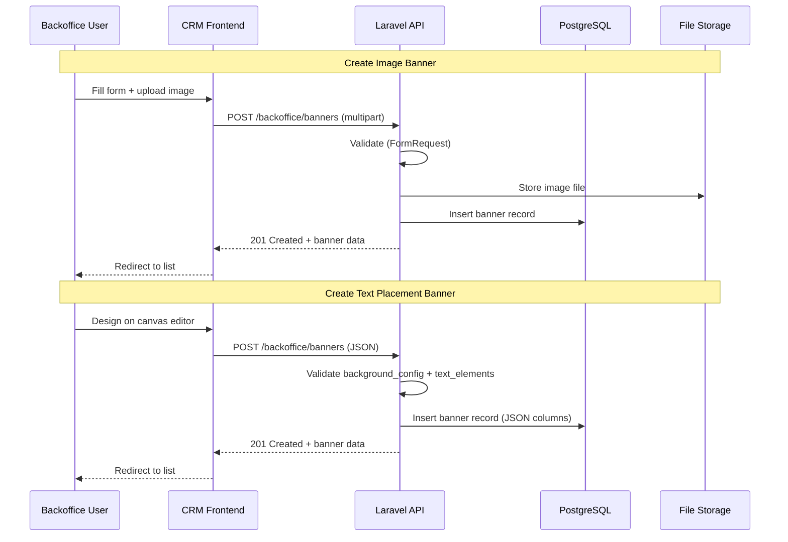
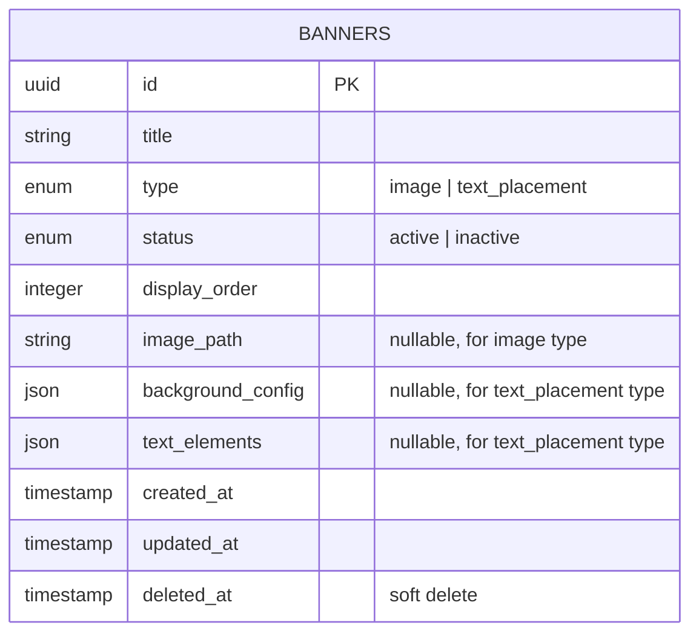
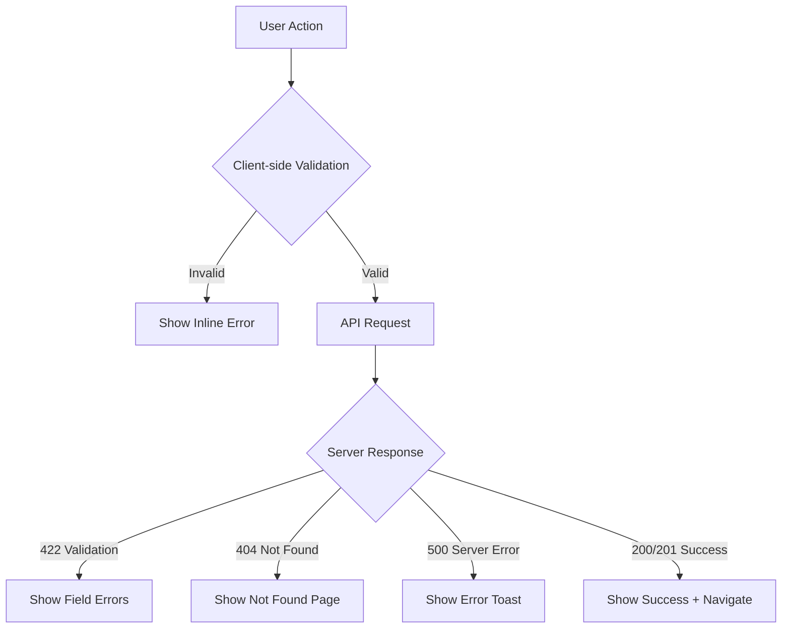

# Design Document — Banner Management

## Overview

Banner Management adalah fitur fullstack yang memungkinkan Backoffice User membuat, mengelola, dan mempublikasikan banner untuk ditampilkan di mobile app. Fitur ini mencakup:

- **Backend (Laravel API)**: CRUD endpoints untuk banner, validasi image upload dan text placement data, endpoint publik untuk mobile app.
- **CRM (Next.js)**: Halaman list banner dengan search/filter, form create/edit dengan canvas editor untuk text placement, preview banner, dan manajemen status/ordering.
- **Mobile App (React Native)**: Konsumsi endpoint publik untuk menampilkan banner aktif.

Terdapat dua tipe banner:

1. **Image Upload** — Upload gambar langsung (JPEG/PNG/WebP, max 2MB, 16:9 aspect ratio).
2. **Text Placement** — Editor canvas di CRM untuk menempatkan elemen teks secara bebas di atas background warna (solid/gradient), dengan dukungan template dan preview.

### Design Decisions

| Decision                                                  | Rationale                                                                                  |
| --------------------------------------------------------- | ------------------------------------------------------------------------------------------ |
| Text elements disimpan sebagai JSON column                | Fleksibel untuk jumlah elemen yang bervariasi, tidak perlu relasi tabel terpisah           |
| Posisi text menggunakan persentase (0-100)                | Responsif terhadap berbagai ukuran layar mobile                                            |
| Canvas editor menggunakan HTML5 Canvas API via `<canvas>` | Performa lebih baik untuk drag-and-drop dan rendering real-time dibanding DOM manipulation |
| Soft delete untuk banner                                  | Mencegah kehilangan data, memungkinkan recovery                                            |
| Background presets hardcoded di frontend                  | Tidak perlu API tambahan, mudah di-maintain, presets jarang berubah                        |
| Template disimpan sebagai konstanta di frontend           | Template adalah layout preset, bukan user-generated content                                |

## Architecture

### System Architecture



### Data Flow



## Components and Interfaces

### Backend Components

#### 1. BannerController

Thin controller mengikuti pattern project: validate via FormRequest → call service → return ApiResponse.

**Endpoints:**

| Method | Path                                         | Description                                    |
| ------ | -------------------------------------------- | ---------------------------------------------- |
| GET    | `/api/v1/backoffice/banners`                 | Paginated list (search, filter by type/status) |
| GET    | `/api/v1/backoffice/banners/{banner}`        | Detail single banner                           |
| POST   | `/api/v1/backoffice/banners`                 | Create banner                                  |
| PUT    | `/api/v1/backoffice/banners/{banner}`        | Update banner                                  |
| DELETE | `/api/v1/backoffice/banners/{banner}`        | Soft delete banner                             |
| PATCH  | `/api/v1/backoffice/banners/{banner}/status` | Toggle active/inactive                         |
| PATCH  | `/api/v1/backoffice/banners/reorder`         | Update display order                           |
| GET    | `/api/v1/client/banners`                     | Public endpoint — active banners for mobile    |

#### 2. BannerService

Service layer yang menangani semua business logic:

```php
class BannerService
{
    use ApiPaginationTrait;

    public function getAllBanners(): LengthAwarePaginator;
    public function getBannerById(string $id): Banner;
    public function createBanner(array $data): Banner;
    public function updateBanner(Banner $banner, array $data): Banner;
    public function deleteBanner(Banner $banner): void;
    public function updateStatus(Banner $banner, array $data): Banner;
    public function reorderBanners(array $data): void;
    public function getActiveBanners(): Collection;
}
```

#### 3. FormRequests

- **StoreBannerRequest**: Validasi create — conditional rules berdasarkan `type` (image vs text_placement).
- **UpdateBannerRequest**: Validasi update — image opsional jika tipe image, text_elements/background_config opsional jika tipe text_placement.
- **UpdateBannerStatusRequest**: Validasi status toggle (active/inactive).
- **ReorderBannersRequest**: Validasi array of `{id, display_order}`.

#### 4. ClientBannerController

Controller terpisah untuk endpoint mobile app, di bawah prefix `client` dengan middleware `role:client`.

### CRM Components

#### 1. Banner Service (`src/services/backoffice/banners/`)

```typescript
// banners.types.ts
export type BannerType = "image" | "text_placement";
export type BannerStatus = "active" | "inactive";
export type BackgroundType = "solid" | "gradient";
export type GradientDirection = "to-right" | "to-bottom" | "to-bottom-right";
export type FontWeight = "normal" | "bold" | "semibold";

export interface ITextElement {
  id: string; // client-side UUID for React key
  content: string;
  position_x: number; // 0-100 percentage
  position_y: number; // 0-100 percentage
  font_size: number; // 12-72
  font_color: string; // hex color
  font_weight: FontWeight;
}

export interface IBackgroundConfig {
  type: BackgroundType;
  colors: string[]; // 1 color for solid, 2+ for gradient
  direction?: GradientDirection; // required for gradient
}

export interface IBanner {
  id: string;
  title: string;
  type: BannerType;
  status: BannerStatus;
  display_order: number;
  image_path: string | null;
  image_url: string | null;
  background_config: IBackgroundConfig | null;
  text_elements: ITextElement[] | null;
  created_at: string;
  updated_at: string;
  deleted_at: string | null;
}

export interface IBannerParams extends IPaginationParams {
  type?: BannerType;
  status?: BannerStatus;
}

// banners.service.ts
export const bannersService = {
  list: (params: IBannerParams) => api.get("/backoffice/banners", { params }),
  detail: (id: string) => api.get(`/backoffice/banners/${id}`),
  create: (data: FormData | object) => api.post("/backoffice/banners", data),
  update: (id: string, data: FormData | object) =>
    api.post(`/backoffice/banners/${id}`, data), // POST with _method=PUT for multipart
  delete: (id: string) => api.delete(`/backoffice/banners/${id}`),
  updateStatus: (id: string, payload: { status: BannerStatus }) =>
    api.patch(`/backoffice/banners/${id}/status`, payload),
  reorder: (payload: { banners: { id: string; display_order: number }[] }) =>
    api.patch("/backoffice/banners/reorder", payload),
};
```

#### 2. Banner List Page (`/dashboard/banners/`)

Menggunakan `useTableData` hook dengan pattern yang sama seperti deposit-requests page:

- `TableCard` + `TableCardHeader` + `TableCardContent` + `TableCardPagination`
- `SearchInput` untuk search by title
- `FilterPopup` dengan `FilterChipGroup` untuk filter type dan status
- Kolom: thumbnail, title, type badge, status badge, display order, created date, actions
- Actions: edit (link), toggle status, delete (with `ConfirmDialog`)

#### 3. Banner Create/Edit Page (`/dashboard/banners/create/` dan `/dashboard/banners/[id]/edit/`)

Form page dengan conditional rendering berdasarkan banner type:

- **Common fields**: title, type selector
- **Image type**: file upload dengan preview, aspect ratio validation di client
- **Text Placement type**: background selector + canvas editor

Menggunakan "Page + Inner Form" split pattern untuk React 19 compliance.

#### 4. Canvas Editor Component

Komponen paling kompleks — editor visual untuk text placement banners:

```
┌─────────────────────────────────────────┐
│  Background Presets    │  Custom Color   │
├────────────────────────┴─────────────────┤
│                                          │
│   ┌──────────────────────────────────┐   │
│   │         Canvas (16:9)            │   │
│   │                                  │   │
│   │   [Draggable Text Element 1]     │   │
│   │          [Text Element 2]        │   │
│   │                                  │   │
│   └──────────────────────────────────┘   │
│                                          │
├──────────────────────────────────────────┤
│  [+ Add Text]  [Templates ▼]            │
├──────────────────────────────────────────┤
│  Properties Panel (selected element):    │
│  Content: [________]                     │
│  Font Size: [24]  Weight: [Bold ▼]      │
│  Color: [#FFFFFF]                        │
└──────────────────────────────────────────┘
```

**Key behaviors:**

- Canvas area maintains 16:9 aspect ratio (responsive width)
- Text elements are draggable within canvas bounds
- Click to select element → shows properties panel
- Real-time rendering of background + text elements
- Position stored as percentage (0-100) for responsiveness

#### 5. Banner Preview Modal

Modal yang menampilkan banner pada ukuran mobile viewport (~375px width):

- Image type: render uploaded image
- Text Placement type: render background + text elements at correct positions
- Close/Back to Edit button

#### 6. Banner Template Selector

Dropdown/grid yang menampilkan 4+ template thumbnails:

- Each template defines pre-configured text element positions
- Applying template populates canvas with placeholder text
- Preserves current background selection
- User can modify all elements after applying

## Data Models

### Database Schema



### Migration

```php
Schema::create('banners', function (Blueprint $table) {
    $table->uuid('id')->primary();
    $table->string('title', 100);
    $table->enum('type', ['image', 'text_placement']);
    $table->enum('status', ['active', 'inactive'])->default('inactive');
    $table->integer('display_order')->default(0);
    $table->string('image_path')->nullable();
    $table->json('background_config')->nullable();
    $table->json('text_elements')->nullable();
    $table->timestamps();
    $table->softDeletes();

    $table->index(['status', 'display_order']);
});
```

### JSON Column Structures

**background_config (solid):**

```json
{
  "type": "solid",
  "colors": ["#FF5733"]
}
```

**background_config (gradient):**

```json
{
  "type": "gradient",
  "colors": ["#FF5733", "#33FF57"],
  "direction": "to-right"
}
```

**text_elements:**

```json
[
  {
    "content": "Promo Spesial",
    "position_x": 50,
    "position_y": 30,
    "font_size": 36,
    "font_color": "#FFFFFF",
    "font_weight": "bold"
  },
  {
    "content": "Diskon 50%",
    "position_x": 50,
    "position_y": 60,
    "font_size": 24,
    "font_color": "#FFFF00",
    "font_weight": "semibold"
  }
]
```

### Banner Model

```php
class Banner extends Model
{
    use HasFactory, SoftDeletes;

    protected $keyType = 'string';
    public $incrementing = false;

    protected $fillable = [
        'id', 'title', 'type', 'status', 'display_order',
        'image_path', 'background_config', 'text_elements',
    ];

    protected $casts = [
        'background_config' => 'array',
        'text_elements' => 'array',
        'display_order' => 'integer',
    ];

    // Accessor: image_url
    protected function imageUrl(): Attribute
    {
        return Attribute::make(
            get: fn () => $this->image_path ? url('storage/' . $this->image_path) : null,
        );
    }

    protected $appends = ['image_url'];

    // Scopes
    public function scopeActive($query) { return $query->where('status', 'active'); }
    public function scopeSearch($query, ?string $search) {
        return $search ? $query->where('title', 'ilike', "%{$search}%") : $query;
    }
    public function scopeOfType($query, ?string $type) {
        return $type ? $query->where('type', $type) : $query;
    }
    public function scopeOfStatus($query, ?string $status) {
        return $status ? $query->where('status', $status) : $query;
    }
}
```

### Filepath Config Addition

```php
// config/filepath.php
return [
    // ... existing paths
    'banners' => 'backoffice/banners',
];
```

## Correctness Properties

_A property is a characteristic or behavior that should hold true across all valid executions of a system — essentially, a formal statement about what the system should do. Properties serve as the bridge between human-readable specifications and machine-verifiable correctness guarantees._

### Property 1: Banner data serialization round-trip

_For any_ valid text_placement banner data (containing a valid background_config and an array of valid text_elements), serializing the data to JSON and deserializing it back SHALL produce a data structure equivalent to the original.

**Validates: Requirements 10.3**

### Property 2: Title validation rejects invalid lengths

_For any_ string that is empty or exceeds 100 characters, the banner title validation SHALL reject it. _For any_ non-empty string of 100 characters or fewer, the validation SHALL accept it.

**Validates: Requirements 1.6**

### Property 3: Image aspect ratio validation with tolerance

_For any_ pair of image dimensions (width, height), the aspect ratio validation SHALL accept dimensions where `|width - 1080| ≤ 10` AND `|height - 608| ≤ 10`, and SHALL reject dimensions outside this tolerance range.

**Validates: Requirements 2.4**

### Property 4: Background config validation

_For any_ background configuration object: if the type is "solid", validation SHALL accept it if and only if exactly one valid hex color is provided; if the type is "gradient", validation SHALL accept it if and only if at least two valid hex colors and a valid gradient direction are provided. _For any_ invalid background type, validation SHALL reject it.

**Validates: Requirements 3.2, 3.3, 3.4, 10.4**

### Property 5: TextElement field validation

_For any_ TextElement object, validation SHALL accept it if and only if: content is a non-empty string of at most 200 characters, position_x and position_y are numbers in range [0, 100], font_size is a number in range [12, 72], font_color is a valid hex color string, and font_weight is one of "normal", "bold", or "semibold".

**Validates: Requirements 4.2, 10.4**

### Property 6: Soft-deleted banners are excluded from list results

_For any_ banner that has been soft-deleted, querying the banner list endpoint SHALL NOT include that banner in the results, regardless of search or filter parameters.

**Validates: Requirements 1.5**

### Property 7: New banners default to inactive with next display order

_For any_ valid banner creation request, the resulting banner SHALL have status "inactive" and a display_order value that is greater than the maximum display_order of all existing banners.

**Validates: Requirements 7.3**

### Property 8: Mobile endpoint returns only active banners in display order

_For any_ set of banners with mixed statuses, the mobile banner endpoint SHALL return only banners with status "active", and the returned list SHALL be ordered by display_order ascending.

**Validates: Requirements 8.1**

### Property 9: Template application preserves background configuration

_For any_ background configuration and any banner template, applying the template to the canvas SHALL preserve the background configuration unchanged while populating text elements from the template.

**Validates: Requirements 5.4**

## Error Handling

### Backend Error Handling

All errors follow the existing `ApiResponse::error()` pattern:

| Scenario                                     | HTTP Status | Message                                                       |
| -------------------------------------------- | ----------- | ------------------------------------------------------------- |
| Validation failure (FormRequest)             | 422         | Field-specific error messages                                 |
| Banner not found                             | 404         | "Banner tidak ditemukan."                                     |
| Image upload failure (disk full, permission) | 500         | "Gagal mengupload gambar."                                    |
| Invalid image dimensions                     | 422         | "Dimensi gambar harus 1080x608 piksel (toleransi 10 piksel)." |
| Image file too large                         | 422         | "Ukuran file tidak boleh lebih dari 2MB."                     |
| Invalid image format                         | 422         | "Format file harus JPEG, PNG, atau WebP."                     |
| Delete image from storage fails              | 500         | Logged, but banner update proceeds (graceful degradation)     |
| Invalid JSON structure in text_elements      | 422         | "Struktur text_elements tidak valid."                         |
| Invalid JSON structure in background_config  | 422         | "Struktur background_config tidak valid."                     |

### CRM Error Handling

Following existing patterns:

- API errors caught in service functions, displayed via toast/notification
- Form validation errors displayed inline per field
- Network errors show global error notification
- File upload errors (size, format) validated client-side before submission for immediate feedback, with server-side validation as fallback
- Canvas editor errors (e.g., no text elements) shown as inline validation messages on form submit

### Error Flow



## Testing Strategy

### Backend Testing

**Unit Tests (PHPUnit):**

- BannerService methods: create, update, delete, list, status toggle, reorder
- Validation rules: StoreBannerRequest, UpdateBannerRequest
- Model scopes: active, search, ofType, ofStatus
- Image dimension validation logic (pure function)

**Property-Based Tests:**

- Use a PHP property-based testing library (e.g., Eris or PHPQuickCheck)
- Minimum 100 iterations per property test
- Each test tagged with: **Feature: banner-management, Property {N}: {title}**
- Properties to implement:
  - Property 1: JSON serialization round-trip for text_placement data
  - Property 2: Title validation (length constraints)
  - Property 3: Image aspect ratio validation with tolerance
  - Property 4: Background config validation (solid/gradient rules)
  - Property 5: TextElement field validation (all constraints)
  - Property 6: Soft-deleted banners excluded from list
  - Property 7: Default values on creation
  - Property 8: Mobile endpoint active filter + ordering

**Integration Tests:**

- Full API endpoint tests (create, read, update, delete, list)
- Image upload and storage verification
- Old image cleanup on update
- Mobile endpoint with mixed active/inactive banners
- Pagination and filtering

### CRM Testing

**Unit Tests:**

- Banner service functions (mock API responses)
- Canvas editor state management (add, remove, reposition elements)
- Background config builder (solid/gradient)
- Template application logic
- Preview rendering logic

**Property-Based Tests (fast-check):**

- Property 9: Template application preserves background configuration
- TextElement position clamping (0-100 range)

**Component Tests:**

- Banner list page renders correctly with mock data
- Banner form conditional rendering (image vs text_placement)
- Canvas editor interactions (add, drag, edit, remove text elements)
- Preview modal rendering
- Filter and search functionality

### Test File Locations

**Backend:**

- `tests/Feature/Backoffice/BackofficeBannerTest.php` — Integration tests
- `tests/Unit/Services/BannerServiceTest.php` — Unit tests
- `tests/Unit/Validation/BannerValidationPropertyTest.php` — Property-based tests

**CRM:**

- `src/services/backoffice/banners/__tests__/` — Service tests
- `src/app/(dashboard)/dashboard/banners/__tests__/` — Page/component tests
