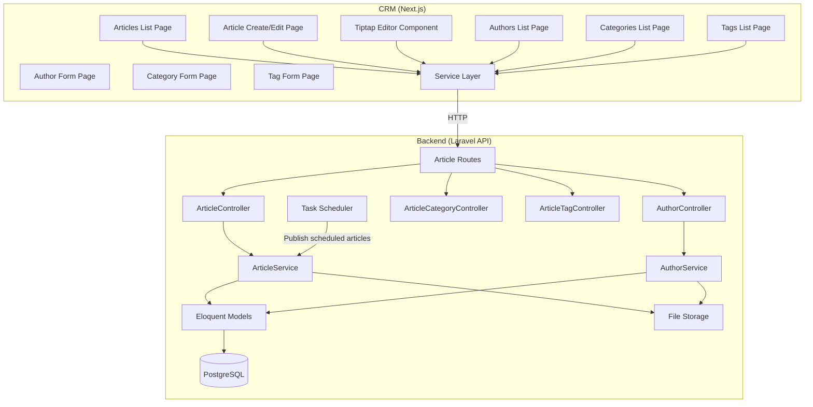
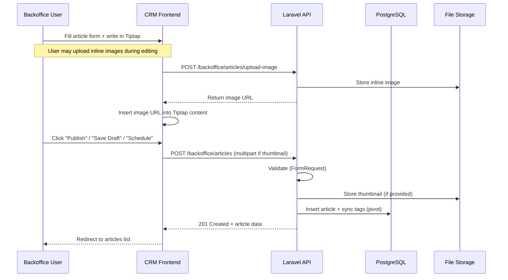

# Design Document — Blog/Article Management

## Overview

Blog/Article Management adalah fitur yang memungkinkan Backoffice User membuat dan mengelola konten artikel untuk ditampilkan di mobile app dan public website. Fitur ini menggunakan pendekatan modular dengan 4 entitas terpisah: Authors, Article Categories, Article Tags, dan Articles.

Scope implementasi:

- **Backend (Laravel API)**: CRUD endpoints untuk semua entitas, image upload, status workflow, scheduled publishing.
- **CRM (Next.js)**: Halaman management untuk semua entitas, Tiptap rich text editor untuk artikel, autocomplete author selection.

Tidak termasuk dalam scope: mobile app UI, public website/SSR frontend.

### Design Decisions

| Decision                                        | Rationale                                                                        |
| ----------------------------------------------- | -------------------------------------------------------------------------------- |
| Author sebagai tabel terpisah                   | Reusable, bisa dipilih via autocomplete, menghindari duplikasi data              |
| Category = belongsTo (1:1), Tags = many-to-many | Category untuk grouping utama, tags untuk cross-cutting labels                   |
| Tiptap sebagai rich text editor                 | Modern, extensible, headless (bisa di-style sesuai design system), support image |
| Body disimpan sebagai HTML                      | Output langsung dari Tiptap, siap render di frontend tanpa transformasi          |
| Inline images via dedicated endpoint            | Terpisah dari article CRUD, bisa upload sebelum article di-save                  |
| Status workflow tanpa approval                  | Sesuai kebutuhan — hanya draft/scheduled/published/archived                      |
| Slug auto-generated                             | Konsisten, SEO-friendly, unique constraint di DB                                 |
| Soft delete semua entitas                       | Mencegah kehilangan data, konsisten dengan pattern project                       |

## Architecture

### System Architecture



### Data Flow — Article Creation



## Components and Interfaces

### Backend Components

#### 1. Database Schema

**authors**
| Column | Type | Constraints |
|--------|------|-------------|
| id | bigint (PK) | auto-increment |
| name | varchar(100) | not null |
| email | varchar(255) | nullable |
| avatar_path | varchar(500) | nullable |
| avatar_url | varchar(500) | nullable |
| created_at | timestamp | |
| updated_at | timestamp | |
| deleted_at | timestamp | nullable (soft delete) |

**article_categories**
| Column | Type | Constraints |
|--------|------|-------------|
| id | bigint (PK) | auto-increment |
| name | varchar(100) | not null, unique |
| slug | varchar(120) | not null, unique |
| description | varchar(500) | nullable |
| created_at | timestamp | |
| updated_at | timestamp | |
| deleted_at | timestamp | nullable (soft delete) |

**article_tags**
| Column | Type | Constraints |
|--------|------|-------------|
| id | bigint (PK) | auto-increment |
| name | varchar(50) | not null, unique |
| slug | varchar(60) | not null, unique |
| created_at | timestamp | |
| updated_at | timestamp | |
| deleted_at | timestamp | nullable (soft delete) |

**articles**
| Column | Type | Constraints |
|--------|------|-------------|
| id | bigint (PK) | auto-increment |
| title | varchar(255) | not null |
| slug | varchar(280) | not null, unique |
| excerpt | text | nullable |
| body | longtext | not null |
| thumbnail_path | varchar(500) | nullable |
| thumbnail_url | varchar(500) | nullable |
| author_id | bigint (FK) | not null, references authors.id |
| category_id | bigint (FK) | nullable, references article_categories.id |
| status | enum('draft','scheduled','published','archived') | not null, default 'draft' |
| published_at | timestamp | nullable |
| is_featured | boolean | not null, default false |
| meta_title | varchar(255) | nullable |
| meta_description | varchar(500) | nullable |
| created_at | timestamp | |
| updated_at | timestamp | |
| deleted_at | timestamp | nullable (soft delete) |

**article_tag (pivot)**
| Column | Type | Constraints |
|--------|------|-------------|
| article_id | bigint (FK) | references articles.id, on delete cascade |
| tag_id | bigint (FK) | references article_tags.id, on delete cascade |
| | | composite primary key (article_id, tag_id) |

#### 2. API Endpoints

**Authors** — prefix: `/api/v1/backoffice/authors`

| Method | Path    | Request                            | Response           |
| ------ | ------- | ---------------------------------- | ------------------ |
| GET    | `/`     | `?search=&page=&per_page=`         | Paginated list     |
| POST   | `/`     | `{ name, email?, avatar? (file) }` | Created author     |
| GET    | `/{id}` | —                                  | Author detail      |
| PUT    | `/{id}` | `{ name, email?, avatar? (file) }` | Updated author     |
| DELETE | `/{id}` | —                                  | null (soft delete) |

**Article Categories** — prefix: `/api/v1/backoffice/article-categories`

| Method | Path    | Request                  | Response           |
| ------ | ------- | ------------------------ | ------------------ |
| GET    | `/`     | `?page=&per_page=`       | Paginated list     |
| POST   | `/`     | `{ name, description? }` | Created category   |
| GET    | `/{id}` | —                        | Category detail    |
| PUT    | `/{id}` | `{ name, description? }` | Updated category   |
| DELETE | `/{id}` | —                        | null (soft delete) |

**Article Tags** — prefix: `/api/v1/backoffice/article-tags`

| Method | Path    | Request                    | Response           |
| ------ | ------- | -------------------------- | ------------------ |
| GET    | `/`     | `?search=&page=&per_page=` | Paginated list     |
| POST   | `/`     | `{ name }`                 | Created tag        |
| GET    | `/{id}` | —                          | Tag detail         |
| PUT    | `/{id}` | `{ name }`                 | Updated tag        |
| DELETE | `/{id}` | —                          | null (soft delete) |

**Articles** — prefix: `/api/v1/backoffice/articles`

| Method | Path              | Request                                                                                                                               | Response                                           |
| ------ | ----------------- | ------------------------------------------------------------------------------------------------------------------------------------- | -------------------------------------------------- |
| GET    | `/`               | `?page=&per_page=&status=&category_id=&tag_id=&search=`                                                                               | Paginated list with author & category              |
| POST   | `/`               | multipart: `{ title, body, author_id, excerpt?, thumbnail?, category_id?, tag_ids[]?, meta_title?, meta_description?, is_featured? }` | Created article                                    |
| GET    | `/{id}`           | —                                                                                                                                     | Article detail (with author, category, tags)       |
| PUT    | `/{id}`           | same as POST                                                                                                                          | Updated article                                    |
| DELETE | `/{id}`           | —                                                                                                                                     | null (soft delete)                                 |
| PATCH  | `/{id}/publish`   | —                                                                                                                                     | Published article                                  |
| PATCH  | `/{id}/unpublish` | —                                                                                                                                     | Reverted to draft                                  |
| PATCH  | `/{id}/archive`   | —                                                                                                                                     | Archived article                                   |
| PATCH  | `/{id}/schedule`  | `{ published_at }`                                                                                                                    | Scheduled article                                  |
| POST   | `/upload-image`   | multipart: `{ image (file) }`                                                                                                         | `{ url }` — general endpoint, no article ID needed |

#### 3. Backend Services

```php
class AuthorService
{
    use ApiPaginationTrait;

    public function getAllAuthors(): LengthAwarePaginator;
    public function getAuthorById(int $id): Author;
    public function createAuthor(array $data): Author;
    public function updateAuthor(Author $author, array $data): Author;
    public function deleteAuthor(Author $author): void;
}

class ArticleCategoryService
{
    use ApiPaginationTrait;

    public function getAllCategories(): LengthAwarePaginator;
    public function getCategoryById(int $id): ArticleCategory;
    public function createCategory(array $data): ArticleCategory;
    public function updateCategory(ArticleCategory $category, array $data): ArticleCategory;
    public function deleteCategory(ArticleCategory $category): void;
}

class ArticleTagService
{
    use ApiPaginationTrait;

    public function getAllTags(): LengthAwarePaginator;
    public function getTagById(int $id): ArticleTag;
    public function createTag(array $data): ArticleTag;
    public function updateTag(ArticleTag $tag, array $data): ArticleTag;
    public function deleteTag(ArticleTag $tag): void;
}

class ArticleService
{
    use ApiPaginationTrait;

    public function getAllArticles(): LengthAwarePaginator;
    public function getArticleById(int $id): Article;
    public function createArticle(array $data): Article;
    public function updateArticle(Article $article, array $data): Article;
    public function deleteArticle(Article $article): void;
    public function publishArticle(Article $article): Article;
    public function unpublishArticle(Article $article): Article;
    public function archiveArticle(Article $article): Article;
    public function scheduleArticle(Article $article, array $data): Article;
    public function uploadImage(Article $article, UploadedFile $file): string;
    public function publishScheduledArticles(): int; // Called by scheduler
}
```

#### 4. Scheduled Task

```php
// app/Console/Kernel.php
$schedule->call(function () {
    app(ArticleService::class)->publishScheduledArticles();
})->everyMinute();
```

Transitions articles with `status = 'scheduled'` and `published_at <= now()` to `status = 'published'`.

### CRM Components

#### 1. Service Layer

```
src/services/backoffice/
├── authors/
│   ├── index.ts
│   ├── authors.service.ts
│   └── authors.types.ts
├── article-categories/
│   ├── index.ts
│   ├── article-categories.service.ts
│   └── article-categories.types.ts
├── article-tags/
│   ├── index.ts
│   ├── article-tags.service.ts
│   └── article-tags.types.ts
└── articles/
    ├── index.ts
    ├── articles.service.ts
    └── articles.types.ts
```

#### 2. TypeScript Types

```typescript
// authors.types.ts
export interface IAuthor {
  id: number;
  name: string;
  email: string | null;
  avatar_path: string | null;
  avatar_url: string | null;
  created_at: string;
  updated_at: string;
  deleted_at: string | null;
}

// article-categories.types.ts
export interface IArticleCategory {
  id: number;
  name: string;
  slug: string;
  description: string | null;
  created_at: string;
  updated_at: string;
  deleted_at: string | null;
}

// article-tags.types.ts
export interface IArticleTag {
  id: number;
  name: string;
  slug: string;
  created_at: string;
  updated_at: string;
  deleted_at: string | null;
}

// articles.types.ts
export type ArticleStatus = "draft" | "scheduled" | "published" | "archived";

export interface IArticle {
  id: number;
  title: string;
  slug: string;
  excerpt: string | null;
  body: string;
  thumbnail_path: string | null;
  thumbnail_url: string | null;
  author_id: number;
  category_id: number | null;
  status: ArticleStatus;
  published_at: string | null;
  is_featured: boolean;
  meta_title: string | null;
  meta_description: string | null;
  created_at: string;
  updated_at: string;
  deleted_at: string | null;
  author?: IAuthor;
  category?: IArticleCategory;
  tags?: IArticleTag[];
}

export interface IArticleParams extends IPaginationParams {
  status?: ArticleStatus;
  category_id?: number;
  tag_id?: number;
  search?: string;
}

export interface IArticleCreatePayload {
  title: string;
  body: string;
  author_id: number;
  excerpt?: string;
  category_id?: number;
  tag_ids?: number[];
  meta_title?: string;
  meta_description?: string;
  is_featured?: boolean;
}
```

#### 3. Routing

```typescript
// Added to src/config/routing.ts
const ARTICLE_SERVICES = {
  articles: "/dashboard/articles",
  articleCreate: "/dashboard/articles/create",
  articleEdit: (id: number) => `/dashboard/articles/${id}/edit`,
  authors: "/dashboard/authors",
  authorCreate: "/dashboard/authors/create",
  authorEdit: (id: number) => `/dashboard/authors/${id}/edit`,
  articleCategories: "/dashboard/article-categories",
  articleCategoryCreate: "/dashboard/article-categories/create",
  articleCategoryEdit: (id: number) =>
    `/dashboard/article-categories/${id}/edit`,
  articleTags: "/dashboard/article-tags",
  articleTagCreate: "/dashboard/article-tags/create",
  articleTagEdit: (id: number) => `/dashboard/article-tags/${id}/edit`,
};
```

#### 4. Page Structure

```
src/app/(dashboard)/dashboard/
├── articles/
│   ├── page.tsx              (list with table, filters, pagination)
│   ├── create/
│   │   └── page.tsx          (full-page editor form)
│   └── [id]/
│       └── edit/
│           └── page.tsx      (full-page editor form, pre-filled)
├── authors/
│   ├── page.tsx              (list table)
│   ├── create/
│   │   └── page.tsx          (FormCard)
│   └── [id]/
│       └── edit/
│           └── page.tsx      (FormCard)
├── article-categories/
│   ├── page.tsx              (list table)
│   ├── create/
│   │   └── page.tsx          (FormCard)
│   └── [id]/
│       └── edit/
│           └── page.tsx      (FormCard)
└── article-tags/
    ├── page.tsx              (list table)
    ├── create/
    │   └── page.tsx          (FormCard)
    └── [id]/
        └── edit/
            └── page.tsx      (FormCard)
```

#### 5. Article Editor Layout

```
┌─────────────────────────────────────────────────────────────────┐
│ ← Back to Articles                              [Save Draft] [Publish] │
├───────────────────────────────────────────┬─────────────────────┤
│                                           │                     │
│  Title Input                              │  Author             │
│  ─────────────────────────────────        │  [autocomplete]     │
│                                           │                     │
│  ┌─────────────────────────────────┐      │  Category           │
│  │ Toolbar: B I H1 H2 • ○ "" <> 🖼 │      │  [select]           │
│  ├─────────────────────────────────┤      │                     │
│  │                                 │      │  Tags               │
│  │  Tiptap Editor                  │      │  [multi-select]     │
│  │  (rich text body)               │      │                     │
│  │                                 │      │  Thumbnail          │
│  │                                 │      │  [image upload]     │
│  │                                 │      │                     │
│  │                                 │      │  Status             │
│  │                                 │      │  [badge]            │
│  └─────────────────────────────────┘      │                     │
│                                           │  Schedule            │
│  Excerpt                                  │  [date picker]      │
│  ─────────────────────────────────        │                     │
│  (textarea, optional)                     │  ── SEO ──          │
│                                           │  Meta Title         │
│                                           │  Meta Description   │
│                                           │                     │
│                                           │  ☐ Featured         │
│                                           │                     │
└───────────────────────────────────────────┴─────────────────────┘
```

#### 6. Tiptap Configuration

**Extensions to install:**

- `@tiptap/react` — React integration
- `@tiptap/starter-kit` — Bold, Italic, Heading, BulletList, OrderedList, Blockquote, Code, HorizontalRule, History
- `@tiptap/extension-image` — Inline image nodes
- `@tiptap/extension-link` — Hyperlinks
- `@tiptap/extension-placeholder` — Placeholder text

**Editor toolbar actions:**

- Bold, Italic
- Heading (H2, H3, H4)
- Bullet List, Ordered List
- Blockquote
- Link (insert/edit URL)
- Image (upload via API, insert URL)
- Horizontal Rule
- Code block

**Image upload flow in editor:**

1. User clicks image button or drags file into editor
2. CRM calls `POST /backoffice/articles/upload-image` with the file
3. API stores file in articles image directory, returns `{ url: "https://..." }`
4. CRM inserts `` node into Tiptap content

Note: Upload endpoint is general (no article ID required), so images can be uploaded before the article is saved.

#### 7. Sidebar Navigation

Under "Marketing" group in sidebar:

```
Marketing
├── Banners
├── Vouchers
├── Referral Program
└── Blog
    ├── Articles
    ├── Authors
    ├── Categories
    └── Tags
```

## Testing Strategy

### Backend Tests

- Unit tests for each service method (CRUD, status transitions, slug generation)
- Validation tests for FormRequests (required fields, file types, size limits)
- Integration tests for scheduled publishing (mock time)
- Test deletion guards (prevent delete author/category with articles)

### CRM Tests

- Service function tests (mock API responses)
- Component tests for Tiptap editor (toolbar actions, image upload flow)
- Page-level tests for article form (validation, submit flow)

## Dependencies

### New npm packages (CRM)

| Package                         | Version | Purpose                   |
| ------------------------------- | ------- | ------------------------- |
| `@tiptap/react`                 | ^2.x    | React bindings for Tiptap |
| `@tiptap/starter-kit`           | ^2.x    | Basic extensions bundle   |
| `@tiptap/extension-image`       | ^2.x    | Inline image support      |
| `@tiptap/extension-link`        | ^2.x    | Hyperlink support         |
| `@tiptap/extension-placeholder` | ^2.x    | Placeholder text          |

### Backend (Laravel)

No new packages required — uses existing Laravel features (Eloquent, Storage, Scheduler, FormRequest).
