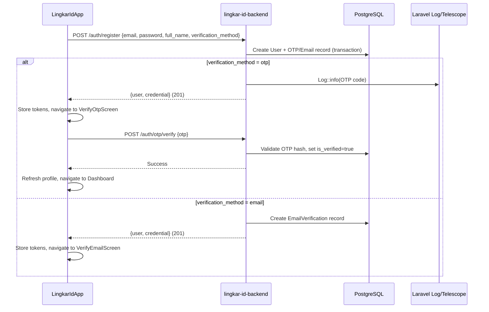
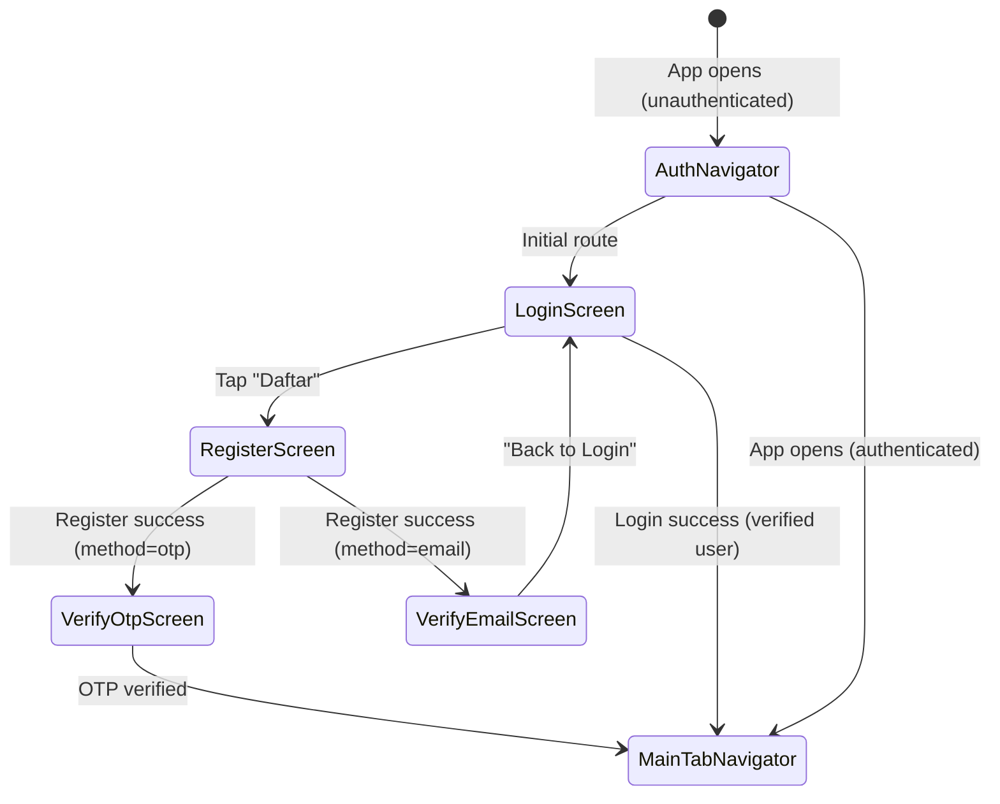

# Design Document: Client Registration with OTP Verification

## Overview

This feature adds a complete client registration flow spanning the lingkar-id-backend (Laravel) and LingkarIdApp (React Native). It introduces OTP-based verification as the default method alongside the existing email-link verification, allowing users to choose their preferred verification path during registration.

**Key design decisions:**

- OTP codes are logged via `Log::info()` (viewable in Laravel Telescope) — email delivery deferred to a future iteration
- Dev bypass code "223344" accepted in non-production environments for testing convenience
- Default verification method is `otp` when not specified
- All OTP parameters are configurable via `config/businessflow.php`
- Backend strictly follows existing Service Layer pattern (thin controllers, all logic in Services)
- Frontend uses existing design system components and Zustand store pattern

## Architecture

### System Flow



### Navigation Flow



## Components and Interfaces

### Backend Components

#### 1. OtpVerification Model (`app/Models/OtpVerification.php`)

Eloquent model for the `otp_verifications` table. Mirrors the pattern of `EmailVerification` with added attempt tracking.

#### 2. OtpVerificationService (`app/Services/Auth/OtpVerificationService.php`)

Core service handling OTP lifecycle:

- `generate(User $user): void` — Creates OTP, hashes it, stores record, logs plain code
- `verify(User $user, string $code): array` — Validates OTP against hash, handles expiry/attempts/dev bypass
- `resend(User $user): array` — Invalidates existing OTP, generates new one with cooldown enforcement

#### 3. RegisterService Update (`app/Services/Auth/RegisterService.php`)

Extended `handle()` method accepts `verification_method` parameter. Branches to either existing email flow or new OTP flow within the same DB transaction.

#### 4. AuthHelper Update (`app/Support/AuthHelper.php`)

New static method `generateOtp(int $length): array` returning `['plain' => '123456', 'hash' => 'sha256...']`.

#### 5. RegisterFormRequest Update (`app/Http/Requests/RegisterFormRequest.php`)

Adds `verification_method` validation rule: `['sometimes', 'string', 'in:email,otp']`.

#### 6. New FormRequests

- `VerifyOtpFormRequest` — validates `otp` field (required, string, size:6, regex for digits)
- `ResendVerificationFormRequest` — no body fields needed (user from auth)

#### 7. AuthController Updates

New methods:

- `verifyOtp(VerifyOtpFormRequest $request, OtpVerificationService $service)` — delegates to service
- `resendOtp(Request $request, OtpVerificationService $service)` — delegates to service with rate limiting
- `resendVerificationEmail(Request $request, RegisterService $service)` — resends email verification

#### 8. New Routes

```
POST /api/v1/auth/otp/verify      (auth:sanctum)
POST /api/v1/auth/otp/resend      (auth:sanctum, throttle)
POST /api/v1/auth/verify/resend   (auth:sanctum, throttle)
```

### Frontend Components

#### 1. Auth Service Types (`src/services/auth/auth.types.ts`)

New interfaces:

- `IRegisterPayload` — registration form fields + verification_method
- `IRegisterResponse` — user data + credentials
- `IVerifyOtpPayload` — otp string
- `IResendOtpResponse` — success message

#### 2. Auth Service Methods (`src/services/auth/auth.service.ts`)

New methods:

- `register(payload)` → `POST /auth/register`
- `verifyOtp(payload)` → `POST /auth/otp/verify`
- `resendOtp()` → `POST /auth/otp/resend`
- `resendVerificationEmail()` → `POST /auth/verify/resend`

#### 3. Auth Store Updates (`src/store/useAuthStore.ts`)

New actions:

- `register(payload)` — calls service, stores tokens, sets isAuthenticated, fetches profile
- `verifyOtp(otp)` — calls service, refreshes profile
- `resendOtp()` — calls service

#### 4. AuthNavigator (`src/navigation/AuthNavigator.tsx`)

React Navigation stack with screens: Login, Register, VerifyOtp, VerifyEmail. Replaces the direct `<LoginScreen />` render in `App.tsx`.

#### 5. RegisterScreen (`src/screens/auth/RegisterScreen.tsx`)

Form with: full name, email, password, password confirmation, verification method selector (segmented control). Follows LoginScreen patterns for styling and error handling.

#### 6. VerifyOtpScreen (`src/screens/auth/VerifyOtpScreen.tsx`)

6-digit OTP input with auto-advance, auto-submit, countdown timer for resend, error display.

#### 7. VerifyEmailScreen (`src/screens/auth/VerifyEmailScreen.tsx`)

Informational screen showing user's email, resend button, back-to-login button.

## Data Models

### OTP Verifications Table

```sql
CREATE TABLE otp_verifications (
    id BIGSERIAL PRIMARY KEY,
    user_id BIGINT NOT NULL REFERENCES users(id) ON DELETE CASCADE,
    otp_hash VARCHAR(255) NOT NULL,
    expires_at TIMESTAMP NOT NULL,
    attempts INTEGER NOT NULL DEFAULT 0,
    max_attempts INTEGER NOT NULL DEFAULT 5,
    created_at TIMESTAMP NULL,
    updated_at TIMESTAMP NULL
);

CREATE INDEX idx_otp_verifications_user_id ON otp_verifications(user_id);
```

### OtpVerification Eloquent Model

```php
class OtpVerification extends Model
{
    protected $fillable = [
        'user_id', 'otp_hash', 'expires_at', 'attempts', 'max_attempts',
    ];

    protected $casts = [
        'expires_at' => 'datetime',
        'attempts' => 'integer',
        'max_attempts' => 'integer',
    ];

    public function user() { return $this->belongsTo(User::class); }
    public function isExpired(): bool { return $this->expires_at->isPast(); }
    public function hasExceededMaxAttempts(): bool { return $this->attempts >= $this->max_attempts; }
}
```

### Configuration Extension (`config/businessflow.php`)

```php
'otp' => [
    'expiry_minutes' => 5,
    'max_attempts' => 5,
    'code_length' => 6,
    'resend_cooldown_seconds' => 60,
    'dev_bypass_code' => '223344',
],
```

### Frontend Type Additions

```typescript
interface IRegisterPayload {
  email: string;
  password: string;
  password_confirmation: string;
  full_name: string;
  verification_method?: "email" | "otp";
}

interface IRegisterResponse {
  user: IUserAuth;
  credential: ILoginResponse;
}

interface IVerifyOtpPayload {
  otp: string;
}
```

## Correctness Properties

_A property is a characteristic or behavior that should hold true across all valid executions of a system — essentially, a formal statement about what the system should do. Properties serve as the bridge between human-readable specifications and machine-verifiable correctness guarantees._

### Property 1: OTP Generation Produces Valid Hashed Code

_For any_ call to `AuthHelper::generateOtp()`, the returned plain code SHALL be a numeric string of exactly 6 digits with integer value in the range [100000, 999999], AND `hash('sha256', plain)` SHALL equal the returned hash value.

**Validates: Requirements 2.1, 2.2**

### Property 2: Single Active OTP Per User Invariant

_For any_ user, after calling `OtpVerificationService::generate()` N times (N ≥ 1), there SHALL be exactly one `OtpVerification` record for that user in the database, and it SHALL be the most recently created one.

**Validates: Requirements 2.5**

### Property 3: Incorrect OTP Attempt Increment

_For any_ OtpVerification record with attempts < max_attempts and a non-expired expiry, submitting any OTP code that does not match the stored hash SHALL increment the attempts counter by exactly 1 and leave all other fields unchanged.

**Validates: Requirements 4.2**

### Property 4: Model Helper Methods Correctness

_For any_ OtpVerification record with arbitrary `expires_at` timestamp and arbitrary `attempts`/`max_attempts` integer values, `isExpired()` SHALL return `true` if and only if `expires_at` is in the past, AND `hasExceededMaxAttempts()` SHALL return `true` if and only if `attempts >= max_attempts`.

**Validates: Requirements 6.4, 6.5**

## Error Handling

### Backend Error Responses

All errors use `ApiResponse::error()` with appropriate HTTP status codes:

| Scenario                    | HTTP Status | Message                                                        |
| --------------------------- | ----------- | -------------------------------------------------------------- |
| Invalid registration fields | 422         | Laravel validation errors (field-level)                        |
| Invalid verification_method | 422         | `The selected verification method is invalid.`                 |
| OTP code incorrect          | 400         | `Kode OTP tidak valid.`                                        |
| OTP expired                 | 400         | `Kode OTP sudah kedaluwarsa.`                                  |
| Max attempts exceeded       | 400         | `Batas percobaan OTP telah tercapai. Silakan minta kode baru.` |
| Resend rate limited         | 429         | `Silakan tunggu sebelum meminta kode baru.`                    |
| Unauthenticated             | 401         | `Unauthenticated.` (Sanctum default)                           |
| Already verified            | 200         | `Akun sudah terverifikasi.` (success, not error)               |

### Frontend Error Handling

- **Field-level errors**: Displayed below corresponding input fields (same pattern as LoginScreen)
- **General errors**: Displayed via `Alert.alert()` (same pattern as LoginScreen)
- **Network errors**: Handled by Axios interceptor in `api.ts` — shows generic error message
- **Token expiry during verification**: Interceptor handles silent refresh; if refresh fails, force-logout triggers

### OTP-Specific Edge Cases

1. **User closes app during verification**: Tokens are persisted in secure storage. On reopen, hydrate restores auth state. User can navigate back to verify screen.
2. **Multiple rapid resend taps**: Rate limiting on backend (60s cooldown). Frontend disables button during countdown.
3. **OTP expires while user is on screen**: User submits expired OTP → backend returns expiry error → user taps resend.

## Testing Strategy

### Backend Testing (PHPUnit)

**Property-Based Tests** (using PHPUnit with data providers for iteration):

- Each property test runs minimum 100 iterations with randomized inputs
- Tag format: `Feature: client-registration-otp, Property {N}: {title}`
- Library: PHPUnit with custom random data generators (PHP doesn't have a standard PBT library, so we use data providers with `random_int`/`Str::random` to generate inputs across 100 iterations)

**Unit Tests** (example-based):

- `OtpVerificationService::generate()` — creates record with correct defaults
- `OtpVerificationService::verify()` — happy path, wrong code, expired, max attempts, dev bypass, already verified
- `OtpVerificationService::resend()` — happy path, already verified, cooldown
- `RegisterService::handle()` — with verification_method=otp, =email, default

**Integration Tests** (HTTP):

- `POST /auth/register` — with otp method, email method, default, invalid method, validation errors
- `POST /auth/otp/verify` — valid code, wrong code, expired, max attempts, dev bypass, unauthenticated
- `POST /auth/otp/resend` — success, already verified, rate limited, unauthenticated
- `POST /auth/verify/resend` — success, already verified, rate limited, unauthenticated

### Frontend Testing

**Unit Tests** (Jest + React Native Testing Library):

- Auth service methods — verify correct API endpoints and payloads
- Auth store actions — verify state transitions with mocked services
- RegisterScreen — form validation, submission, error display, navigation
- VerifyOtpScreen — digit input, auto-submit, resend, error display
- VerifyEmailScreen — resend, logout navigation

### Test Configuration

- Backend property tests: 100 iterations per property via PHPUnit data providers
- Each property test tagged with: `Feature: client-registration-otp, Property {N}: {title}`
- Frontend tests: standard Jest configuration from existing project setup
