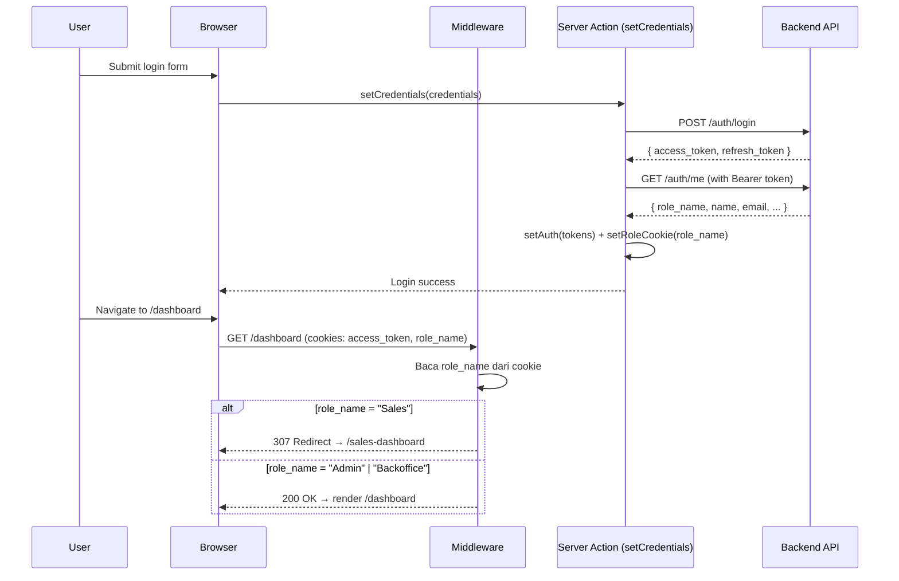
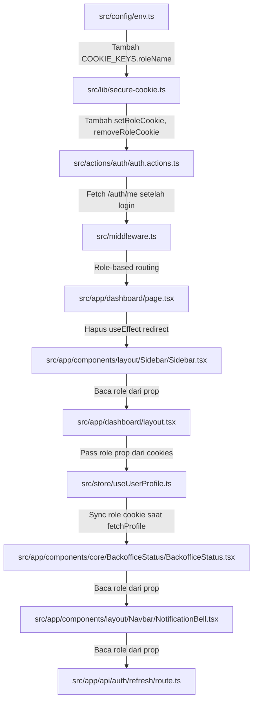

# Design Document: Dashboard Cookie Auth Refactoring

## Overview

Refaktor logika routing dashboard dari client-side (Zustand + `useEffect` + `router.replace`) ke server-side menggunakan secure cookie di Next.js middleware. Saat ini, user Sales mengalami flash/loading karena redirect terjadi setelah client-side hydration dan profile fetch. Solusinya: simpan `role_name` di httpOnly cookie saat login, lalu middleware membaca cookie tersebut untuk routing sebelum halaman di-render.

### Masalah Saat Ini

```
Login → Render Dashboard → Fetch Profile (Zustand) → Cek Role → router.replace(/sales-dashboard)
                            ↑ flash/loading terjadi di sini
```

### Solusi

```
Login → Set Role Cookie → Request /dashboard → Middleware baca cookie → 307 Redirect → Render halaman yang benar
                                                ↑ tidak ada flash, redirect terjadi sebelum render
```

### Keputusan Desain Utama

1. **Fetch `/auth/me` saat login**: Karena `ILoginResponse` hanya berisi token (tanpa `role_name`), `setCredentials` perlu melakukan fetch tambahan ke `/auth/me` menggunakan token yang baru didapat untuk mendapatkan `role_name`.

2. **Role cookie sebagai non-sensitive data**: `role_name` bukan data sensitif (hanya "Admin", "Backoffice", atau "Sales"). Cookie tetap httpOnly untuk konsistensi dengan cookie lainnya, tapi nilainya tidak bersifat rahasia.

3. **Sidebar menerima role sebagai prop**: Karena Sidebar ada di dalam server component layout (`layout.tsx`), layout bisa membaca cookie via `cookies()` dan meneruskan `role` sebagai prop ke Sidebar. Ini menghilangkan ketergantungan pada Zustand untuk menentukan navigasi.

4. **Graceful degradation**: Jika role cookie tidak ada (misalnya user login sebelum fitur ini di-deploy), middleware dan Sidebar tetap berfungsi dengan fallback ke perilaku saat ini.

## Architecture

### Alur Data Baru



### Komponen yang Berubah



## Components and Interfaces

### 1. `src/config/env.ts` — Tambah Cookie Key

```typescript
export const COOKIE_KEYS = {
  accessToken: "access_token",
  refreshToken: "refresh_token",
  roleName: "role_name", // BARU
};
```

### 2. `src/lib/secure-cookie.ts` — Tambah Role Cookie Helpers

Fungsi baru:

```typescript
/** Set role_name cookie (dipanggil dari server action) */
export async function setRoleCookie(
  roleName: string,
  response?: NextResponse
): Promise<void>;

/** Baca role_name dari cookie (dipanggil dari server component / middleware) */
export async function getRoleCookie(): Promise<string | null>;
```

Update fungsi existing:

```typescript
/** setAuth sekarang menerima optional roleName */
export async function setAuth(
  authData: ILoginResponse,
  roleName?: string
): Promise<boolean>;

/** removeAuth sekarang juga menghapus role cookie */
export function removeAuth(response?: NextResponse): void;
```

### 3. `src/actions/auth/auth.actions.ts` — Fetch Profile Saat Login

```typescript
export async function setCredentials(
  credentials: ILoginPayload
): Promise<TLoginResult> {
  // 1. POST /auth/login → dapat tokens
  // 2. GET /auth/me (dengan Bearer token baru) → dapat role_name
  // 3. setAuth(tokens, role_name) → set semua cookies
  // 4. Return result
}
```

**Keputusan**: Fetch `/auth/me` dilakukan server-side di dalam server action, bukan di client. Ini memastikan role cookie di-set sebelum client menerima response sukses.

**Error handling**: Jika fetch `/auth/me` gagal, login tetap berhasil (tokens sudah di-set), tapi role cookie tidak di-set. Middleware akan fallback ke perilaku tanpa role-based routing.

### 4. `src/middleware.ts` — Role-Based Routing

Logika baru ditambahkan setelah auth check existing:

```typescript
export function middleware(request: NextRequest) {
  // ... existing API proxy logic ...
  // ... existing auth redirect (no token → login) ...

  // BARU: Role-based routing
  const roleName = request.cookies.get(COOKIE_KEYS.roleName)?.value;

  if (roleName && token) {
    const isSalesUser = BUSINESSFLOW.salesRoles.includes(roleName);
    const isBackofficeUser = BUSINESSFLOW.backofficeRoles.includes(roleName);

    // Sales mengakses /dashboard → redirect ke /sales-dashboard
    if (isSalesUser && pathname === PATHS.dashboard) {
      return NextResponse.redirect(new URL(PATHS.salesDashboard, request.url));
    }

    // Sales mengakses /dashboard/* (sub-routes) → redirect ke /sales-dashboard
    if (isSalesUser && pathname.startsWith(PATHS.dashboard + "/")) {
      return NextResponse.redirect(new URL(PATHS.salesDashboard, request.url));
    }

    // Backoffice mengakses /sales-dashboard atau /sales-activities → redirect ke /dashboard
    if (
      isBackofficeUser &&
      (pathname.startsWith(PATHS.salesDashboard) ||
        pathname.startsWith(PATHS.salesActivities))
    ) {
      return NextResponse.redirect(new URL(PATHS.dashboard, request.url));
    }
  }

  // Jika role cookie tidak ada atau role tidak dikenali → lanjut tanpa redirect
  return NextResponse.next();
}
```

**Catatan**: Middleware berjalan di Edge Runtime dan bisa membaca cookies langsung dari `request.cookies`. Tidak perlu import `cookies()` dari `next/headers`.

### 5. `src/app/(dashboard)/layout.tsx` — Pass Role ke Sidebar

Layout diubah menjadi async server component yang membaca role cookie:

```typescript
import { cookies } from "next/headers";
import { COOKIE_KEYS } from "@config/env";

export default async function DashboardLayout({ children }: { children: React.ReactNode }) {
  const cookieStore = await cookies();
  const roleName = cookieStore.get(COOKIE_KEYS.roleName)?.value ?? null;

  return (
    <div className="min-h-screen bg-white flex">
      <BackofficeStatus roleName={roleName} />
      <Sidebar roleName={roleName} />
      {/* ... rest of layout ... */}
      <NotificationBell roleName={roleName} />
    </div>
  );
}
```

### 6. `src/app/components/layout/Sidebar/Sidebar.tsx` — Terima Role dari Prop

```typescript
interface SidebarProps {
  roleName: string | null;
}

export function Sidebar({ roleName }: SidebarProps) {
  // Gunakan roleName prop untuk menentukan navigasi
  // Tidak lagi bergantung pada useUserProfile untuk role
  const navs = useMemo(() => {
    if (roleName && BUSINESSFLOW.backofficeRoles.includes(roleName)) {
      return [
        ...NAV_ENTRIES,
        USER_MANAGEMENT_NAV,
        SALES_MANAGEMENT_NAV,
        ...OTHER_NAVS,
      ];
    }
    if (roleName && BUSINESSFLOW.salesRoles.includes(roleName)) {
      return SALES_NAVS;
    }
    return NAV_ENTRIES;
  }, [roleName]);

  const navLoaded = roleName !== null;
  // ... rest of component (hapus useUserProfile dependency untuk role)
}
```

### 7. `src/app/components/layout/Navbar/NotificationBell.tsx` — Terima Role dari Prop

```typescript
interface NotificationBellProps {
  roleName: string | null;
}

export function NotificationBell({ roleName }: NotificationBellProps) {
  // Gunakan roleName prop untuk menentukan apakah perlu fetch notifications
  useEffect(() => {
    if (roleName && BUSINESSFLOW.backofficeRoles.includes(roleName)) {
      fetchUnreadCount();
      const interval = setInterval(fetchUnreadCount, 30_000);
      return () => clearInterval(interval);
    }
  }, [fetchUnreadCount, roleName]);
}
```

### 8. `src/app/components/core/BackofficeStatus/BackofficeStatus.tsx` — Terima Role dari Prop

```typescript
interface BackofficeStatusProps {
  roleName: string | null;
}

export function BackofficeStatus({ roleName }: BackofficeStatusProps) {
  // Gunakan roleName prop, tidak perlu fetchProfile untuk cek role
  useEffect(() => {
    if (roleName && BUSINESSFLOW.backofficeRoles.includes(roleName)) {
      generalService.backofficeStatus();
    }
  }, [roleName]);
}
```

### 9. `src/app/(dashboard)/dashboard/page.tsx` — Hapus Client-Side Redirect

Hapus:

- `useEffect` yang melakukan `router.replace(PATHS.salesDashboard)`
- Guard condition `BUSINESSFLOW.salesRoles.includes(profile.role_name)` yang menampilkan loading
- Import `useRouter`, `useUserProfile` (untuk role check), `BUSINESSFLOW` (untuk role check)

Pertahankan:

- `useUserProfile` untuk data profil yang dibutuhkan `useDetailData` (enabled check bisa dihapus karena middleware sudah menjamin hanya backoffice yang sampai ke halaman ini)
- `useDetailData` untuk fetch dashboard data

### 10. `src/store/useUserProfile.ts` — Sync Role Cookie

Tambah server action untuk sync cookie:

```typescript
// src/actions/auth/auth.actions.ts (tambahan)
export async function syncRoleCookie(roleName: string): Promise<void> {
  await setRoleCookie(roleName);
}
```

Di `useUserProfile.ts`, setelah `fetchProfile` berhasil, panggil `syncRoleCookie` jika role berubah:

```typescript
fetchProfile: async () => {
  set({ isLoading: true });
  try {
    const res = await authService.me();
    set({ profile: res.data, isLoading: false });
    // Sync role cookie (fire-and-forget)
    syncRoleCookie(res.data.role_name);
  } catch {
    set({ profile: null, isLoading: false });
  }
},
```

### 11. `src/app/api/auth/refresh/route.ts` — Pertahankan Role Cookie

Saat refresh token gagal dan `removeAuth` dipanggil, role cookie juga ikut terhapus (karena `removeAuth` sudah di-update). Tidak perlu perubahan tambahan di file ini.

## Data Models

### Cookie Schema

| Cookie Name     | Value                          | httpOnly | Secure     | SameSite | Path | MaxAge |
| --------------- | ------------------------------ | -------- | ---------- | -------- | ---- | ------ |
| `access_token`  | JWT string                     | ✅       | production | lax      | /    | 1 hari |
| `refresh_token` | JWT string                     | ✅       | production | lax      | /    | 1 hari |
| `role_name`     | String (e.g. "Admin", "Sales") | ✅       | production | lax      | /    | 1 hari |

### Role Mapping

| Role Name  | Grup            | Dashboard Route    | Accessible Routes                          |
| ---------- | --------------- | ------------------ | ------------------------------------------ |
| Admin      | backofficeRoles | `/dashboard`       | `/dashboard/*`, `/dashboard/notifications` |
| Backoffice | backofficeRoles | `/dashboard`       | `/dashboard/*`, `/dashboard/notifications` |
| Sales      | salesRoles      | `/sales-dashboard` | `/sales-dashboard`, `/sales-activities/*`  |

### Middleware Routing Matrix

| Kondisi                                   | Aksi                       |
| ----------------------------------------- | -------------------------- |
| Tidak ada `access_token`                  | Redirect → `/login`        |
| Ada `access_token`, tidak ada `role_name` | Lanjut tanpa role redirect |
| Sales → `/dashboard`                      | 307 → `/sales-dashboard`   |
| Sales → `/dashboard/*` (sub-routes)       | 307 → `/sales-dashboard`   |
| Backoffice → `/sales-dashboard`           | 307 → `/dashboard`         |
| Backoffice → `/sales-activities`          | 307 → `/dashboard`         |
| Role tidak dikenali                       | Lanjut tanpa role redirect |
| Login page + ada `access_token`           | Redirect → `/dashboard`    |

## Error Handling

### Skenario Error

| Skenario                                      | Handling                                                                                                                                                       |
| --------------------------------------------- | -------------------------------------------------------------------------------------------------------------------------------------------------------------- |
| Fetch `/auth/me` gagal setelah login berhasil | Login tetap sukses, role cookie tidak di-set. Middleware fallback ke perilaku tanpa role routing. Sidebar menampilkan skeleton lalu fetch profile via Zustand. |
| Role cookie berisi nilai tidak valid          | Middleware mengizinkan request lanjut tanpa redirect. Sidebar menampilkan navigasi default.                                                                    |
| Cookie expired/hilang di tengah sesi          | Middleware tidak melakukan role redirect. Sidebar fallback ke skeleton → fetch profile → sync cookie.                                                          |
| `syncRoleCookie` gagal                        | Fire-and-forget, tidak mempengaruhi UX. Cookie akan di-sync ulang pada fetch profile berikutnya.                                                               |

### Backward Compatibility

- User yang sudah login sebelum fitur ini di-deploy tidak memiliki role cookie. Middleware dan Sidebar akan fallback ke perilaku saat ini (fetch profile via Zustand, redirect via client-side).
- Setelah user melakukan fetch profile (otomatis saat halaman dimuat), `syncRoleCookie` akan membuat role cookie untuk request berikutnya.

## Testing Strategy

### Mengapa Property-Based Testing Tidak Diterapkan

Fitur ini tidak cocok untuk property-based testing karena:

- **Middleware routing** adalah logika routing dengan input terbatas (beberapa role × beberapa path). Tidak ada input space yang besar atau infinite.
- **Cookie management** adalah operasi side-effect (set/delete cookie). Tidak ada pure function dengan input/output yang bisa di-test secara universal.
- **UI component changes** (Sidebar, NotificationBell) adalah perubahan data source (dari Zustand ke prop). Testing-nya berupa verifikasi rendering dengan input spesifik.

### Unit Tests

| Test Case                                           | File                    | Deskripsi                                                              |
| --------------------------------------------------- | ----------------------- | ---------------------------------------------------------------------- |
| Login sets role cookie                              | `auth.actions.test.ts`  | Mock fetch login + /auth/me, verifikasi role cookie di-set             |
| Login failure skips role cookie                     | `auth.actions.test.ts`  | Mock failed login, verifikasi role cookie tidak di-set                 |
| removeAuth deletes role cookie                      | `secure-cookie.test.ts` | Panggil removeAuth, verifikasi 3 cookies dihapus                       |
| Middleware: Sales → /dashboard redirects            | `middleware.test.ts`    | Simulasi request dengan role=Sales ke /dashboard, verifikasi 307       |
| Middleware: Backoffice → /sales-dashboard redirects | `middleware.test.ts`    | Simulasi request dengan role=Admin ke /sales-dashboard, verifikasi 307 |
| Middleware: No role cookie → no redirect            | `middleware.test.ts`    | Simulasi request tanpa role cookie, verifikasi request lanjut          |
| Middleware: Unknown role → no redirect              | `middleware.test.ts`    | Simulasi request dengan role=Unknown, verifikasi request lanjut        |
| Sidebar renders backoffice nav for Admin            | `Sidebar.test.tsx`      | Render Sidebar dengan roleName="Admin", verifikasi menu items          |
| Sidebar renders sales nav for Sales                 | `Sidebar.test.tsx`      | Render Sidebar dengan roleName="Sales", verifikasi menu items          |
| Sidebar shows skeleton when no role                 | `Sidebar.test.tsx`      | Render Sidebar dengan roleName=null, verifikasi skeleton               |

### Integration Tests

| Test Case                   | Deskripsi                                                                           |
| --------------------------- | ----------------------------------------------------------------------------------- |
| Full login flow             | Login → verifikasi semua cookies di-set (access_token, refresh_token, role_name)    |
| Full logout flow            | Logout → verifikasi semua cookies dihapus                                           |
| Profile sync updates cookie | Set role cookie "Sales" → fetch profile returns "Admin" → verifikasi cookie updated |

### Manual Testing Checklist

- [ ] Login sebagai Admin → langsung ke `/dashboard` tanpa flash
- [ ] Login sebagai Sales → langsung ke `/sales-dashboard` tanpa flash
- [ ] Sales mengakses `/dashboard` via URL → redirect ke `/sales-dashboard`
- [ ] Admin mengakses `/sales-dashboard` via URL → redirect ke `/dashboard`
- [ ] Sidebar menampilkan menu yang benar segera saat halaman dimuat
- [ ] Logout → login ulang dengan role berbeda → routing benar
- [ ] Clear cookies manual → halaman tetap berfungsi (fallback)
