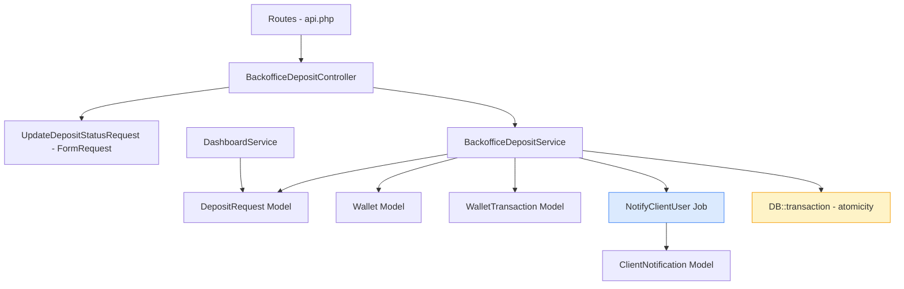
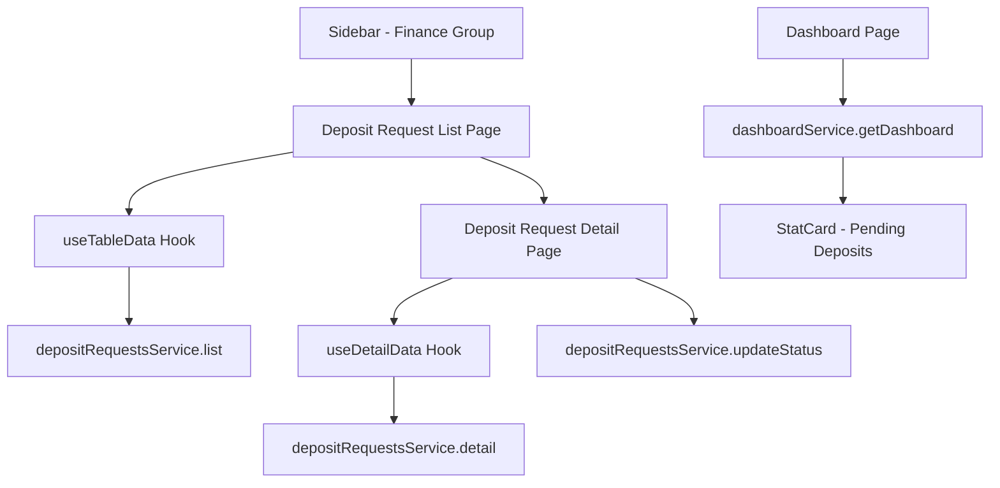
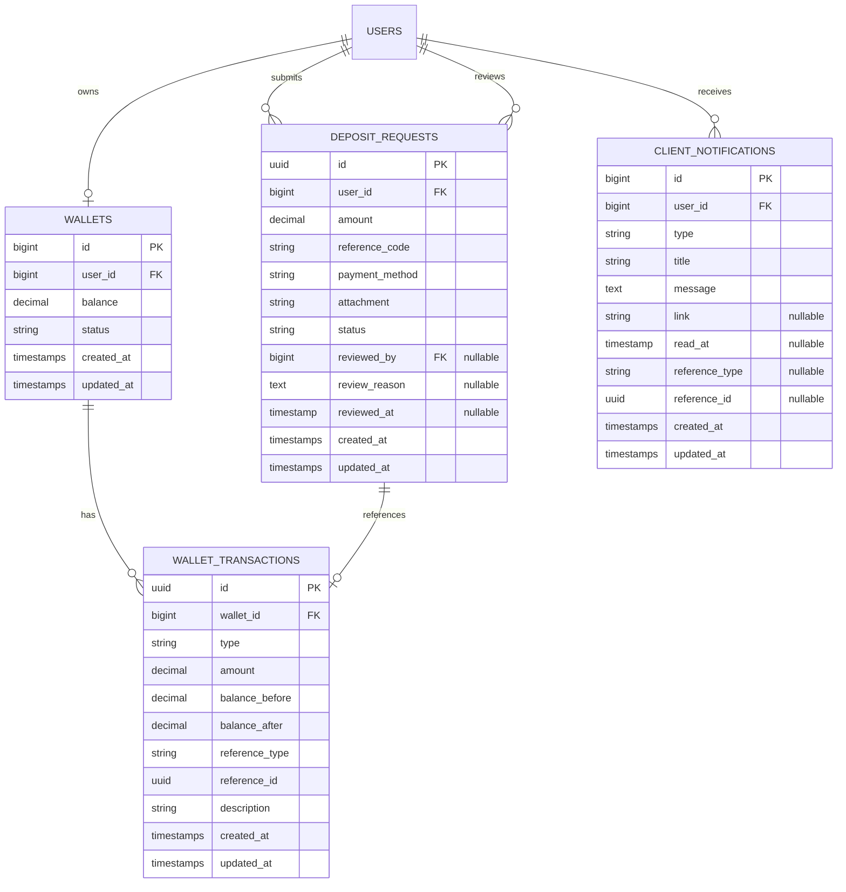
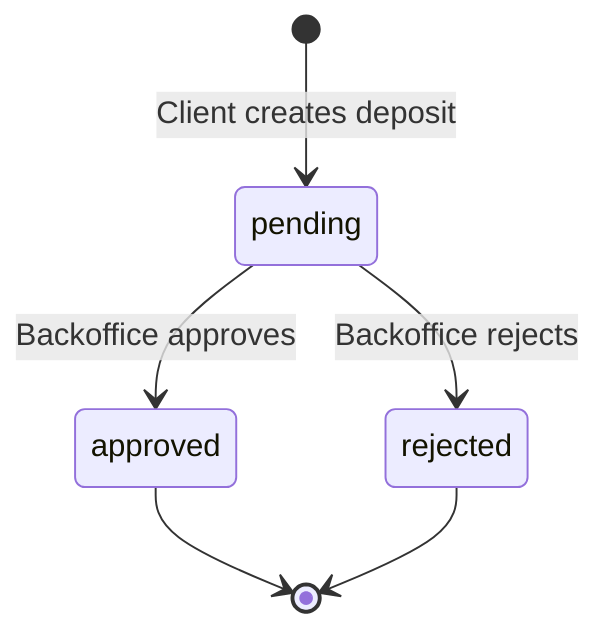
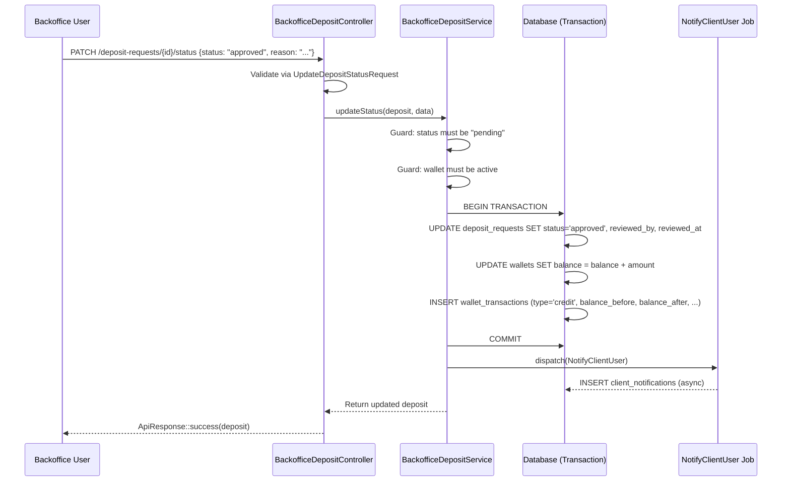

# Design Document: Deposit Request Management

## Overview

This feature adds a complete backoffice workflow for reviewing, approving, and rejecting client deposit requests. It follows the established Activity Log Review pattern (list → detail → approve/reject) adapted for the financial deposit context.

**Key flows:**

- Backoffice users browse deposit requests in a paginated, searchable, filterable table
- Backoffice users view deposit details (client info, amount, payment proof attachment) and approve or reject
- On approval: wallet balance is credited atomically with a transaction record
- On rejection: a reason is recorded
- Both outcomes trigger an async notification to the client
- The backoffice dashboard shows a pending deposit count widget

**Scope spans two workspaces:**

- **Backend (lingkar-id-backend):** Migration, model updates, service, controller, form request, job, routes
- **Frontend (lingkar-crm):** Service layer, list page, detail page, sidebar nav, dashboard widget, routing

---

## Architecture

The feature follows the existing layered architecture on both sides.

### Backend Architecture



**Layer responsibilities:**

- **Controller** (`BackofficeDepositController`): Thin — validates via FormRequest, delegates to service, returns ApiResponse. Uses `ApiPaginationTrait` for list endpoint.
- **Service** (`BackofficeDepositService`): All business logic — list/detail queries, approval workflow (DB transaction wrapping status update + wallet credit + transaction creation), rejection workflow, notification dispatch.
- **FormRequest** (`UpdateDepositStatusRequest`): Validates status (in:approved,rejected), reason (required|string|max:1000).
- **Job** (`NotifyClientUser`): Async queued job that creates a `ClientNotification` record for a specific client user. Mirrors `NotifySalesUser` pattern.

### Frontend Architecture



**Page components:**

- **List page** (`/dashboard/deposit-requests`): `TableCard` with `SearchInput` + `FilterPopup` (status, payment_method). Uses `useTableData` for URL-synced pagination.
- **Detail page** (`/dashboard/deposit-requests/[id]`): `DetailCard` with deposit info, attachment preview, and conditional approve/reject form (pending) or read-only review info (processed). Uses `useDetailData`.

---

## Components and Interfaces

### Backend Components

#### 1. Migration: Add reviewer fields to deposit_requests

Adds three nullable columns to the existing `deposit_requests` table:

```php
Schema::table('deposit_requests', function (Blueprint $table) {
    $table->foreignId('reviewed_by')->nullable()->constrained('users')->nullOnDelete();
    $table->text('review_reason')->nullable();
    $table->timestamp('reviewed_at')->nullable();
});
```

#### 2. Migration: Create client_notifications table

```php
Schema::create('client_notifications', function (Blueprint $table) {
    $table->id();
    $table->foreignId('user_id')->constrained('users')->cascadeOnDelete();
    $table->string('type');
    $table->string('title');
    $table->text('message');
    $table->string('link')->nullable();
    $table->timestamp('read_at')->nullable();
    $table->string('reference_type')->nullable();
    $table->uuid('reference_id')->nullable();
    $table->timestamps();
});
```

#### 3. DepositRequest Model (updated)

```php
// New fillable fields
protected $fillable = [
    'user_id', 'amount', 'reference_code', 'payment_method',
    'attachment', 'status',
    'reviewed_by', 'review_reason', 'reviewed_at', // new
];

protected $appends = ['attachment_url'];
protected $casts = ['reviewed_at' => 'datetime'];

// New relationships
public function reviewedBy() { return $this->belongsTo(User::class, 'reviewed_by'); }

// New accessor
public function getAttachmentUrlAttribute(): ?string {
    return $this->attachment ? Storage::disk('public')->url($this->attachment) : null;
}

// New scope
public function scopeSearch($query, ?string $search) {
    if (!$search) return $query;
    return $query->where(function ($q) use ($search) {
        $q->where('reference_code', 'ILIKE', "%{$search}%")
          ->orWhereHas('user', fn($uq) => $uq->where('name', 'ILIKE', "%{$search}%"));
    });
}
```

#### 4. ClientNotification Model

```php
class ClientNotification extends Model {
    const TYPE_DEPOSIT_APPROVED = 'deposit_approved';
    const TYPE_DEPOSIT_REJECTED = 'deposit_rejected';

    protected $fillable = ['user_id','type','title','message','link','read_at','reference_type','reference_id'];
    protected $casts = ['read_at' => 'datetime'];

    public function user() { return $this->belongsTo(User::class); }
    public function scopeUnread($query) { return $query->whereNull('read_at'); }
}
```

#### 5. NotifyClientUser Job

```php
class NotifyClientUser implements ShouldQueue {
    use Queueable;

    public function __construct(
        public int $userId,
        public string $type,
        public string $title,
        public string $message,
        public ?string $link,
        public ?string $referenceType,
        public ?string $referenceId, // UUID string
    ) {}

    public function handle(): void {
        ClientNotification::create([
            'user_id' => $this->userId,
            'type' => $this->type,
            'title' => $this->title,
            'message' => $this->message,
            'link' => $this->link,
            'reference_type' => $this->referenceType,
            'reference_id' => $this->referenceId,
        ]);
    }
}
```

#### 6. BackofficeDepositService

```php
class BackofficeDepositService {
    use ApiPaginationTrait;

    public function getAllDepositRequests(): LengthAwarePaginator { ... }
    public function getDepositRequestById(string $id): DepositRequest { ... }
    public function updateStatus(DepositRequest $deposit, array $data): DepositRequest { ... }
}
```

Key method — `updateStatus`:

- Guard: reject if status !== 'pending' (throw 422)
- If approving: guard wallet status (reject if locked/banned), then wrap in `DB::transaction`:
  1. Update deposit status to 'approved', set reviewed_by, reviewed_at
  2. Credit wallet balance
  3. Create WalletTransaction record
- If rejecting: update deposit status to 'rejected', set reviewed_by, reviewed_at, review_reason
- Dispatch `NotifyClientUser` job

#### 7. BackofficeDepositController

```php
class BackofficeDepositController extends Controller {
    use ApiPaginationTrait;

    public function index(): JsonResponse { ... }       // paginated list
    public function show(string $id): JsonResponse { ... } // single detail
    public function updateStatus(UpdateDepositStatusRequest $request, DepositRequest $deposit): JsonResponse { ... }
}
```

#### 8. UpdateDepositStatusRequest

```php
public function rules(): array {
    return [
        'status' => 'required|string|in:approved,rejected',
        'reason' => 'required_if:status,rejected|nullable|string|max:1000',
    ];
}
```

Note: reason is required only for rejection, optional for approval.

#### 9. Routes

```php
// Inside backoffice prefix group
Route::get('deposit-requests', [BackofficeDepositController::class, 'index']);
Route::get('deposit-requests/{deposit_request}', [BackofficeDepositController::class, 'show']);
Route::patch('deposit-requests/{deposit_request}/status', [BackofficeDepositController::class, 'updateStatus']);
```

#### 10. DashboardService Update

Add a `getDepositsSummary()` private method returning `['total' => int, 'pending' => int]` and include it in the `getSummary()` response under the `deposits` key.

### Frontend Components

#### 1. Service Layer (`src/services/backoffice/deposit-requests/`)

**Types (`deposit-requests.types.ts`):**

```typescript
export interface IDepositRequest {
  id: string;
  user_id: number;
  amount: number;
  reference_code: string;
  payment_method: string;
  attachment: string | null;
  attachment_url: string | null;
  status: DepositRequestStatus;
  reviewed_by: number | null;
  review_reason: string | null;
  reviewed_at: string | null;
  created_at: string;
  updated_at: string;
  user: { id: number; name: string; email: string };
  reviewed_by_user: { id: number; name: string } | null;
}

export type DepositRequestStatus =
  | "pending"
  | "approved"
  | "rejected"
  | "expired";

export interface IDepositRequestParams extends IPaginationParams {
  search?: string;
  status?: DepositRequestStatus;
  payment_method?: string;
}

export interface IUpdateDepositStatusPayload {
  status: "approved" | "rejected";
  reason?: string;
}
```

**Service (`deposit-requests.service.ts`):**

```typescript
export const depositRequestsService = {
  list: (params) => api.get("/backoffice/deposit-requests", { params }),
  detail: (id) => api.get(`/backoffice/deposit-requests/${id}`),
  updateStatus: (id, payload) =>
    api.patch(`/backoffice/deposit-requests/${id}/status`, payload),
};
```

**Barrel export (`index.ts`):**

```typescript
export * from "./deposit-requests.types";
export * from "./deposit-requests.service";
```

#### 2. Routing (`src/config/routing.ts`)

```typescript
const DEPOSIT_REQUESTS_SERVICES = {
  depositRequests: "/dashboard/deposit-requests",
  depositRequestDetail: (id: string) => `/dashboard/deposit-requests/${id}`,
};
```

#### 3. Sidebar Navigation

Add a "Finance" `NavGroup` to the backoffice navigation in `Sidebar.tsx`:

```typescript
const FINANCE_NAV: NavEntry = {
  label: "Finance",
  icon: Wallet,
  items: [
    {
      label: "Deposit Requests",
      href: PATHS.depositRequests,
      icon: CreditCard,
    },
  ],
};
```

Insert into the backoffice nav array between `SALES_MANAGEMENT_NAV` and `OTHER_NAVS`.

#### 4. List Page (`/dashboard/deposit-requests/page.tsx`)

- `TableCard` with columns: Client Name, Reference Code, Amount (Rp format), Payment Method, Status (badge), Created Date
- `SearchInput` for reference_code / client name search
- `FilterPopup` with status chips (pending, approved, rejected, expired) and payment method chips
- `useTableData` for URL-synced pagination
- Row click navigates to detail page

#### 5. Detail Page (`/dashboard/deposit-requests/[id]/page.tsx`)

- `DetailCard` with sections:
  - **Informasi Deposit**: client name, email, reference code, amount (Rp format), payment method, status badge, created date
  - **Lampiran**: clickable image preview (if image) or download link (if file)
  - **Update Status** (pending only): `FormSelect` (approved/rejected) + `FormInput as="textarea"` for reason + submit `Button`
  - **Informasi Review** (non-pending): reviewer name, reason, review timestamp (read-only)
- `useDetailData` for data fetching
- Toast notifications on success/error via `useNotificationStore`

#### 6. Dashboard Widget Update

Add a `StatCard` for deposits to the dashboard grid:

```typescript
<StatCard
  title="Deposit Requests"
  value={deposits.total}
  description={`${deposits.pending} pending review`}
  icon={Wallet}
  iconVariant="warning"
/>
```

Update `IDashboardData` interface to include `deposits: { total: number; pending: number }`.

### API Contracts

#### GET /backoffice/deposit-requests

**Request:** `?page=1&per_page=10&search=keyword&status=pending&payment_method=bank_transfer`

**Response:**

```json
{
  "success": true,
  "message": "Success get deposit requests",
  "data": [
    {
      "id": "uuid",
      "user_id": 1,
      "amount": 500000,
      "reference_code": "DEP-1234567890-ABC",
      "payment_method": "bank_transfer",
      "attachment": "client-deposits/hash.jpg",
      "attachment_url": "http://localhost:8000/storage/client-deposits/hash.jpg",
      "status": "pending",
      "reviewed_by": null,
      "review_reason": null,
      "reviewed_at": null,
      "created_at": "2025-01-15T10:00:00.000000Z",
      "updated_at": "2025-01-15T10:00:00.000000Z",
      "user": { "id": 1, "name": "John Doe", "email": "john@example.com" }
    }
  ],
  "meta": {
    "http_status": 200,
    "pagination": {
      "total": 50,
      "per_page": 10,
      "current_page": 1,
      "last_page": 5,
      "next_page_url": "...",
      "prev_page_url": null
    }
  }
}
```

#### GET /backoffice/deposit-requests/{id}

**Response:**

```json
{
  "success": true,
  "message": "Success get deposit request detail.",
  "data": {
    "id": "uuid",
    "user_id": 1,
    "amount": 500000,
    "reference_code": "DEP-1234567890-ABC",
    "payment_method": "bank_transfer",
    "attachment": "client-deposits/hash.jpg",
    "attachment_url": "http://localhost:8000/storage/client-deposits/hash.jpg",
    "status": "approved",
    "reviewed_by": 2,
    "review_reason": "Bukti transfer valid",
    "reviewed_at": "2025-01-15T12:00:00.000000Z",
    "created_at": "2025-01-15T10:00:00.000000Z",
    "updated_at": "2025-01-15T12:00:00.000000Z",
    "user": { "id": 1, "name": "John Doe", "email": "john@example.com" },
    "reviewed_by_user": { "id": 2, "name": "Admin User" }
  },
  "meta": { "http_status": 200 }
}
```

#### PATCH /backoffice/deposit-requests/{id}/status

**Request:**

```json
{ "status": "approved", "reason": "Bukti transfer valid" }
```

or

```json
{
  "status": "rejected",
  "reason": "Bukti transfer tidak valid, nominal tidak sesuai"
}
```

**Success Response:**

```json
{
  "success": true,
  "message": "Status deposit request berhasil diperbarui.",
  "data": { "...updated deposit request with relations..." },
  "meta": { "http_status": 200 }
}
```

**Error Responses:**

- 422: `{ "success": false, "message": "Deposit request sudah diproses sebelumnya." }`
- 422: `{ "success": false, "message": "Wallet klien tidak aktif." }`

---

## Data Models

### Entity Relationship Diagram



### Deposit Status Flow



### Approval Data Flow



---

## Correctness Properties

_A property is a characteristic or behavior that should hold true across all valid executions of a system — essentially, a formal statement about what the system should do. Properties serve as the bridge between human-readable specifications and machine-verifiable correctness guarantees._

### Property 1: List ordering is always descending by created_at

_For any_ set of deposit requests in the database, the list endpoint SHALL always return them ordered by `created_at` descending — every item's `created_at` must be greater than or equal to the next item's `created_at`.

**Validates: Requirements 1.1**

### Property 2: Search filter returns only matching results

_For any_ search query string, all deposit requests returned by the list endpoint SHALL have either a `reference_code` or associated user `name` that contains the search string (case-insensitive).

**Validates: Requirements 1.3**

### Property 3: Enum filters return only matching results

_For any_ status filter value or payment_method filter value, all deposit requests returned by the list endpoint SHALL have a `status` or `payment_method` that exactly matches the provided filter value.

**Validates: Requirements 1.4, 1.5**

### Property 4: Status change records reviewer information

_For any_ pending deposit request and any valid status change (approved or rejected), after the update the deposit request SHALL have `reviewed_by` set to the current authenticated user's ID, `reviewed_at` set to a non-null timestamp, and `status` set to the requested status value.

**Validates: Requirements 3.1, 4.1**

### Property 5: Non-pending deposits cannot be processed

_For any_ deposit request with a status other than "pending" (approved, rejected, or expired), attempting to update the status SHALL result in a 422 error, and the deposit request's status, reviewed_by, and reviewed_at SHALL remain unchanged.

**Validates: Requirements 3.5, 4.3**

### Property 6: Wallet balance invariant on approval

_For any_ pending deposit request with amount `A` and a client wallet with initial balance `B`, after approval the wallet balance SHALL equal `B + A` exactly.

**Validates: Requirements 3.2**

### Property 7: Transaction record invariant on approval

_For any_ approved deposit request, a WalletTransaction record SHALL exist with `type` = "credit", `amount` equal to the deposit amount, `balance_after` = `balance_before` + `amount`, `reference_type` = "deposit_request", and `reference_id` = the deposit request's UUID.

**Validates: Requirements 3.3**

### Property 8: Approval dispatches notification with deposit amount

_For any_ approved deposit request, a `NotifyClientUser` job SHALL be dispatched targeting the deposit's `user_id`, with type "deposit_approved" and a message that contains the formatted deposit amount.

**Validates: Requirements 3.7, 5.2**

### Property 9: Rejection dispatches notification with reason

_For any_ rejected deposit request with reason `R`, a `NotifyClientUser` job SHALL be dispatched targeting the deposit's `user_id`, with type "deposit_rejected" and a message that contains the rejection reason `R`.

**Validates: Requirements 4.4, 5.3**

### Property 10: Rejection reason validation

_For any_ string that is empty, whitespace-only, or exceeds 1000 characters, attempting to reject a deposit request with that string as the reason SHALL result in a validation error.

**Validates: Requirements 4.2**

### Property 11: Dashboard deposit counts accuracy

_For any_ set of deposit requests in the database, the dashboard endpoint's `deposits.total` SHALL equal the total count of all deposit requests, and `deposits.pending` SHALL equal the count of deposit requests with status "pending".

**Validates: Requirements 11.1**

### Property 12: Attachment URL accessor

_For any_ deposit request with a non-null `attachment` path, the `attachment_url` accessor SHALL return a non-null string containing the storage URL. For any deposit request with a null `attachment`, the accessor SHALL return null.

**Validates: Requirements 13.3**

---

## Error Handling

### Backend Error Handling

| Scenario                        | HTTP Status | Error Message                                        | Handler                      |
| ------------------------------- | ----------- | ---------------------------------------------------- | ---------------------------- |
| Unauthenticated request         | 401         | Unauthenticated                                      | Sanctum middleware           |
| Non-backoffice role             | 403         | Forbidden                                            | Role middleware              |
| Deposit not found               | 404         | Deposit request tidak ditemukan                      | ModelNotFoundException catch |
| Already processed deposit       | 422         | Deposit request sudah diproses sebelumnya            | Service guard → Exception    |
| Inactive wallet (locked/banned) | 422         | Wallet klien tidak aktif                             | Service guard → Exception    |
| Validation failure (reason)     | 422         | The reason field is required when status is rejected | FormRequest                  |
| DB transaction failure          | 500         | Internal server error                                | DB::transaction rollback     |

**Atomicity:** The approval flow (status update + wallet credit + transaction creation) is wrapped in `DB::transaction()`. If any step fails, all changes are rolled back. The notification job is dispatched _after_ the transaction commits, so no notification is sent on failure.

### Frontend Error Handling

| Scenario           | Handling                                                       |
| ------------------ | -------------------------------------------------------------- |
| List fetch error   | `TableCardContent` shows error state with retry                |
| Detail fetch error | `FormCardError` with back button                               |
| Status update 422  | `showNotification(err.message, "error")` toast                 |
| Status update 500  | `showNotification("Gagal memperbarui status.", "error")` toast |
| Network error      | Axios interceptor handles token refresh; fallback error toast  |

---

## Testing Strategy

### Backend Testing (PHPUnit + Property-Based Tests)

**Property-based tests** (`tests/Feature/Backoffice/BackofficeDepositRequestTest.php`):

Uses the same pattern as `BackofficeActivityLogTest.php` — Laravel's `RefreshDatabase` trait, factory-generated data, and assertions across multiple random inputs. Each property test runs a minimum of **100 iterations**.

| Test                        | Property    | Tag                                                                           |
| --------------------------- | ----------- | ----------------------------------------------------------------------------- |
| List ordering               | Property 1  | Feature: deposit-request-management, Property 1: List ordering                |
| Search filter               | Property 2  | Feature: deposit-request-management, Property 2: Search filter                |
| Enum filter                 | Property 3  | Feature: deposit-request-management, Property 3: Enum filter                  |
| Status change reviewer      | Property 4  | Feature: deposit-request-management, Property 4: Status change reviewer       |
| Non-pending guard           | Property 5  | Feature: deposit-request-management, Property 5: Non-pending guard            |
| Wallet balance              | Property 6  | Feature: deposit-request-management, Property 6: Wallet balance               |
| Transaction record          | Property 7  | Feature: deposit-request-management, Property 7: Transaction record           |
| Approval notification       | Property 8  | Feature: deposit-request-management, Property 8: Approval notification        |
| Rejection notification      | Property 9  | Feature: deposit-request-management, Property 9: Rejection notification       |
| Rejection reason validation | Property 10 | Feature: deposit-request-management, Property 10: Rejection reason validation |
| Dashboard counts            | Property 11 | Feature: deposit-request-management, Property 11: Dashboard counts            |
| Attachment URL accessor     | Property 12 | Feature: deposit-request-management, Property 12: Attachment URL accessor     |

**PBT library:** PHPUnit with custom iteration loops (same approach as existing `BackofficeActivityLogTest.php`).

**Example-based unit tests:**

- Detail endpoint returns user relation and attachment_url
- Detail endpoint returns reviewer info for processed deposits
- 404 for non-existent deposit
- Wallet status guard (locked/banned → 422)
- Atomicity: simulated failure mid-transaction leaves no partial state

**Smoke tests:**

- Authentication middleware (401 for unauthenticated)
- Role middleware (403 for non-backoffice)
- ClientNotification model has correct fillable fields and type constants
- NotifyClientUser job implements ShouldQueue

### Frontend Testing

**TypeScript compilation:** `npx tsc --noEmit` must pass after all changes.

**Manual verification checklist:**

1. List page loads with correct columns and pagination
2. Search filters by reference code and client name
3. Status and payment method filters work
4. Row click navigates to detail page
5. Detail page shows all deposit info and attachment
6. Approve flow: status change → wallet credited → toast shown → review info displayed
7. Reject flow: reason required → status change → toast shown → review info displayed
8. Already-processed deposit shows read-only review info (no form)
9. Dashboard shows pending deposit count widget
10. Sidebar shows "Finance" group with "Deposit Requests" item
