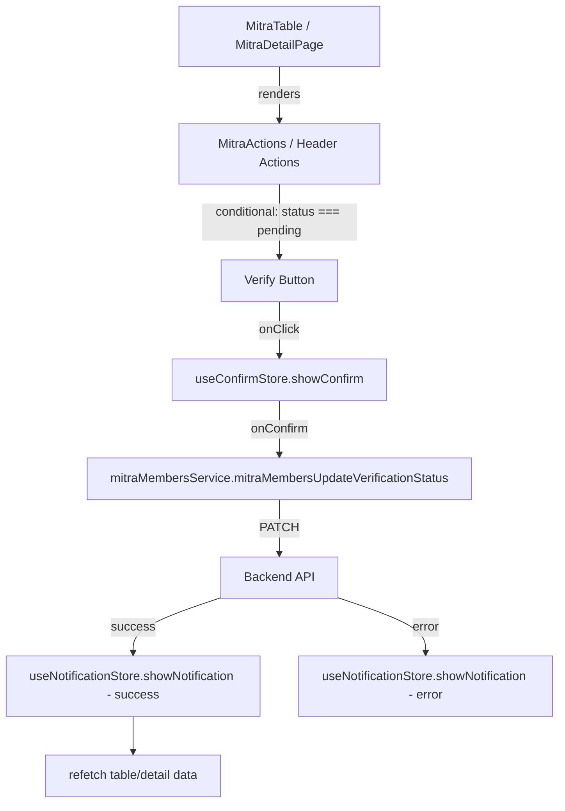

# Design Document: Mitra Verify Button

## Overview

This feature adds a "Verify" (approve) button to the Mitra Members module in the CRM backoffice. The button appears in two locations:

1. **Table row actions** — inline with existing View/Edit/Delete buttons
2. **Detail page header** — alongside the existing Edit button

The button is conditionally rendered only when a Mitra's `verification_status` is `pending`, and triggers a confirmation dialog before calling the existing backend endpoint `PATCH /backoffice/mitra-members/{id}/verification-status` with `{ verification_status: "approved" }`.

This follows the exact same pattern established by the Client Members verify button (FM-02-07), adapted for Mitra's multi-state verification model.

## Architecture



### Data Flow

1. User clicks verify button → `showConfirm()` opens confirmation dialog
2. User confirms → `onConfirm` callback fires → calls service function
3. Service sends `PATCH /backoffice/mitra-members/{id}/verification-status` with `{ verification_status: "approved" }`
4. On success: show success toast → call `refetch()` to reload data
5. On error: show error toast → dialog closes automatically (existing behavior)

### Key Design Decisions

- **Reuse existing patterns**: Follow the Client Members verify button implementation exactly (same component structure, same store usage, same error handling)
- **No new components**: The verify button is added directly to the existing `MitraActions` component and detail page — no new files needed for UI
- **Single service function**: One new function in the existing service file handles the verification status update
- **TypeScript union type for status**: The function parameter uses a string union type to enforce valid status values at compile time

## Components and Interfaces

### Modified Components

#### 1. `MitraActions` (in `mitra-table.tsx`)

**Changes:**

- Accept `verificationStatus` prop from parent column definition
- Add conditional verify button (visible only when `verificationStatus === "pending"`)
- Add `handleVerify` function following the same pattern as `ClientActions.handleVerify`

```typescript
function MitraActions({
  memberId,
  verificationStatus,
  onDeleted,
}: {
  memberId: number;
  verificationStatus: string;
  onDeleted: () => void;
}) {
  // ... existing code ...

  const handleVerify = () => {
    showConfirm({
      title: "Approve Mitra Verification?",
      description:
        "Mitra ini akan diverifikasi dan statusnya akan berubah menjadi approved. Mereka akan mendapatkan akses penuh ke platform.",
      confirmLabel: "Approve",
      cancelLabel: "Batal",
      onConfirm: async () => {
        try {
          const resp = await mitraMembersService.mitraMembersUpdateVerificationStatus(memberId, "approved");
          showNotification(resp.message, "success");
          onDeleted(); // triggers refetch
        } catch (err: unknown) {
          const apiError = err as { message?: string };
          showNotification(apiError.message || "Gagal memverifikasi mitra", "error");
          throw err;
        }
      },
    });
  };

  return (
    <div className="flex items-center justify-end gap-2 ...">
      {verificationStatus === "pending" && (
        <Button variant="ghost" size="icon" className="... hover:text-success-600 hover:bg-success-50 ..." aria-label="Verify" onClick={handleVerify}>
          <ShieldCheck size={16} />
        </Button>
      )}
      {/* existing View, Edit, Delete buttons */}
    </div>
  );
}
```

#### 2. `MitraMemberShowPage` (detail page)

**Changes:**

- Add verify button to the `actions` area of `DetailCardHeader`
- Add `handleVerify` function with same confirm flow
- Use `refetch` from `useDetailData` on success

```typescript
// In the actions prop of DetailCardHeader:
{verificationStatus === "pending" && (
  <Button variant="success" size="sm" onClick={handleVerify} className="gap-1.5">
    <ShieldCheck size={14} />
    Verify
  </Button>
)}
```

### Service Layer

#### New Function: `mitraMembersUpdateVerificationStatus`

Added to the existing `mitraMembersService` object:

```typescript
mitraMembersUpdateVerificationStatus: async (
  id: number,
  status: MitraVerificationStatus
): Promise<IApiResponse<IMitraUser>> => {
  return await api.patch(`/backoffice/mitra-members/${id}/verification-status`, {
    verification_status: status,
  });
},
```

## Data Models

### New Type: `MitraVerificationStatus`

Added to `mitra-members.types.ts`:

```typescript
export type MitraVerificationStatus =
  | "pending"
  | "approved"
  | "rejected"
  | "suspended";
```

This type already exists implicitly in the `IMitraProfile.verification_status` field. We extract it as a named type for reuse in the service function signature.

### Existing Types (No Changes)

- `IMitraUser` — already has `mitra.verification_status` field
- `IApiResponse<IMitraUser>` — standard response wrapper
- `IMitraProfile` — already defines the 4-state verification status

### Files Modified

| File                                                                                | Change                                                              |
| ----------------------------------------------------------------------------------- | ------------------------------------------------------------------- |
| `src/services/backoffice/mitra-members/mitra-members.types.ts`                      | Add `MitraVerificationStatus` type alias                            |
| `src/services/backoffice/mitra-members/mitra-members.service.ts`                    | Add `mitraMembersUpdateVerificationStatus` function                 |
| `src/app/(dashboard)/dashboard/mitra-members/_partials/mitra-table/mitra-table.tsx` | Add verify button to `MitraActions`, pass `verificationStatus` prop |
| `src/app/(dashboard)/dashboard/mitra-members/[id]/page.tsx`                         | Add verify button to detail page header actions                     |

## Correctness Properties

_A property is a characteristic or behavior that should hold true across all valid executions of a system — essentially, a formal statement about what the system should do. Properties serve as the bridge between human-readable specifications and machine-verifiable correctness guarantees._

### Property 1: Verify button visibility in table is determined by verification status

_For any_ Mitra member rendered in the table, the verify button (ShieldCheck) SHALL be visible if and only if `mitra.verification_status === "pending"`. For any other status value (`approved`, `rejected`, `suspended`), the verify button SHALL NOT be rendered.

**Validates: Requirements 2.1, 2.2**

### Property 2: API response message passthrough

_For any_ API response (success or error) returned by the verification endpoint, the notification toast SHALL display the exact `message` string from that response with the corresponding type (`"success"` for successful responses, `"error"` for error responses).

**Validates: Requirements 4.2, 4.4**

### Property 3: Verify button visibility in detail page is determined by verification status

_For any_ Mitra member displayed on the detail page, the verify button SHALL be visible in the header actions if and only if `mitra.verification_status === "pending"`. For any other status value, the verify button SHALL NOT be rendered.

**Validates: Requirements 5.1, 5.2**

## Error Handling

| Scenario                                   | Handling                                                                                           |
| ------------------------------------------ | -------------------------------------------------------------------------------------------------- | --- | ---------------------------------------------------------------------- |
| API returns error response                 | Show error toast with `response.message`, dialog closes automatically, table/detail data unchanged |
| Network failure                            | Caught by axios interceptor, error message shown via toast                                         |
| Mitra has no `mitra` profile (null)        | Treat as non-pending — verify button hidden (defensive: `mitra?.verification_status                |     | "pending"`already exists but verify button checks explicit`"pending"`) |
| Concurrent verification (already approved) | Backend returns error, toast shows backend message                                                 |

The error handling follows the exact same pattern as the existing delete and client verify actions — try/catch in the `onConfirm` callback, with `throw err` to signal the ConfirmDialog to stop loading.

## Testing Strategy

### Unit Tests (Example-Based)

- Verify button renders with correct props (variant, size, aria-label, className)
- Confirm dialog is called with correct title, description, confirmLabel, cancelLabel
- Service function calls correct endpoint with correct payload
- Refetch is triggered on success
- Refetch is NOT triggered on error

### Property Tests

Property-based testing is applicable for this feature's conditional rendering logic. Use `vitest` with `fast-check` for property-based tests.

**Configuration:**

- Minimum 100 iterations per property test
- Tag format: `Feature: mitra-verify-button, Property {number}: {property_text}`

**Property 1**: Generate random `IMitraUser` objects with varying `verification_status` values. Assert that the verify button presence matches `status === "pending"`.

**Property 2**: Generate random message strings. Mock the API to return them. Assert that `showNotification` receives the exact same string.

**Property 3**: Same as Property 1 but for the detail page component.

### Integration Tests

- End-to-end flow: click verify → confirm → API call → toast → table refresh
- Cancel flow: click verify → cancel → no API call
