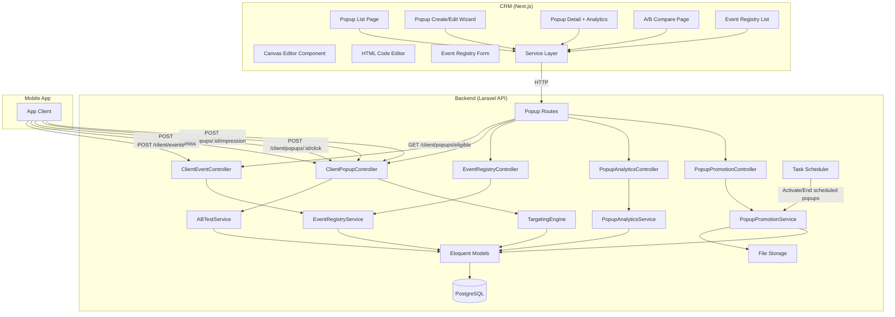
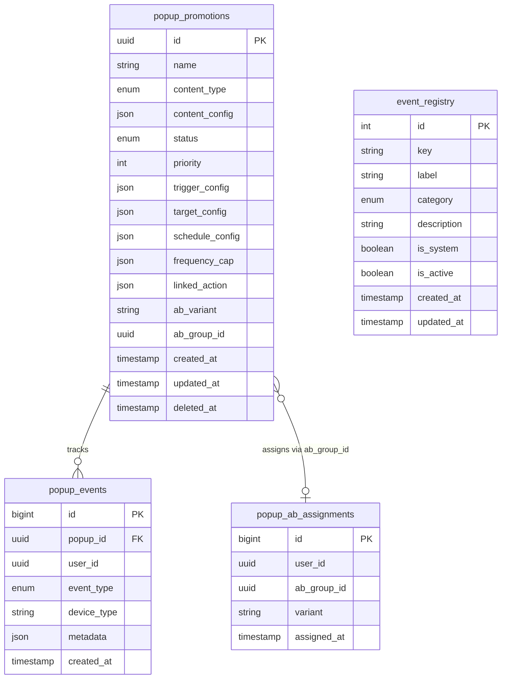
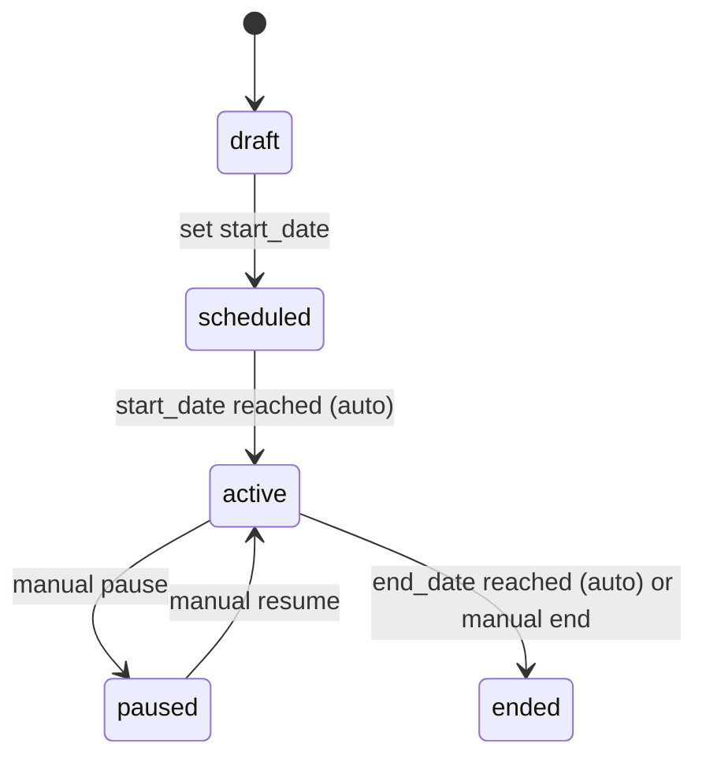

# Design Document — In-App Popup Promotion Management

## Overview

In-App Popup Promotion Management adalah fitur marketing module untuk membuat dan mengelola popup promosi yang ditampilkan di mobile app. Fitur ini mendukung 4 mode pembuatan konten (template, image upload, canvas editor, HTML code), advanced targeting & triggers (event-based dengan metadata matching), A/B testing, dan full conversion analytics.

Scope implementasi:

- **Backend (Laravel API)**: CRUD endpoints, status lifecycle, targeting engine, A/B assignment, analytics aggregation, event ingestion, event registry.
- **CRM (Next.js)**: Management pages (list, wizard create/edit, detail+analytics, A/B compare), canvas editor component, event registry pages.
- **Mobile App**: Hanya consume API — tidak termasuk dalam scope implementasi.

### Design Decisions

| Decision                            | Rationale                                                                         |
| ----------------------------------- | --------------------------------------------------------------------------------- |
| Monolithic CRM module               | Konsisten dengan pattern existing (banners, vouchers, referrals), single codebase |
| 4 content modes                     | Flexibility: quick (template), custom visual (image/canvas), full control (HTML)  |
| Canvas editor extends BannerEditor  | Reuse existing drag & drop infrastructure, familiar pattern                       |
| JSON config over rendered images    | Mobile app render native → better performance, responsive, dynamic                |
| HTML mode via WebView               | Fallback untuk layout yang terlalu complex untuk native render                    |
| Event Registry sebagai master data  | Reusable across popup triggers dan analytics, single source of truth              |
| System events = journey funnel only | Hardcoded di backend business flow, read-only di CRM                              |
| page_viewed = custom event          | Fired by mobile app, bisa di-edit/configure dari CRM                              |
| Metadata matching untuk triggers    | Flexible — bisa target specific screens/categories tanpa hardcode                 |
| Attribution window per popup        | Different campaigns need different conversion windows                             |
| Platform-agnostic API               | Mobile first, web bisa consume endpoint yang sama nanti                           |
| Location/city skipped               | Belum ada data kota di sistem saat ini                                            |

## Architecture

### System Architecture



### Data Model



### Status Lifecycle



## Component Design

### Backend Components

#### PopupPromotionService

Handles CRUD, status transitions, duplication, and file management for popup promotions.

- `getAllPopups(params)` — paginated list with filters
- `getPopupById(id)` — detail with full config
- `createPopup(data)` — create with image handling
- `updatePopup(popup, data)` — update with image handling
- `deletePopup(popup)` — soft delete
- `changeStatus(popup, newStatus)` — validate transition, update
- `duplicatePopup(popup)` — clone with status=draft
- `createABVariant(popup)` — clone as variant B, generate ab_group_id
- `activateScheduledPopups()` — cron: scheduled→active
- `endExpiredPopups()` — cron: active→ended

#### TargetingEngine

Determines which popups are eligible for a given user context.

- `getEligiblePopup(user, context)` — returns highest priority eligible popup
- `matchesTarget(popup, user)` — check user_type, journey_stage, platform, segment
- `matchesSchedule(popup, now)` — check date range, time window, days
- `matchesFrequencyCap(popup, user)` — check daily/session/lifetime limits
- `matchesTrigger(popup, event)` — check trigger rules including metadata conditions

#### ABTestService

Manages A/B variant assignment and retrieval.

- `getOrAssignVariant(user, abGroupId)` — sticky assignment
- `getComparisonMetrics(abGroupId)` — side-by-side stats

#### PopupAnalyticsService

Aggregates and returns analytics data.

- `getAggregateMetrics(popupId, dateRange)` — impressions, clicks, CTR, conversions, CVR
- `getTimeline(popupId, granularity)` — daily/weekly chart data
- `getBreakdown(popupId, dimension)` — by device, journey_stage, time_of_day
- `trackEvent(popupId, userId, eventType, metadata)` — record popup event
- `checkConversion(popupId, userId)` — check if linked_action completed within attribution window

#### EventRegistryService

Manages event registry CRUD.

- `getAllEvents(params)` — list system + custom events
- `createEvent(data)` — create custom event (validate not system)
- `updateEvent(event, data)` — update custom event
- `deleteEvent(event)` — delete custom event (block system events)
- `validateEventKey(key)` — check exists and is active

### Frontend Components

#### PopupCanvasEditor (extends BannerEditor pattern)

New component at `src/app/components/ui/PopupEditor/`:

- `PopupCanvasEditor.tsx` — main canvas (vertical aspect ratio 3:4), drag & drop elements
- `PopupElementPanel.tsx` — right panel, form-based property editing per selected element
- `PopupBackgroundSelector.tsx` — enhanced: solid, gradient (2-4 stops, angle/radial), image, pattern
- `PopupColorPicker.tsx` — preset swatches + hex input + visual picker + opacity slider
- `PopupGradientEditor.tsx` — color stops bar, direction config, live preview
- `PopupTemplateSelector.tsx` — template gallery with slot forms
- `PopupHtmlEditor.tsx` — Monaco/CodeMirror + live preview split
- `PopupPreviewModal.tsx` — mobile frame preview

#### Wizard Form (Create/Edit)

Multi-step form at `src/app/(dashboard)/dashboard/popup-promotions/create/`:

- Step 1: BasicInfoStep — name, content_type, priority
- Step 2: ContentStep — renders appropriate editor based on content_type
- Step 3: TargetingStep — user type, journey stage, device, segment, trigger rules, frequency cap
- Step 4: SchedulingStep — dates, time window, days, A/B toggle
- Step 5: ReviewStep — summary + preview + publish actions

#### Analytics Dashboard (Detail Page)

At `src/app/(dashboard)/dashboard/popup-promotions/[id]/page.tsx`:

- StatCards row: impressions, clicks, CTR, conversions, CVR
- Line chart: timeline (impressions + clicks over time)
- Bar charts: breakdown by device, journey stage
- Heatmap or bar: time of day effectiveness

## API Design

### Backoffice Endpoints

```
# Popup Promotions CRUD
GET    /api/v1/marketing/popup-promotions              # List + filter + pagination
POST   /api/v1/marketing/popup-promotions              # Create
GET    /api/v1/marketing/popup-promotions/{id}         # Detail
PUT    /api/v1/marketing/popup-promotions/{id}         # Update
DELETE /api/v1/marketing/popup-promotions/{id}         # Soft delete
PATCH  /api/v1/marketing/popup-promotions/{id}/status  # Change status
POST   /api/v1/marketing/popup-promotions/{id}/duplicate    # Duplicate
POST   /api/v1/marketing/popup-promotions/{id}/ab-variant   # Create variant B

# Popup Analytics
GET    /api/v1/marketing/popup-promotions/{id}/analytics           # Aggregate metrics
GET    /api/v1/marketing/popup-promotions/{id}/analytics/timeline  # Chart data
GET    /api/v1/marketing/popup-promotions/{id}/analytics/breakdown # By dimension
GET    /api/v1/marketing/popup-promotions/{id}/compare             # A/B comparison

# Event Registry
GET    /api/v1/marketing/event-registry       # List all
POST   /api/v1/marketing/event-registry       # Create custom event
PUT    /api/v1/marketing/event-registry/{id}  # Update custom event
DELETE /api/v1/marketing/event-registry/{id}  # Delete custom event
```

### Mobile App Endpoints

```
GET    /api/v1/client/popups/eligible          # Get eligible popup for current user
POST   /api/v1/client/popups/{id}/impression   # Track impression
POST   /api/v1/client/popups/{id}/click        # Track click
POST   /api/v1/client/popups/{id}/dismiss      # Track dismiss
POST   /api/v1/client/events                   # Generic event ingestion
```

### Key Request/Response Schemas

**POST /api/v1/marketing/popup-promotions (Create):**

```json
{
  "name": "Welcome Promo Q2",
  "content_type": "canvas",
  "content_config": { "elements": [...], "background": {...} },
  "priority": 10,
  "trigger_config": {
    "rules": [
      { "type": "event", "event_key": "page_viewed", "metadata_conditions": [
        { "field": "screen", "operator": "equals", "value": "home" }
      ]},
      { "type": "delay", "delay_seconds": 5 }
    ],
    "combine": "and"
  },
  "target_config": {
    "user_types": ["client"],
    "journey_stages": ["registered"],
    "platforms": ["android", "ios"],
    "segment_ids": []
  },
  "schedule_config": {
    "start_date": "2026-05-15T00:00:00Z",
    "end_date": "2026-06-15T00:00:00Z",
    "time_window": { "start": "08:00", "end": "22:00" },
    "days_of_week": null
  },
  "frequency_cap": {
    "max_per_day": 1,
    "max_per_session": 1,
    "max_lifetime": 3,
    "cooldown_minutes": 60
  },
  "linked_action": {
    "type": "deeplink",
    "value": "lingkar://services/cleaning",
    "attribution_window_hours": 24
  }
}
```

**GET /api/v1/client/popups/eligible (Response):**

```json
{
  "data": {
    "id": "uuid-here",
    "content_type": "canvas",
    "content_config": {
      "aspect_ratio": "3:4",
      "background": {
        "type": "gradient",
        "colors": ["#667EEA", "#764BA2"],
        "direction": "to-bottom"
      },
      "elements": [
        {
          "type": "text",
          "content": "Diskon 50%!",
          "x": 50,
          "y": 100,
          "font_size": 32,
          "font_color": "#FFFFFF",
          "font_weight": "bold"
        },
        {
          "type": "cta_button",
          "text": "Pesan Sekarang",
          "x": 80,
          "y": 400,
          "bg_color": "#FF5733",
          "text_color": "#FFFFFF",
          "action": "deeplink://services/cleaning"
        },
        { "type": "close_button", "x": 280, "y": 20 }
      ]
    },
    "trigger_config": {
      "rules": [{ "type": "delay", "delay_seconds": 5 }],
      "combine": "and"
    },
    "linked_action": {
      "type": "deeplink",
      "value": "lingkar://services/cleaning"
    },
    "ab_variant": "A"
  }
}
```

**POST /api/v1/client/events (Request):**

```json
{
  "event_key": "page_viewed",
  "metadata": {
    "screen": "service_detail",
    "service_id": 42,
    "category": "cleaning"
  }
}
```
