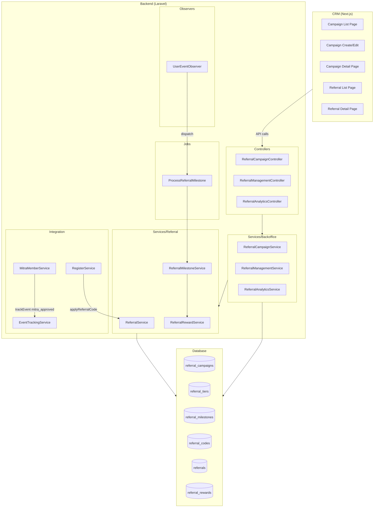
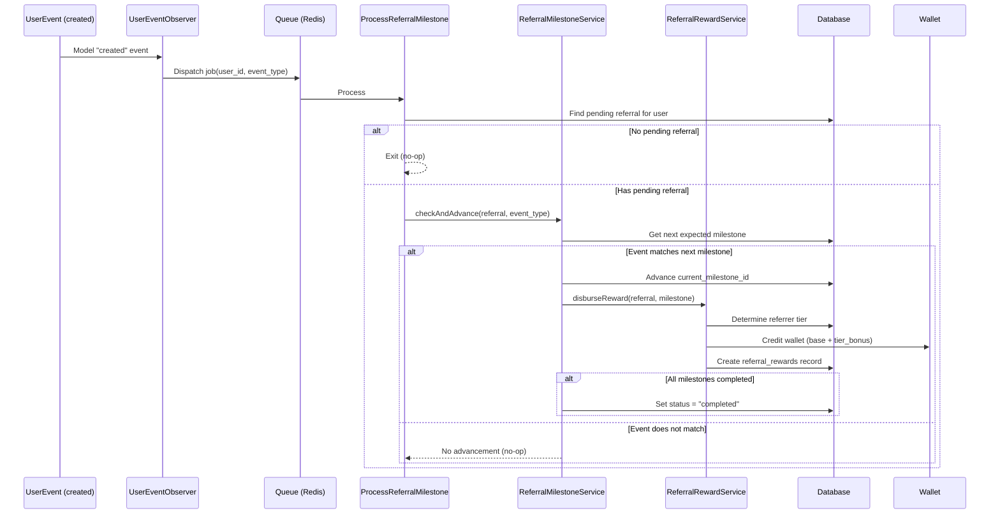
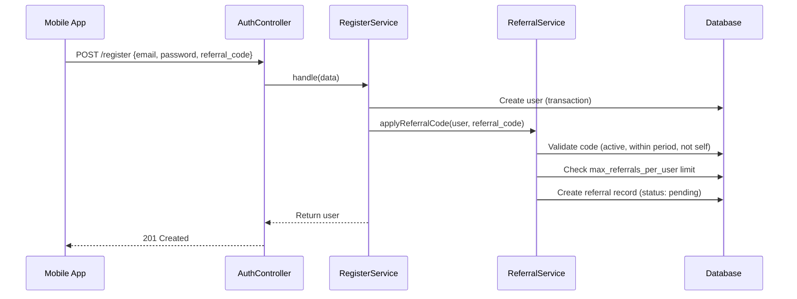
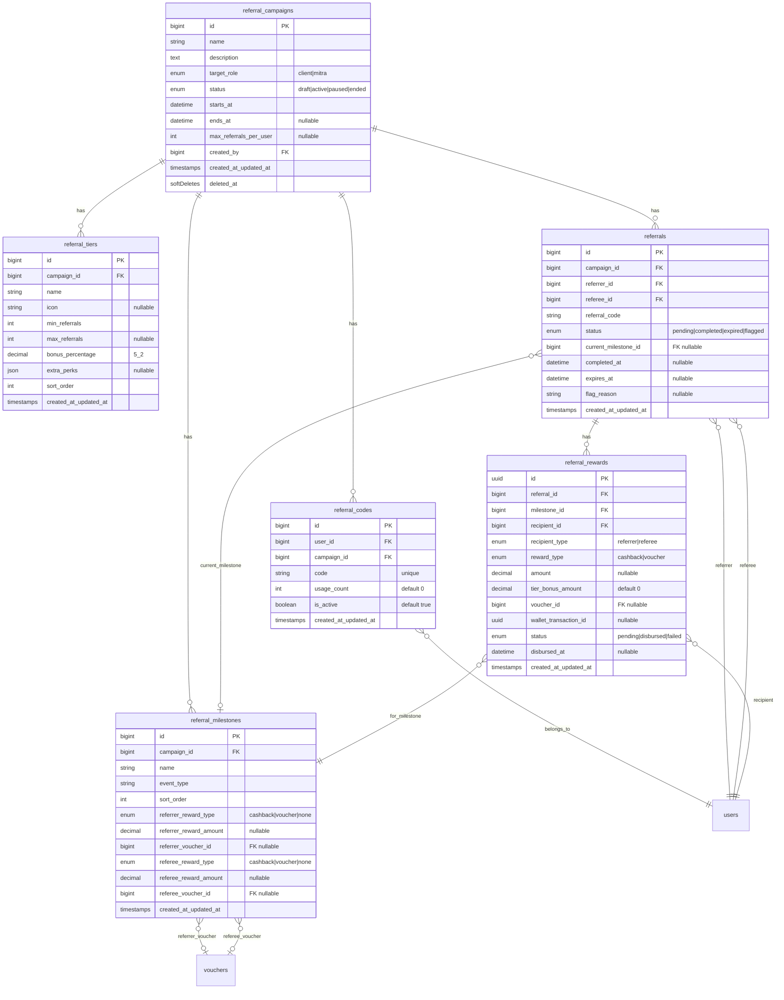

# Design Document: Referral Program

## Overview

Referral Program memungkinkan Client dan Mitra mengajak user baru bergabung ke platform Lingkar melalui kode referral. Sistem ini mengimplementasikan multi-milestone reward disbursement yang diproses otomatis melalui `UserEventObserver` pattern, dengan tier system yang memberikan bonus tambahan untuk referrer aktif.

**Key Design Decisions:**

- **Observer-driven processing**: `UserEventObserver` dispatches `ProcessReferralMilestone` job on every `UserEvent` creation — decoupled, non-blocking, consistent with existing `UserObserver` pattern
- **Service layer split**: Core referral logic (`Services/Referral/`) separated from CRM-facing operations (`Services/Backoffice/`) for clear responsibility boundaries
- **Sequential milestone advancement**: Milestones processed strictly in sort_order — no skipping allowed
- **Idempotent job processing**: Same event processed multiple times produces same result — safe for queue retries
- **Reward types**: Wallet cashback (with tier bonus) and voucher auto-assign — extensible for future reward types

**Scope:** Backend (Laravel) + CRM (Next.js). Mobile app integration deferred to Phase 2.

---

## Architecture

### High-Level Architecture



### Request Flow: Milestone Processing



### Request Flow: Referral Code Application at Registration



---

## Components and Interfaces

### Backend Service Layer

#### ReferralService (`app/Services/Referral/ReferralService.php`)

Core service handling referral code lifecycle and application.

```php
class ReferralService
{
    /**
     * Generate a referral code for a user in a campaign.
     * Format: {NAME_PREFIX}{RANDOM_4} — e.g. "RIZKI7X2K"
     * Retries up to 3 times on collision.
     */
    public function generateCode(User $user, ReferralCampaign $campaign): ReferralCode;

    /**
     * Apply a referral code during registration.
     * Validates: code active, campaign active/in-period, not self-referral,
     * not over max limit, referee not already referred in campaign.
     * Creates referral record with status "pending".
     */
    public function applyReferralCode(User $referee, string $code): Referral;

    /**
     * Find active campaign for a given role.
     */
    public function getActiveCampaignForRole(string $role): ?ReferralCampaign;
}
```

#### ReferralMilestoneService (`app/Services/Referral/ReferralMilestoneService.php`)

Handles milestone progression logic.

```php
class ReferralMilestoneService
{
    /**
     * Check if event advances the referral's milestone.
     * Sequential processing: only advances to next expected milestone.
     * Idempotent: same event processed twice has no additional effect.
     */
    public function checkAndAdvance(Referral $referral, string $eventType): bool;

    /**
     * Get the next expected milestone for a referral.
     * Returns null if all milestones completed.
     */
    public function getNextMilestone(Referral $referral): ?ReferralMilestone;
}
```

#### ReferralRewardService (`app/Services/Referral/ReferralRewardService.php`)

Handles reward calculation and disbursement.

```php
class ReferralRewardService
{
    /**
     * Disburse rewards for a completed milestone.
     * Handles both referrer (with tier bonus) and referee (base only).
     * Records all attempts (success/failure) for audit.
     */
    public function disburseForMilestone(Referral $referral, ReferralMilestone $milestone): void;

    /**
     * Determine referrer's current tier based on completed referral count.
     * Returns null if below minimum tier threshold.
     */
    public function determineCurrentTier(User $referrer, ReferralCampaign $campaign): ?ReferralTier;

    /**
     * Calculate tier bonus amount.
     * Formula: base_amount * (bonus_percentage / 100)
     */
    public function calculateTierBonus(float $baseAmount, ReferralTier $tier): float;

    /**
     * Retry a failed reward disbursement.
     * Uses same configuration from original attempt.
     */
    public function retryDisbursement(ReferralReward $reward): ReferralReward;
}
```

#### ReferralCampaignService (`app/Services/Backoffice/ReferralCampaignService.php`)

CRM-facing campaign management.

```php
class ReferralCampaignService
{
    use ApiPaginationTrait;

    public function getAllCampaigns(): LengthAwarePaginator;
    public function getCampaignById(string $id): ReferralCampaign;
    public function createCampaign(array $data): ReferralCampaign;
    public function updateCampaign(ReferralCampaign $campaign, array $data): ReferralCampaign;
    public function deleteCampaign(ReferralCampaign $campaign): bool;
    public function updateStatus(ReferralCampaign $campaign, string $status): ReferralCampaign;

    // Tier management
    public function createTier(ReferralCampaign $campaign, array $data): ReferralTier;
    public function updateTier(ReferralTier $tier, array $data): ReferralTier;
    public function deleteTier(ReferralTier $tier): bool;

    // Milestone management
    public function createMilestone(ReferralCampaign $campaign, array $data): ReferralMilestone;
    public function updateMilestone(ReferralMilestone $milestone, array $data): ReferralMilestone;
    public function deleteMilestone(ReferralMilestone $milestone): bool;
}
```

#### ReferralManagementService (`app/Services/Backoffice/ReferralManagementService.php`)

```php
class ReferralManagementService
{
    use ApiPaginationTrait;

    public function getAllReferrals(): LengthAwarePaginator;
    public function getReferralById(string $id): Referral;
    public function flagReferral(Referral $referral, string $reason): Referral;
}
```

#### ReferralAnalyticsService (`app/Services/Backoffice/ReferralAnalyticsService.php`)

```php
class ReferralAnalyticsService
{
    public function getOverview(?int $campaignId, ?string $period): array;
    public function getLeaderboard(?int $campaignId, int $limit = 10): Collection;
    public function getTierDistribution(int $campaignId): Collection;
}
```

### Job: ProcessReferralMilestone

```php
class ProcessReferralMilestone implements ShouldQueue
{
    use Dispatchable, InteractsWithQueue, Queueable, SerializesModels;

    public function __construct(
        public int $userId,
        public string $eventType
    ) {}

    public function handle(ReferralMilestoneService $milestoneService): void
    {
        // 1. Find pending referral for this user
        // 2. If none → exit (no-op)
        // 3. Check and advance milestone
        // 4. If first milestone completed → increment usage_count
        // 5. If all milestones completed → mark referral as "completed"
    }
}
```

### Observer: UserEventObserver

```php
class UserEventObserver
{
    public function created(UserEvent $event): void
    {
        ProcessReferralMilestone::dispatch($event->user_id, $event->event_type);
    }
}
```

### CRM Service Layer

#### referral-campaigns.service.ts

```typescript
export const referralCampaignsService = {
  list: async (params: IReferralCampaignParams) => IApiListResponse<IReferralCampaign>;
  detail: async (id: number) => IApiResponse<IReferralCampaignDetail>;
  create: async (data: IReferralCampaignCreatePayload) => IApiResponse<IReferralCampaign>;
  update: async (id: number, data: IReferralCampaignUpdatePayload) => IApiResponse<IReferralCampaign>;
  delete: async (id: number) => IApiResponse<null>;
  updateStatus: async (id: number, status: string) => IApiResponse<IReferralCampaign>;
};
```

#### referrals.service.ts

```typescript
export const referralsService = {
  list: async (params: IReferralParams) => IApiListResponse<IReferral>;
  detail: async (id: number) => IApiResponse<IReferralDetail>;
  flag: async (id: number, reason: string) => IApiResponse<IReferral>;
  retryReward: async (rewardId: string) => IApiResponse<IReferralReward>;
};
```

#### referral-analytics.service.ts

```typescript
export const referralAnalyticsService = {
  overview: async (params: IAnalyticsParams) => IApiResponse<IReferralOverview>;
  leaderboard: async (params: ILeaderboardParams) => IApiResponse<IReferralLeaderboard[]>;
  tierDistribution: async (campaignId: number) => IApiResponse<ITierDistribution[]>;
};
```

### API Endpoints

#### Campaign Management (`/api/v1/backoffice/referral-campaigns`)

| Method | Endpoint                                     | Description                                    |
| ------ | -------------------------------------------- | ---------------------------------------------- |
| GET    | `/backoffice/referral-campaigns`             | Paginated list with status/target_role filters |
| POST   | `/backoffice/referral-campaigns`             | Create campaign with milestones + tiers        |
| GET    | `/backoffice/referral-campaigns/{id}`        | Detail with milestones, tiers                  |
| PUT    | `/backoffice/referral-campaigns/{id}`        | Update campaign                                |
| DELETE | `/backoffice/referral-campaigns/{id}`        | Soft delete                                    |
| PATCH  | `/backoffice/referral-campaigns/{id}/status` | Update status                                  |

#### Tier & Milestone (nested under campaign)

| Method | Endpoint                                               | Description      |
| ------ | ------------------------------------------------------ | ---------------- |
| GET    | `/backoffice/referral-campaigns/{id}/tiers`            | List tiers       |
| POST   | `/backoffice/referral-campaigns/{id}/tiers`            | Create tier      |
| PUT    | `/backoffice/referral-campaigns/{id}/tiers/{tierId}`   | Update tier      |
| DELETE | `/backoffice/referral-campaigns/{id}/tiers/{tierId}`   | Delete tier      |
| GET    | `/backoffice/referral-campaigns/{id}/milestones`       | List milestones  |
| POST   | `/backoffice/referral-campaigns/{id}/milestones`       | Create milestone |
| PUT    | `/backoffice/referral-campaigns/{id}/milestones/{mId}` | Update milestone |
| DELETE | `/backoffice/referral-campaigns/{id}/milestones/{mId}` | Delete milestone |

#### Referral Records (`/api/v1/backoffice/referrals`)

| Method | Endpoint                                  | Description                              |
| ------ | ----------------------------------------- | ---------------------------------------- |
| GET    | `/backoffice/referrals`                   | Paginated list with filters              |
| GET    | `/backoffice/referrals/{id}`              | Detail with milestone progress + rewards |
| PATCH  | `/backoffice/referrals/{id}/flag`         | Flag referral                            |
| PATCH  | `/backoffice/referral-rewards/{id}/retry` | Retry failed reward                      |

#### Analytics (`/api/v1/backoffice/referral-analytics`)

| Method | Endpoint                                           | Description    |
| ------ | -------------------------------------------------- | -------------- |
| GET    | `/backoffice/referral-analytics/overview`          | Stats summary  |
| GET    | `/backoffice/referral-analytics/leaderboard`       | Top referrers  |
| GET    | `/backoffice/referral-analytics/tier-distribution` | Tier breakdown |

---

## Data Models

### Entity Relationship Diagram



### Database Constraints

| Table                 | Constraint                  | Type   |
| --------------------- | --------------------------- | ------ |
| `referral_codes`      | `(user_id, campaign_id)`    | UNIQUE |
| `referrals`           | `(campaign_id, referee_id)` | UNIQUE |
| `referral_tiers`      | `(campaign_id, sort_order)` | UNIQUE |
| `referral_milestones` | `(campaign_id, sort_order)` | UNIQUE |
| `referral_milestones` | `(campaign_id, event_type)` | UNIQUE |
| `referral_codes`      | `code`                      | UNIQUE |

### Indexes

| Table                | Index                                         | Purpose                                     |
| -------------------- | --------------------------------------------- | ------------------------------------------- |
| `referrals`          | `(referee_id, status)`                        | Fast lookup in ProcessReferralMilestone job |
| `referrals`          | `(referrer_id, campaign_id, status)`          | Tier calculation (count completed)          |
| `referral_rewards`   | `(referral_id, milestone_id, recipient_type)` | Idempotency check                           |
| `referral_campaigns` | `(status, target_role)`                       | Campaign list filtering                     |
| `referral_codes`     | `(code)`                                      | Code lookup at registration                 |

### Integration Points (Existing Model Changes)

| Model/Service                                    | Change                                                                                                 |
| ------------------------------------------------ | ------------------------------------------------------------------------------------------------------ |
| `UserEvent`                                      | Add `TYPE_MITRA_APPROVED = 'mitra_approved'` to constants and `ALLOWED_EVENT_TYPES`                    |
| `WalletTransaction`                              | Add `TYPE_REFERRAL_REWARD = 'referral_reward'` constant                                                |
| `RegisterService::handle()`                      | Accept optional `referral_code` param, call `ReferralService::applyReferralCode()` after user creation |
| `MitraMemberService::updateVerificationStatus()` | Track `mitra_approved` event via `EventTrackingService` when status → approved                         |
| `AppServiceProvider`                             | Register `UserEventObserver` for `UserEvent` model                                                     |

---

## Correctness Properties

_A property is a characteristic or behavior that should hold true across all valid executions of a system — essentially, a formal statement about what the system should do. Properties serve as the bridge between human-readable specifications and machine-verifiable correctness guarantees._

### Property 1: Campaign data round-trip

_For any_ valid referral campaign configuration (including milestones and tiers), creating the campaign via the API and then fetching it by ID SHALL return an equivalent data structure with all milestones and tiers preserved.

**Validates: Requirements 1.3, 1.4, 24.5**

### Property 2: Campaign validation rejects invalid input

_For any_ campaign creation payload that violates at least one validation rule (empty name, invalid target_role, starts_at >= ends_at, non-positive max_referrals_per_user, duplicate milestone event_types, overlapping tier ranges, non-positive cashback amounts, or bonus_percentage outside [0,100]), the API SHALL reject the request with a validation error.

**Validates: Requirements 2.1, 2.2, 2.3, 2.4, 2.5, 2.7, 2.8, 2.10**

### Property 3: Referral code format compliance

_For any_ user name and active campaign, the generated referral code SHALL match the pattern `^[A-Z0-9]{1,5}[A-Z0-9]{4}$` where the first 1-5 characters are derived from the user's name (uppercase, alphanumeric only) and the last 4 characters are random alphanumeric.

**Validates: Requirements 6.1**

### Property 4: Referral initial state invariant

_For any_ successfully created referral record (via code application at registration), the referral SHALL have status "pending" and current_milestone_id as null.

**Validates: Requirements 7.7**

### Property 5: Sequential milestone advancement

_For any_ referral with a campaign containing N milestones ordered by sort_order, the ProcessReferralMilestone job SHALL only advance to the next expected milestone in sequence — never skip milestones, never go backwards, and only advance when the event_type matches the next milestone's event_type.

**Validates: Requirements 8.4, 8.5, 24.1**

### Property 6: Milestone processing idempotence

_For any_ event_type processed for the same user multiple times, the system SHALL produce the same result as processing it once — no duplicate rewards, no duplicate milestone advancements.

**Validates: Requirements 24.2**

### Property 7: Referral completion detection

_For any_ referral in a campaign with N milestones, when the Nth (final) milestone is completed, the referral status SHALL be updated to "completed" with a non-null completed_at timestamp.

**Validates: Requirements 8.7**

### Property 8: Tier bonus calculation correctness

_For any_ referrer with a completed referral count that falls within a tier's [min_referrals, max_referrals] range, the tier bonus SHALL equal `base_amount * (bonus_percentage / 100)`. For referrers below all tier minimums, the tier bonus SHALL be zero. For referee rewards, the tier bonus SHALL always be zero regardless of any tier configuration.

**Validates: Requirements 9.2, 9.6, 11.1, 11.2, 11.3**

### Property 9: Audit trail completeness

_For any_ reward disbursement attempt (whether successful or failed), a referral_rewards record SHALL exist with the correct status, and for successful cashback rewards, the associated WalletTransaction SHALL have reference_type "referral_reward" and reference_id pointing to the reward record ID.

**Validates: Requirements 24.3, 24.4**

### Property 10: Flagged referral freezes processing

_For any_ referral with status "flagged", the ProcessReferralMilestone job SHALL not advance milestones or disburse rewards, regardless of matching events.

**Validates: Requirements 12.5**

### Property 11: Campaign list filtering correctness

_For any_ combination of status and target_role filter parameters, all campaigns returned by the list endpoint SHALL match the specified filter criteria.

**Validates: Requirements 1.1**

### Property 12: Ordered responses invariant

_For any_ campaign's tiers or milestones returned by list endpoints, the items SHALL always be sorted in ascending sort_order.

**Validates: Requirements 4.5, 5.6**

### Property 13: Analytics conversion rate consistency

_For any_ set of referral data filtered by campaign_id and period, the reported conversion_rate SHALL equal completed_referrals divided by total_referrals (or 0 when total is 0), and the leaderboard SHALL be sorted in descending order by completed referral count.

**Validates: Requirements 14.1, 14.2**

---

## Error Handling

### Service Layer Errors

| Scenario                       | Error Type             | HTTP Status | Message                                                                    |
| ------------------------------ | ---------------------- | ----------- | -------------------------------------------------------------------------- |
| Campaign not found             | ModelNotFoundException | 404         | "Campaign tidak ditemukan"                                                 |
| Invalid referral code          | Exception              | 422         | "Kode referral tidak valid"                                                |
| Self-referral attempt          | Exception              | 422         | "Tidak dapat menggunakan kode referral sendiri"                            |
| Max referrals reached          | Exception              | 422         | "Referrer telah mencapai batas maksimum referral"                          |
| Referee already referred       | Exception              | 422         | "User sudah pernah direferral di campaign ini"                             |
| Campaign not active            | Exception              | 422         | "Campaign tidak aktif atau di luar periode"                                |
| Code generation collision (3x) | Exception              | 500         | "Gagal generate kode referral, silakan coba lagi"                          |
| Edit restricted field          | Exception              | 422         | "Tidak dapat mengubah target_role karena campaign memiliki referral aktif" |
| Delete milestone in use        | Exception              | 422         | "Tidak dapat menghapus milestone yang sudah diselesaikan"                  |
| Delete tier in use             | Exception              | 422         | "Tidak dapat menghapus tier yang sedang digunakan referrer"                |
| Wallet credit failure          | Exception (caught)     | —           | Reward status set to "failed", logged for retry                            |
| Voucher assign failure         | Exception (caught)     | —           | Reward status set to "failed", logged for retry                            |

### Job Error Handling

`ProcessReferralMilestone` job:

- **No pending referral**: Exit silently (expected case for non-referred users)
- **Flagged referral**: Exit silently (frozen state)
- **Event doesn't match next milestone**: Exit silently (out-of-order event)
- **Reward disbursement failure**: Catch exception, record as "failed" reward, do NOT fail the job (milestone still advances)
- **Unexpected exception**: Let job fail → Laravel retry mechanism (3 attempts with backoff)

### API Response Format

All errors follow the standard `ApiResponse::error()` format:

```json
{
  "success": false,
  "message": "Kode referral tidak valid",
  "data": null,
  "meta": {
    "http_status": 422
  }
}
```

---

## Testing Strategy

### Property-Based Testing

**Library:** [Pest PHP](https://pestphp.com/) with custom data providers for property-based testing patterns. Each property test runs minimum 100 iterations with randomized inputs.

**Tag format:** `Feature: referral-program, Property {number}: {property_text}`

Properties to implement as PBT:

- Property 1: Campaign round-trip (generate random valid configs, create → fetch → compare)
- Property 2: Validation rejection (generate random invalid payloads, verify rejection)
- Property 3: Code format (generate random names, verify regex match)
- Property 4: Initial state (generate random valid referrals, verify pending/null)
- Property 5: Sequential advancement (generate random milestone sequences, verify order)
- Property 6: Idempotence (process same event N times, verify single result)
- Property 7: Completion detection (generate N-milestone campaigns, complete all, verify status)
- Property 8: Tier bonus calculation (generate random amounts/percentages, verify formula)
- Property 9: Audit trail (generate random disbursements, verify records exist)
- Property 10: Flagged freeze (flag referrals, fire events, verify no advancement)
- Property 11: Filter correctness (generate random data + filters, verify results match)
- Property 12: Ordering (generate random sort_orders, verify response sorted)
- Property 13: Analytics consistency (generate random data, verify math)

### Unit Tests (Example-Based)

Focus areas:

- Campaign CRUD operations (create, update, delete, status change)
- Edit restrictions (active referrals prevent target_role change)
- Referral code application edge cases (self-referral, max limit, inactive code)
- Reward retry flow (success and repeated failure)
- Observer dispatch verification
- Integration points (RegisterService, MitraMemberService)

### Integration Tests

- Full milestone processing flow: register with code → track events → verify rewards
- Wallet credit with WalletTransaction creation
- Voucher assignment with VoucherUser creation
- Campaign with multiple referrals and tier progression
- Analytics endpoint accuracy with seeded data

### CRM Frontend Tests

- Component rendering tests for all 6 pages
- Form validation behavior (Campaign Editor)
- Filter/search interaction
- Status badge rendering
- Milestone timeline visualization
- Conditional field display (cashback vs voucher inputs)

### Test Data Strategy

- Factory classes: `ReferralCampaignFactory`, `ReferralTierFactory`, `ReferralMilestoneFactory`, `ReferralCodeFactory`, `ReferralFactory`, `ReferralRewardFactory`
- Seeder: `ReferralProgramSeeder` for development/demo data
- Property test generators: Random valid campaign configs, random user names, random tier configurations
