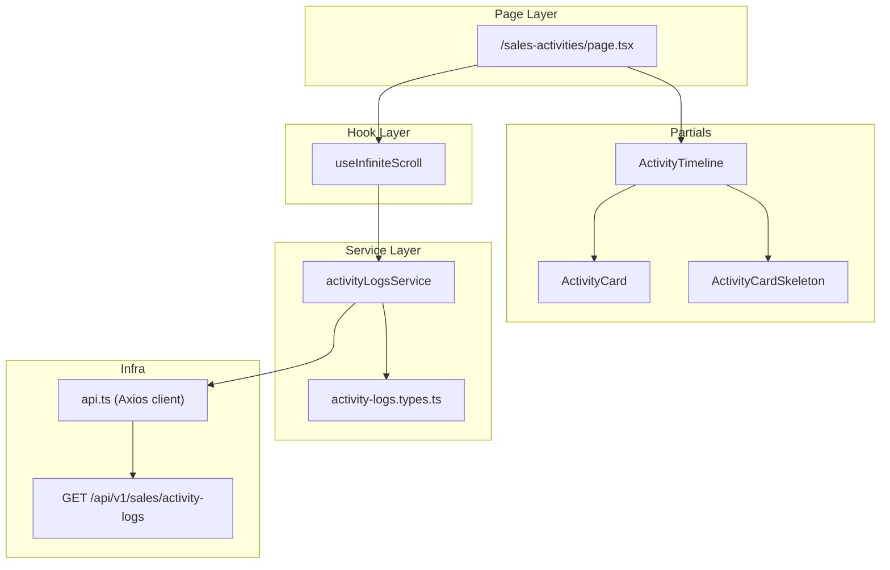
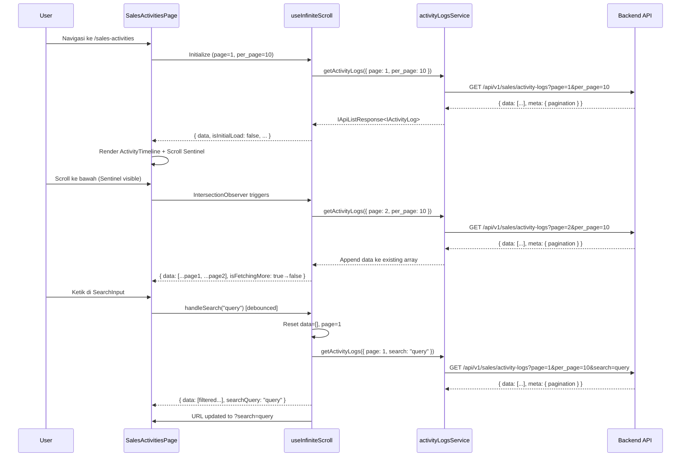

# Design Document: Sales Activities Timeline List Page

## Overview

Fitur Sales Activities menyediakan halaman daftar aktivitas sales dalam format **timeline/list view** (bukan tabel). Halaman ini menampilkan activity log milik sales user yang sedang login secara kronologis, dengan dukungan pencarian (debounced, synced ke URL) dan infinite scroll menggunakan IntersectionObserver.

Arsitektur mengikuti pola yang sudah ada di project:

- **Service layer** (`src/services/sales/activity-logs/`) untuk typed API calls
- **Custom hook** (`useInfiniteScroll`) untuk data fetching dengan append-based pagination
- **Page component** di `src/app/(dashboard)/sales-activities/page.tsx`
- **Timeline components** sebagai partials di `_partials/`

Data diambil dari endpoint `GET /api/v1/sales/activity-logs` yang sudah tersedia di backend dengan pagination (`page`, `per_page`, `search`).

### Design Decisions

1. **Timeline view, bukan TableCard** — Berbeda dari halaman list lain yang menggunakan `TableCard`, halaman ini menggunakan custom timeline layout karena data bersifat kronologis dan membutuhkan visual yang berbeda (ikon tipe, waktu relatif, status badge).

2. **Custom `useInfiniteScroll` hook** — Hook `useTableData` yang ada dirancang untuk pagination berbasis halaman (page 1, 2, 3...) dengan replace data. Infinite scroll membutuhkan append behavior, sehingga perlu hook baru yang mengikuti pola `useReducer` + `queueMicrotask` yang sama untuk React 19 compliance.

3. **URL search sync** — Mengikuti pola `useTableData` yang sudah sync `?search=` ke URL, hook baru juga akan sync search parameter ke URL query string.

4. **Reuse existing components** — `Badge` (dari `@app/components/ui/Table`), `SearchInput`, `Button` digunakan langsung. Komponen baru hanya `ActivityCard` dan `ActivityCardSkeleton`.

---

## Architecture



### Data Flow



---

## Components and Interfaces

### 1. Service Layer: `src/services/sales/activity-logs/`

**File structure:**

```
src/services/sales/activity-logs/
├── index.ts                    # Re-exports
├── activity-logs.types.ts      # Type definitions
└── activity-logs.service.ts    # API call functions
```

**`activity-logs.types.ts`:**

```typescript
import type { IPaginationParams } from "@services/general";

/** Activity log type enum matching backend constants */
export type ActivityLogType =
  | "general_note"
  | "request_lead_assign"
  | "request_update_lead_status";

/** Activity log status enum matching backend constants */
export type ActivityLogStatus = "pending" | "approved" | "rejected";

/** Lead info embedded in activity log response */
export interface IActivityLogLead {
  id: number;
  name: string;
  lead_id: string;
}

/** Single activity log item from GET /sales/activity-logs */
export interface IActivityLog {
  id: number;
  user_id: number;
  lead_id: number | null;
  type: ActivityLogType;
  title: string;
  description: string | null;
  attachment: string | null;
  status: ActivityLogStatus;
  metadata: Record<string, unknown> | null;
  lead: IActivityLogLead | null;
  created_at: string;
  updated_at: string;
}

/** Query params for activity logs list endpoint */
export interface IActivityLogParams extends IPaginationParams {
  search?: string;
}
```

**`activity-logs.service.ts`:**

```typescript
import { api } from "@lib/api";
import type { IApiListResponse, IPaginationMeta } from "@services/general";
import type { IActivityLog, IActivityLogParams } from "./activity-logs.types";

export const activityLogsService = {
  /** GET /sales/activity-logs — paginated list of current user's activity logs */
  getActivityLogs: async (
    params: IActivityLogParams = {}
  ): Promise<IApiListResponse<IActivityLog, IPaginationMeta>> => {
    return await api.get("/sales/activity-logs", { params });
  },
};
```

### 2. Hook: `useInfiniteScroll`

**File:** `src/lib/hooks/use-infinite-scroll.ts`

Hook baru yang mengikuti pola project (`useReducer` + `queueMicrotask` untuk React 19 compliance) dengan behavior khusus infinite scroll:

```typescript
export interface UseInfiniteScrollOptions<
  TData,
  TParams extends IPaginationParams,
> {
  /** API service function that returns a paginated list response. */
  fetcher: (
    params: TParams
  ) => Promise<IApiListResponse<TData, IPaginationMeta>>;
  /** Extra params beyond page & per_page. */
  initialParams?: Omit<TParams, "page" | "per_page">;
  /** Items per page. Defaults to 10. */
  perPage?: number;
  /** Sync search param to URL ?search=. Defaults to true. */
  syncUrl?: boolean;
}

export interface UseInfiniteScrollReturn<
  TData,
  TParams extends IPaginationParams,
> {
  /** Accumulated data from all loaded pages. */
  data: TData[];
  /** True during first page load (no data yet). Shows skeleton. */
  isInitialLoad: boolean;
  /** True while loading the next page. Shows bottom spinner. */
  isFetchingMore: boolean;
  /** Error message if fetch failed, otherwise null. */
  error: string | null;
  /** Error specifically from load-more (next page fetch). */
  loadMoreError: string | null;
  /** Whether more pages are available. */
  hasMore: boolean;
  /** Trigger loading the next page. Called by IntersectionObserver. */
  loadMore: () => void;
  /** Retry loading the next page after a load-more error. */
  retryLoadMore: () => void;
  /** Set search query. Resets data and page to 1. Syncs to URL. */
  handleSearch: (query: string) => void;
  /** Current search query value. */
  searchQuery: string;
  /** Ref to attach to the scroll sentinel element. */
  sentinelRef: React.RefObject<HTMLDivElement>;
  /** Whether component has mounted (safe to render client-only content). */
  isMounted: boolean;
}
```

**Key implementation details:**

- Menggunakan `useReducer` dengan state machine (`idle` → `loading` → `success`/`error`) untuk menghindari synchronous setState di useEffect (React 19 compliance).
- `loadMore` mengappend data baru ke array existing, bukan replace.
- `handleSearch` mereset `data` ke `[]`, `page` ke `1`, dan sync ke URL `?search=`.
- IntersectionObserver di-setup via `useEffect` pada `sentinelRef`, hanya trigger `loadMore` jika `hasMore && !isFetchingMore`.
- `hasMore` dihitung dari `current_page < last_page`.
- URL sync menggunakan `useSearchParams` + `useRouter` + `usePathname` (pola sama dengan `useTableData`).

### 3. Page Component: `src/app/(dashboard)/sales-activities/page.tsx`

```typescript
// Structure overview
export default function SalesActivitiesPage() {
  const { data, isInitialLoad, isFetchingMore, error, loadMoreError,
          hasMore, handleSearch, searchQuery, sentinelRef, retryLoadMore } =
    useInfiniteScroll<IActivityLog, IActivityLogParams>({
      fetcher: activityLogsService.getActivityLogs,
      perPage: 10,
    });

  return (
    <div className="w-full space-y-6">
      {/* Page Header */}
      <div className="flex items-center justify-between">
        <div>
          <h1>Sales Activities</h1>
          <p>Riwayat aktivitas dan laporan Anda</p>
        </div>
        <Button href="/sales-activities/create" variant="primary">
          + New Report
        </Button>
      </div>

      {/* Search Bar */}
      <SearchInput value={searchQuery} onSearch={handleSearch} />

      {/* Content States */}
      {isInitialLoad ? <SkeletonList /> : null}
      {error && data.length === 0 ? <ErrorState /> : null}
      {!isInitialLoad && !error && data.length === 0 ? <EmptyState /> : null}

      {/* Timeline */}
      {data.length > 0 && <ActivityTimeline items={data} />}

      {/* Load More States */}
      {isFetchingMore && <LoadingMoreIndicator />}
      {loadMoreError && <LoadMoreError onRetry={retryLoadMore} />}

      {/* Scroll Sentinel */}
      {hasMore && !isFetchingMore && <div ref={sentinelRef} />}
    </div>
  );
}
```

### 4. Timeline Components: `src/app/(dashboard)/sales-activities/_partials/`

**File structure:**

```
src/app/(dashboard)/sales-activities/_partials/
├── activity-timeline/
│   ├── index.ts
│   └── activity-timeline.tsx      # Timeline container with vertical line
├── activity-card/
│   ├── index.ts
│   └── activity-card.tsx          # Single activity item card
└── activity-card-skeleton/
    ├── index.ts
    └── activity-card-skeleton.tsx  # Skeleton loading placeholder
```

**ActivityCard props:**

```typescript
interface ActivityCardProps {
  activity: IActivityLog;
}
```

**ActivityCard visual structure:**

```
┌─────────────────────────────────────────────────┐
│  🔵  Title of the Activity                      │
│  ┊   ┌──────────┐                               │
│  ┊   │ PENDING  │  Lead Name (if any)           │
│  ┊   └──────────┘                               │
│  ┊   Description text (truncated)...            │
│  ┊   2 hours ago                                │
└─────────────────────────────────────────────────┘
```

- **Type Icon**: Ikon bulat di kiri berdasarkan `activity.type`:
  - `general_note` → `FileText` (lucide) dengan bg tertiary
  - `request_lead_assign` → `UserPlus` (lucide) dengan bg primary
  - `request_update_lead_status` → `RefreshCw` (lucide) dengan bg warning
- **Status Badge**: Menggunakan `Badge` dari `@app/components/ui/Table`:
  - `pending` → `<Badge variant="warning">Pending</Badge>`
  - `approved` → `<Badge variant="success">Approved</Badge>`
  - `rejected` → `<Badge variant="error">Rejected</Badge>`
- **Lead Name**: Ditampilkan jika `activity.lead` tidak null, format: `Lead: {lead.name}`
- **Relative Time**: Menggunakan helper function `formatRelativeTime(created_at)` yang mengkonversi ISO timestamp ke format "2 jam lalu", "3 hari lalu", dll.

**ActivityCardSkeleton**: Skeleton placeholder yang menyerupai bentuk ActivityCard, menggunakan `Skeleton` component dari `@app/components/ui/Table`.

### 5. Routing & Sidebar Integration

**Routing (`src/config/routing.ts`):**

```typescript
const SALES_ACTIVITIES_SERVICES = {
  salesActivities: "/sales-activities",
  salesActivitiesCreate: "/sales-activities/create",
};
```

**Sidebar (`Sidebar.tsx`):**
Update `SALES_NAVS` array untuk mengarahkan "Sales Activity Report" ke `PATHS.salesActivities` (saat ini mengarah ke `PATHS.leads` yang salah).

**Middleware:** Route `/sales-activities` sudah ter-cover oleh dashboard layout group `(dashboard)` yang memerlukan authentication token.

---

## Data Models

### API Response Shape

**`GET /api/v1/sales/activity-logs?page=1&per_page=10&search=query`**

```json
{
  "success": true,
  "message": "Activity logs retrieved successfully",
  "data": [
    {
      "id": 1,
      "user_id": 5,
      "lead_id": 12,
      "type": "general_note",
      "title": "Follow up call with client",
      "description": "Discussed pricing options...",
      "attachment": "sales/activity-logs/abc123.pdf",
      "status": "pending",
      "metadata": null,
      "lead": {
        "id": 12,
        "name": "PT Maju Jaya",
        "lead_id": "LD-00012"
      },
      "created_at": "2025-07-10T08:30:00.000000Z",
      "updated_at": "2025-07-10T08:30:00.000000Z"
    }
  ],
  "meta": {
    "http_status": 200,
    "pagination": {
      "total": 45,
      "per_page": 10,
      "current_page": 1,
      "last_page": 5,
      "next_page_url": "...?page=2",
      "prev_page_url": null
    }
  }
}
```

### Frontend State Model (useInfiniteScroll)

```typescript
interface InfiniteScrollState<TData> {
  status:
    | "idle"
    | "loading"
    | "success"
    | "error"
    | "loading_more"
    | "load_more_error";
  data: TData[];
  page: number;
  hasMore: boolean;
  error: string | null;
  loadMoreError: string | null;
}
```

State transitions:

- `idle` → `loading` (initial fetch)
- `loading` → `success` (first page loaded)
- `loading` → `error` (first page failed)
- `success` → `loading_more` (scroll sentinel triggered)
- `loading_more` → `success` (next page appended)
- `loading_more` → `load_more_error` (next page failed)
- `load_more_error` → `loading_more` (retry)
- Any state → `loading` (search changed, reset)

### Helper Functions

**`formatRelativeTime(isoString: string): string`**
Mengkonversi ISO 8601 timestamp ke format waktu relatif dalam Bahasa Indonesia:

- < 1 menit: "Baru saja"
- < 60 menit: "X menit lalu"
- < 24 jam: "X jam lalu"
- < 7 hari: "X hari lalu"
- < 30 hari: "X minggu lalu"
- > = 30 hari: "X bulan lalu"

**`getActivityTypeConfig(type: ActivityLogType)`**
Returns `{ icon: LucideIcon, label: string, bgColor: string, iconColor: string }` mapping.

**`getStatusBadgeConfig(status: ActivityLogStatus)`**
Returns `{ label: string, variant: BadgeVariant }` mapping.

---

## Correctness Properties

_A property is a characteristic or behavior that should hold true across all valid executions of a system — essentially, a formal statement about what the system should do. Properties serve as the bridge between human-readable specifications and machine-verifiable correctness guarantees._

### Property 1: Activity log sort order is descending by created_at

_For any_ array of activity log objects with varying `created_at` timestamps, after applying the sort function, every item at index `i` should have a `created_at` value greater than or equal to the item at index `i+1`.

**Validates: Requirements 1.1**

### Property 2: Activity card renders all required fields

_For any_ valid `IActivityLog` object (with random type, status, title, and optional lead), the rendered ActivityCard should contain: the correct type icon, the title text, the correct status badge, the lead name (when lead is not null), and a relative time string derived from `created_at`.

**Validates: Requirements 1.2**

### Property 3: Search change resets accumulated data and page

_For any_ accumulated infinite scroll state containing N items across multiple pages, when `handleSearch` is called with any string (including empty string), the resulting state should have `data` as an empty array and `page` reset to `1`.

**Validates: Requirements 2.4, 2.5**

### Property 4: Infinite scroll appends data correctly

_For any_ existing data array of length N and a new page response containing M items, after the append operation, the resulting array should have length N + M, with the first N items unchanged and the last M items matching the new page response in order.

**Validates: Requirements 3.3**

### Property 5: hasMore boundary check

_For any_ pagination state with `current_page` and `last_page` values, `hasMore` should be `true` if and only if `current_page < last_page`.

**Validates: Requirements 3.5**

### Property 6: Loading guard prevents duplicate fetches

_For any_ sequence of IntersectionObserver trigger events, if `isFetchingMore` is `true`, subsequent triggers should not initiate additional API calls. Only one fetch should be in-flight at any time.

**Validates: Requirements 3.6**

### Property 7: Existing data preservation invariant

_For any_ accumulated data array, neither a load-more operation (while in progress) nor an API error should modify or remove the already-loaded items. The existing data array should remain identical before and after the operation.

**Validates: Requirements 4.2, 6.2**

### Property 8: Search URL sync round-trip

_For any_ non-empty search query string, calling `handleSearch(query)` should update the URL to contain `?search=query`. Conversely, loading the page with URL parameter `?search=query` should initialize the search input with that query and trigger an API call with the `search` parameter.

**Validates: Requirements 7.2, 7.3**

---

## Error Handling

### Error Scenarios

| Scenario           | Behavior                                  | UI                                                |
| ------------------ | ----------------------------------------- | ------------------------------------------------- |
| Initial load fails | Show error message, hide timeline         | Full-page error state with retry button           |
| Load-more fails    | Keep existing data, show error below list | Inline error message + "Coba lagi" button         |
| Network timeout    | Same as API failure                       | Same error UI with descriptive message            |
| 401 Unauthorized   | Handled by `api.ts` interceptor           | Redirect to `/login` (silent refresh or redirect) |

### Error State Components

1. **Initial Error**: Ditampilkan ketika `error !== null && data.length === 0`. Menampilkan ikon error, pesan deskriptif, dan tombol "Coba Lagi" yang memanggil `refetch()`.

2. **Load More Error**: Ditampilkan ketika `loadMoreError !== null`. Menampilkan pesan error inline di bawah daftar dengan tombol "Coba Lagi" yang memanggil `retryLoadMore()`.

3. **Graceful Degradation**: Jika load-more gagal, data yang sudah dimuat tetap ditampilkan (Property 7). User dapat retry tanpa kehilangan data sebelumnya.

---

## Testing Strategy

### Unit Tests (Example-Based)

Unit tests fokus pada specific examples dan edge cases:

1. **Type-to-icon mapping** (Req 1.3, 1.4, 1.5): Verify each activity type maps to the correct icon.
2. **Status-to-badge mapping** (Req 1.6, 1.7, 1.8): Verify each status maps to correct badge variant and label.
3. **Empty state messages** (Req 5.1, 5.2): Verify correct message shown for no-data vs no-search-results.
4. **Loading states** (Req 4.1, 4.2): Verify skeleton shown on initial load, spinner on load-more.
5. **Scroll sentinel visibility** (Req 3.2): Verify sentinel is rendered when hasMore is true.
6. **Retry button** (Req 6.3): Verify retry button appears on load-more error and triggers retry.
7. **Per-page config** (Req 3.1): Verify API calls include `per_page=10`.
8. **Search bar presence** (Req 2.1): Verify SearchInput is rendered at top of page.
9. **Route accessibility** (Req 7.1): Verify page renders at `/sales-activities`.

### Property-Based Tests

Property-based tests menggunakan **fast-check** library untuk TypeScript/JavaScript. Setiap property test dijalankan minimum **100 iterasi**.

| Property   | Test Tag                                                         | Description                                            |
| ---------- | ---------------------------------------------------------------- | ------------------------------------------------------ |
| Property 1 | `Feature: sales-activities, Property 1: sort order descending`   | Generate random activity log arrays, verify sort order |
| Property 2 | `Feature: sales-activities, Property 2: card renders all fields` | Generate random IActivityLog, verify rendered output   |
| Property 3 | `Feature: sales-activities, Property 3: search resets state`     | Generate random accumulated states + search queries    |
| Property 4 | `Feature: sales-activities, Property 4: append data correctly`   | Generate random existing + new page arrays             |
| Property 5 | `Feature: sales-activities, Property 5: hasMore boundary`        | Generate random current_page/last_page pairs           |
| Property 6 | `Feature: sales-activities, Property 6: loading guard`           | Generate random trigger sequences with loading states  |
| Property 7 | `Feature: sales-activities, Property 7: data preservation`       | Generate random data arrays, simulate errors           |
| Property 8 | `Feature: sales-activities, Property 8: search URL round-trip`   | Generate random search strings, verify URL sync        |

### Integration Tests

1. **Full page flow**: Mount page, verify initial load → data display → scroll → load more → search → reset.
2. **API error handling**: Mock API failures at various stages, verify graceful degradation.
3. **URL sync**: Navigate with `?search=` param, verify search is applied on mount.
