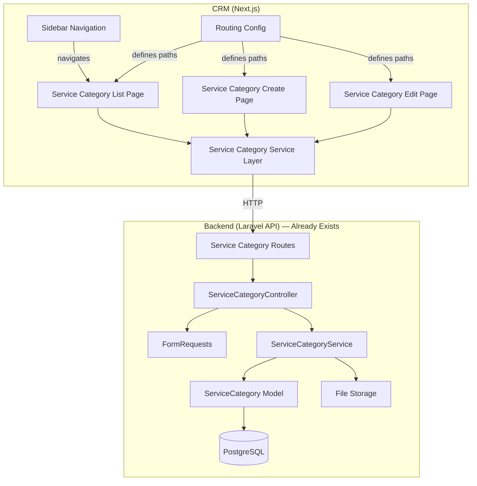
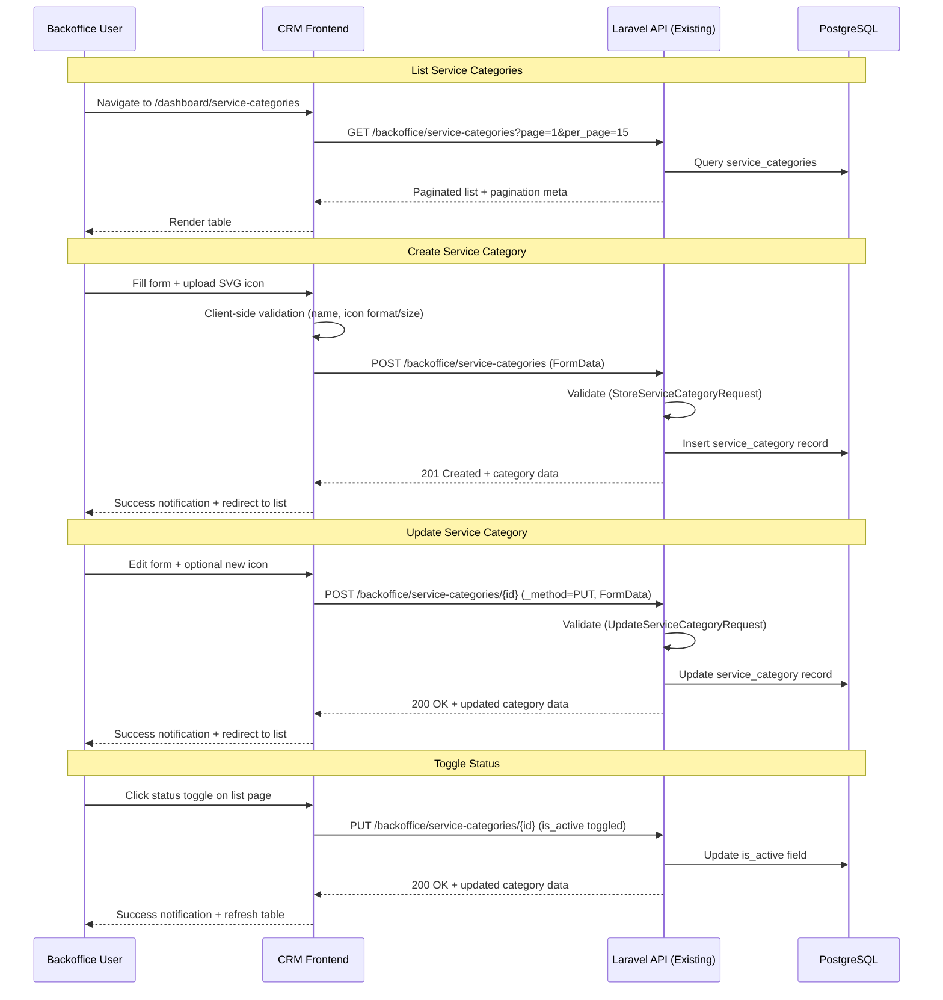
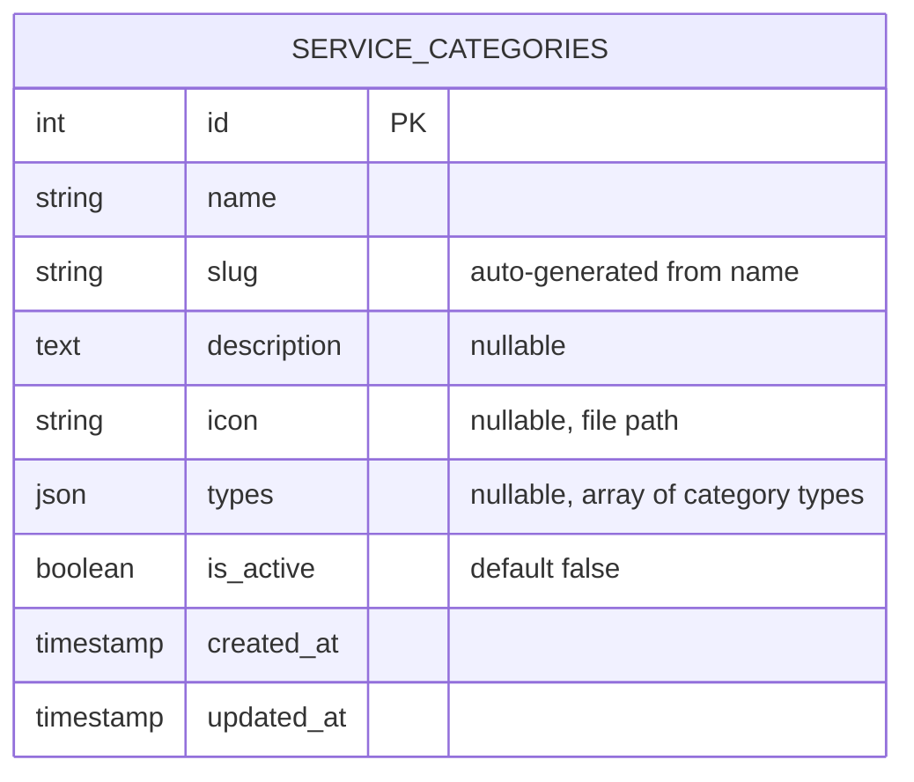
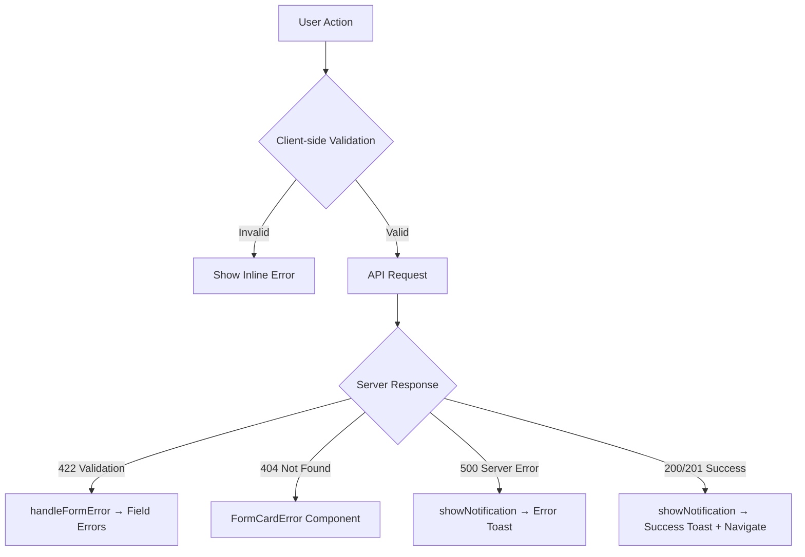

# Design Document — Service Category Management

## Overview

Service Category Management adalah fitur frontend CRM (Next.js) yang menyediakan antarmuka CRUD lengkap untuk mengelola kategori layanan (bidang) di sistem Lingkar ID. Backend Laravel sudah memiliki API endpoint CRUD di `/api/v1/backoffice/service-categories` dengan model `ServiceCategory`.

Fitur ini mencakup:

- **Service Layer**: Typed wrapper functions di `src/services/backoffice/service-categories/` untuk berkomunikasi dengan API backend.
- **List Page**: Tabel paginated dengan search, status toggle, edit, dan delete di `/dashboard/service-categories`.
- **Create Page**: Form untuk membuat kategori baru dengan upload ikon SVG di `/dashboard/service-categories/create`.
- **Edit Page**: Form untuk mengedit kategori yang sudah ada di `/dashboard/service-categories/{id}/edit`.
- **Sidebar Navigation**: Menu item "Service Categories" di sidebar CRM.
- **Routing**: Path configuration di `src/config/routing.ts`.

### Design Decisions

| Decision                                                        | Rationale                                                                                                                                             |
| --------------------------------------------------------------- | ----------------------------------------------------------------------------------------------------------------------------------------------------- |
| Mengikuti pattern banner service untuk CRUD dengan file upload  | Konsistensi arsitektur, banner service sudah proven untuk FormData + `_method=PUT` pattern                                                            |
| Types field menggunakan multi-checkbox, bukan multi-select      | UX lebih baik untuk jumlah opsi yang sedikit (4 opsi), user bisa melihat semua opsi sekaligus                                                         |
| Status toggle langsung di list page                             | Mengikuti pattern banner management, UX lebih cepat tanpa perlu navigasi ke edit page                                                                 |
| Sidebar item ditempatkan di group "Master Data" baru            | Service Categories adalah master data referensi, bukan transactional data. Grouping baru memisahkan concern dari User Management dan Sales Management |
| Backend API sudah ada, tidak perlu modifikasi                   | Fokus implementasi hanya di frontend CRM                                                                                                              |
| Icon preview menggunakan Next.js `<Image>` dengan `unoptimized` | SVG files tidak perlu optimasi Next.js image optimizer, dan menghindari masalah rendering                                                             |

## Architecture

### System Architecture



### Data Flow



## Components and Interfaces

### CRM Components

#### 1. Service Category Service (`src/services/backoffice/service-categories/`)

Mengikuti pattern yang sama dengan `bannersService`:

```typescript
// service-categories.types.ts
export type CategoryType = "general" | "daily" | "monthly" | "popular";

export interface IServiceCategory {
  id: number;
  name: string;
  slug: string;
  description: string | null;
  icon: string | null; // Full URL from backend accessor
  types: CategoryType[] | null;
  is_active: boolean;
  created_at: string;
  updated_at: string;
}

export interface IServiceCategoryParams extends IPaginationParams {
  // Extensible for future filters (e.g., is_active, type)
}

// service-categories.service.ts
export const serviceCategoriesService = {
  list: (params: IServiceCategoryParams) =>
    api.get("/backoffice/service-categories", { params }),

  detail: (id: number) => api.get(`/backoffice/service-categories/${id}`),

  create: (data: FormData) => api.post("/backoffice/service-categories", data),

  update: (id: number, data: FormData) =>
    api.post(`/backoffice/service-categories/${id}`, data),
  // POST with _method=PUT for multipart FormData

  delete: (id: number) => api.delete(`/backoffice/service-categories/${id}`),
};
```

#### 2. Service Category List Page (`/dashboard/service-categories/`)

Menggunakan `useTableData` hook dengan pattern yang sama seperti banners page:

- `TableCard` + `TableCardHeader` + `TableCardContent` + `TableCardPagination`
- `SearchInput` untuk search by name
- Kolom: icon (thumbnail), name, slug, types (badges), status (badge + toggle), created date, actions
- Actions: toggle status, edit (link dengan `returnPage`), delete (dengan `ConfirmDialog`)
- Tombol "Create Service Category" di header

**Wireframe:**

```
┌──────────────────────────────────────────────────────────────────┐
│  Service Categories                    [Search...] [+ Create] │
├──────┬──────────┬──────────┬──────────┬────────┬────────┬───────┤
│ Icon │ Name     │ Slug     │ Types    │ Status │ Date   │ Act.  │
├──────┼──────────┼──────────┼──────────┼────────┼────────┼───────┤
│ 🔧   │ Plumbing │ plumbing │ [general]│ Active │ 15 Jan │ ⟳✏️🗑 │
│ ⚡   │ Electric │ electric │ [daily]  │ Inact. │ 20 Jan │ ⟳✏️🗑 │
│ 🏠   │ Cleaning │ cleaning │ [monthly]│ Active │ 25 Jan │ ⟳✏️🗑 │
├──────┴──────────┴──────────┴──────────┴────────┴────────┴───────┤
│                    < 1  2  3  4  5 >                            │
└──────────────────────────────────────────────────────────────────┘
```

#### 3. Service Category Create Page (`/dashboard/service-categories/create/`)

Form page menggunakan `FormCard` component:

- **Name** — `FormInput` (required, max 255 chars)
- **Description** — `FormInput` atau textarea (optional)
- **Icon** — File upload (SVG only, max 2MB) dengan preview
- **Types** — Multi-checkbox group: general, daily, monthly, popular
- **Is Active** — Toggle/checkbox (default: false)

**Wireframe:**

```
┌──────────────────────────────────────────────────────────────────┐
│  Create Service Category                    [Service Categories] │
│  Add a new service category to the system.                       │
├──────────────────────────────────────────────────────────────────┤
│                                                                  │
│  Name *                          Description                     │
│  [________________________]      [________________________]      │
│                                                                  │
│  Icon (SVG, max 2MB)                                             │
│  [Upload Icon]                                                   │
│  [icon-preview.svg]                                              │
│                                                                  │
│  Types                                                           │
│  ☐ General  ☐ Daily  ☐ Monthly  ☐ Popular                       │
│                                                                  │
│  Status                                                          │
│  ☐ Active                                                        │
│                                                                  │
├──────────────────────────────────────────────────────────────────┤
│                              [Cancel]  [Create Service Category] │
└──────────────────────────────────────────────────────────────────┘
```

#### 4. Service Category Edit Page (`/dashboard/service-categories/{id}/edit/`)

Menggunakan "Page + Inner Form" split pattern (React 19 compliance):

- **Outer Page Component**: Fetches data via `useDetailData`, shows loading/error states
- **Inner Form Component**: Receives `initialData` as prop, pre-populates form fields
- Same form fields as Create Page
- Menampilkan preview icon yang sudah ada
- Navigasi kembali ke list page dengan `returnPage` parameter

#### 5. Sidebar Navigation Update

Menambahkan group "Master Data" baru di sidebar dengan item "Service Categories":

```typescript
const MASTER_DATA_NAV: NavEntry = {
  label: "Master Data",
  icon: Database, // atau Layers icon dari lucide-react
  items: [
    {
      label: "Service Categories",
      href: PATHS.serviceCategories,
      icon: FolderTree, // atau Grid3X3 icon
    },
  ],
};
```

Group ini ditempatkan setelah Finance dan sebelum Analytics di sidebar.

#### 6. Routing Configuration

```typescript
// src/config/routing.ts
const SERVICE_CATEGORIES_SERVICES = {
  serviceCategories: "/dashboard/service-categories",
  serviceCategoryCreate: "/dashboard/service-categories/create",
  serviceCategoryEdit: (id: number) =>
    `/dashboard/service-categories/${id}/edit`,
};

export const PATHS = {
  // ... existing paths
  ...SERVICE_CATEGORIES_SERVICES,
};
```

### Backend API Reference (Already Exists)

| Method | Path                                         | Description                             |
| ------ | -------------------------------------------- | --------------------------------------- |
| GET    | `/api/v1/backoffice/service-categories`      | Paginated list (search via query param) |
| GET    | `/api/v1/backoffice/service-categories/{id}` | Detail single category                  |
| POST   | `/api/v1/backoffice/service-categories`      | Create category (FormData with icon)    |
| PUT    | `/api/v1/backoffice/service-categories/{id}` | Update category (FormData with icon)    |
| DELETE | `/api/v1/backoffice/service-categories/{id}` | Delete category                         |

**Validation Rules (Backend):**

- `name`: required, string, max 255, unique
- `description`: nullable, string
- `icon`: nullable, file, mimes:svg, mimetypes:image/svg+xml, max:2048 (2MB)
- `types`: nullable, array
- `types.*`: string, in:general,daily,monthly,popular
- `is_active`: boolean

## Data Models

### ServiceCategory Model (Backend — Already Exists)



### TypeScript Interfaces (Frontend — To Be Created)

```typescript
export type CategoryType = "general" | "daily" | "monthly" | "popular";

export interface IServiceCategory {
  id: number;
  name: string;
  slug: string;
  description: string | null;
  icon: string | null; // Full URL (backend accessor converts path to URL)
  types: CategoryType[] | null;
  is_active: boolean;
  created_at: string;
  updated_at: string;
}

export interface IServiceCategoryParams extends IPaginationParams {
  // Extensible for future filters
}
```

**Catatan:** Backend model menggunakan integer `id` (bukan UUID), berbeda dengan Banner yang menggunakan UUID. Slug di-generate otomatis oleh backend dari field `name` menggunakan `Str::slug()`. Field `icon` di database menyimpan path relatif, tapi accessor di model mengubahnya menjadi full URL.

## Correctness Properties

_A property is a characteristic or behavior that should hold true across all valid executions of a system — essentially, a formal statement about what the system should do. Properties serve as the bridge between human-readable specifications and machine-verifiable correctness guarantees._

### Property 1: Types array JSON round-trip

_For any_ valid `IServiceCategory` types array (containing zero or more values from the set {"general", "daily", "monthly", "popular"}), serializing the array to JSON via `JSON.stringify` and deserializing it back via `JSON.parse` SHALL produce an array that is deeply equal to the original.

**Validates: Requirements 7.6**

## Error Handling

### Client-Side Validation

| Scenario                   | Behavior                                                            |
| -------------------------- | ------------------------------------------------------------------- |
| Name field kosong          | Tampilkan error "Name is required" di bawah field, cegah submission |
| Name melebihi 255 karakter | Tampilkan error "Name must not exceed 255 characters"               |
| Icon file bukan SVG        | Tampilkan error "File harus berformat SVG" di bawah upload area     |
| Icon file melebihi 2MB     | Tampilkan error "Ukuran file tidak boleh lebih dari 2MB"            |

### API Error Handling

Mengikuti pattern yang sudah ada di project:

| Scenario           | HTTP Status | CRM Behavior                                                      |
| ------------------ | ----------- | ----------------------------------------------------------------- |
| Validation failure | 422         | `handleFormError(err, setFormErrors)` — tampilkan error per field |
| Category not found | 404         | `FormCardError` dengan pesan "Service category not found"         |
| Duplicate name     | 422         | Field-level error pada name: "The name has already been taken"    |
| Server error       | 500         | `showNotification(err.message, "error")` — toast error            |
| Network error      | —           | `showNotification("Network error", "error")` — toast error        |

### Error Flow



## Testing Strategy

### Dual Testing Approach

- **Unit tests**: Verifikasi contoh spesifik, edge cases, dan error conditions
- **Property tests**: Verifikasi universal properties across all inputs
- Keduanya saling melengkapi untuk coverage yang komprehensif

### Property-Based Testing

Menggunakan **fast-check** library (sudah tersedia di project via vitest ecosystem).

**Konfigurasi:**

- Minimum 100 iterasi per property test
- Setiap test di-tag dengan referensi ke design property
- Tag format: **Feature: service-category-management, Property {number}: {property_text}**

**Property tests to implement:**

- Property 1: Types array JSON round-trip — generate random arrays dari valid CategoryType values, serialize/deserialize, verify deep equality

### Unit Tests (Example-Based)

**Service Layer Tests** (`src/services/backoffice/service-categories/__tests__/`):

- `list()` calls correct endpoint with params
- `detail()` calls correct endpoint with id
- `create()` sends FormData to correct endpoint
- `update()` sends FormData with `_method=PUT`
- `delete()` calls correct endpoint

**List Page Tests:**

- Renders table with correct columns
- Search input triggers API call with search param
- Delete action shows ConfirmDialog
- Status toggle sends update request
- Pagination works correctly

**Create Page Tests:**

- Renders all form fields
- Client-side validation (empty name, invalid icon format, icon size)
- Successful submission navigates to list
- 422 errors show field-level messages
- Non-422 errors show toast notification

**Edit Page Tests:**

- Fetches and pre-populates form data
- Shows existing icon preview
- Successful update navigates back with returnPage
- Loading and error states render correctly

### Test File Locations

```
src/services/backoffice/service-categories/__tests__/
  service-categories.service.test.ts     — Service layer tests
  service-categories.properties.test.ts  — Property-based tests

src/app/(dashboard)/dashboard/service-categories/__tests__/
  page.test.tsx                          — List page tests
  create-page.test.tsx                   — Create page tests
  edit-page.test.tsx                     — Edit page tests
```

### Documentation Updates

Setelah implementasi selesai, dokumen berikut HARUS diperbarui:

1. **`docs/PRD.md`** — Tambahkan modul Service Category Management
2. **`docs/DESIGN_SYSTEM.md`** — Update jika ada komponen baru
3. **`docs/ARCHITECTURE.md`** — Tambahkan service category ke project structure dan data flow
4. **`README.md`** — Update API endpoints table dan feature list
5. **`CLAUDE.md`** — Tambahkan service category service documentation
6. **`lingkar-id-backend/postman/Lingkar_ID_API.postman_collection.json`** — Tambahkan/verifikasi endpoint service categories
7. **`/design-system` page** — Update showcase jika ada komponen baru
