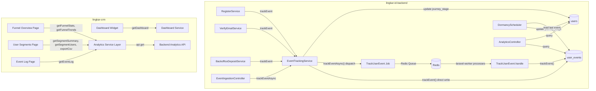
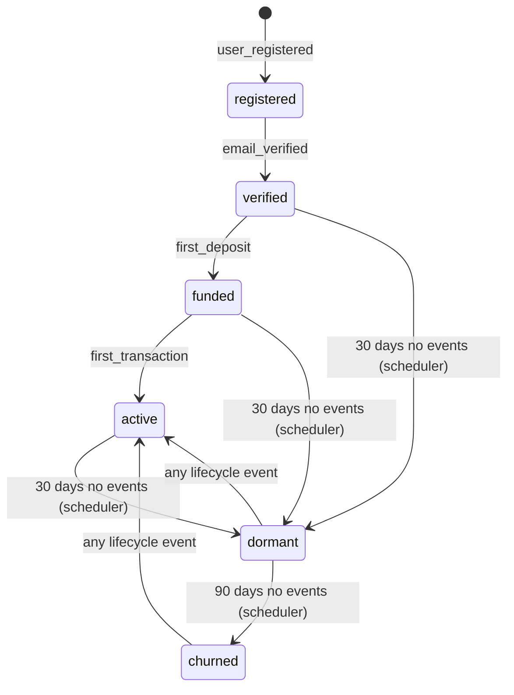
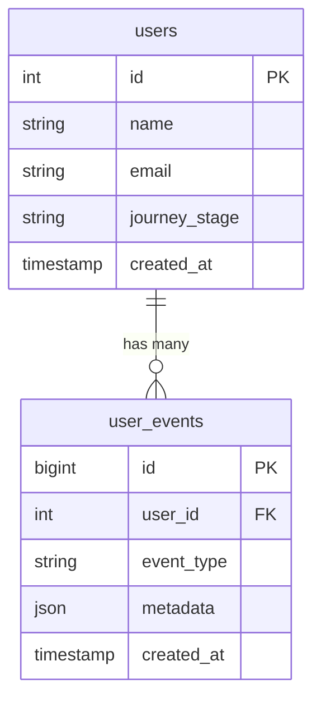

# Design Document: User Journey Funnel

## Overview

The User Journey Funnel system adds lifecycle analytics to the Lingkar ID platform. It tracks user events (registration, verification, deposit, transaction), manages a state-machine-driven journey stage on each user, and exposes backoffice API endpoints and CRM pages for funnel visualization, user segmentation, and event log browsing.

The system spans two workspaces:

- **lingkar-id-backend** (Laravel 12): `UserEvent` model, `EventTrackingService` with journey stage machine, `DormancyScheduler` command, analytics API endpoints (funnel stats, trends, segments, event log), and an event ingestion endpoint for future mobile use.
- **lingkar-crm** (Next.js 16): Three new analytics pages (Funnel Overview, User Segments, Event Log), a dashboard widget, sidebar navigation group, and a typed service layer.

### Design Decisions

1. **Denormalized `journey_stage` on `users` table** — Avoids expensive event aggregation queries for segmentation. The stage is updated synchronously when events are tracked, keeping it always consistent.
2. **Service-layer event tracking with dual approach** — `EventTrackingService` provides two methods: `trackEvent()` for synchronous direct writes (lifecycle events that must be transactional) and `trackEventAsync()` for queue-based writes via Redis (high-frequency mobile events). The async path dispatches a `TrackUserEvent` job to the Redis queue, processed by the existing `laravel-worker` container running `php artisan queue:work redis`.
3. **Explicit service integration over Laravel Events/Listeners** — `EventTrackingService` is called from existing services (RegisterService, VerifyEmailService, BackofficeDepositService) directly. This keeps the integration explicit and within the same transaction where applicable.
4. **Forward-only stage machine with dormancy re-activation** — The lifecycle stages progress forward (registered → verified → funded → active). Dormancy/churn are set by a scheduler. Any new event on a dormant/churned user re-activates them.
5. **Period-based funnel calculation** — Funnel stats are calculated based on when users entered each stage (via `user_events.created_at`), not just current counts. This enables meaningful period comparisons.
6. **Recharts for funnel visualization** — Reuses the existing `ChartCard`, `BarChartComponent`, and line chart patterns with `CHART_COLORS`/`CHART_SETS` from the design system.

---

## Architecture

### System Context



### Journey Stage State Machine



### Backend Architecture

All new backend code follows the existing service layer pattern:

- **Model**: `UserEvent` with scopes, constants, and relationships
- **Service**: `EventTrackingService` (dual approach: `trackEvent()` synchronous direct write + `trackEventAsync()` queue-based via Redis), `AnalyticsService` (funnel stats, trends, segments, event log queries)
- **Job**: `TrackUserEvent` (ShouldQueue, Redis connection, called by `trackEventAsync()`, processed by existing `laravel-worker` container)
- **Controllers**: `AnalyticsController` (backoffice funnel/segments/events), `EventIngestionController` (authenticated mobile endpoint, uses `trackEventAsync()`)
- **Command**: `ProcessDormantUsers` (daily scheduled artisan command)
- **FormRequests**: `TrackEventRequest`, `FunnelStatsRequest`, `SegmentUsersRequest`, `EventLogRequest`

### Frontend Architecture

All new frontend code follows the existing patterns:

- **Service layer**: `src/services/backoffice/analytics/` with typed interfaces and service functions
- **Pages**: Three new pages under `src/app/(dashboard)/dashboard/analytics/`
- **Hooks**: Reuses `useTableData` for paginated lists, `useDetailData` for funnel stats
- **Charts**: Reuses `ChartCard`, `BarChartComponent`, and Recharts `LineChart` with `CHART_COLORS`
- **Navigation**: New "Analytics" accordion group in sidebar

---

## Components and Interfaces

### Backend Components

#### 1. UserEvent Model (`app/Models/UserEvent.php`)

```php
class UserEvent extends Model
{
    public $timestamps = false; // Only created_at, no updated_at

    const TYPE_USER_REGISTERED = 'user_registered';
    const TYPE_EMAIL_VERIFIED = 'email_verified';
    const TYPE_FIRST_DEPOSIT = 'first_deposit';
    const TYPE_FIRST_TRANSACTION = 'first_transaction';
    const TYPE_APP_OPENED = 'app_opened';
    const TYPE_BANNER_CLICKED = 'banner_clicked';
    const TYPE_SERVICE_VIEWED = 'service_viewed';

    const ALLOWED_EVENT_TYPES = [
        self::TYPE_USER_REGISTERED,
        self::TYPE_EMAIL_VERIFIED,
        self::TYPE_FIRST_DEPOSIT,
        self::TYPE_FIRST_TRANSACTION,
        self::TYPE_APP_OPENED,
        self::TYPE_BANNER_CLICKED,
        self::TYPE_SERVICE_VIEWED,
    ];

    protected $fillable = ['user_id', 'event_type', 'metadata'];
    protected $casts = ['metadata' => 'array', 'created_at' => 'datetime'];

    // Relationships
    public function user(): BelongsTo;

    // Scopes
    public function scopeOfType($query, string $eventType);
    public function scopeForUser($query, int $userId);
    public function scopeInDateRange($query, ?string $from, ?string $to);
}
```

#### 2. EventTrackingService (`app/Services/Analytics/EventTrackingService.php`)

```php
class EventTrackingService
{
    // Stage progression order (forward-only for lifecycle events)
    const STAGE_ORDER = ['registered', 'verified', 'funded', 'active'];

    // Maps event types to their target journey stage
    const EVENT_STAGE_MAP = [
        'user_registered' => 'registered',
        'email_verified' => 'verified',
        'first_deposit' => 'funded',
        'first_transaction' => 'active',
    ];

    // Synchronous direct write — for lifecycle events (transactional)
    public function trackEvent(int $userId, string $eventType, ?array $metadata = null): UserEvent;

    // Queue-based write — dispatches TrackUserEvent job to Redis queue (high-frequency mobile events)
    public function trackEventAsync(int $userId, string $eventType, ?array $metadata = null): void;

    private function evaluateStageTransition(User $user, string $eventType): void;
    private function shouldAdvanceStage(string $currentStage, string $targetStage): bool;
}
```

#### 3. TrackUserEvent Job (`app/Jobs/TrackUserEvent.php`)

```php
class TrackUserEvent implements ShouldQueue
{
    use Queueable;

    public $connection = 'redis'; // Explicitly use Redis queue connection

    public function __construct(
        public int $userId,
        public string $eventType,
        public ?array $metadata = null,
    ) {}

    public function handle(EventTrackingService $service): void
    {
        $service->trackEvent($this->userId, $this->eventType, $this->metadata);
    }
}
```

#### 4. AnalyticsService (`app/Services/Backoffice/AnalyticsService.php`)

```php
class AnalyticsService
{
    use ApiPaginationTrait;

    public function getFunnelStats(?string $period, ?string $dateFrom, ?string $dateTo): array;
    public function getFunnelTrends(?string $period, ?string $dateFrom, ?string $dateTo, string $granularity = 'daily'): array;
    public function getSegmentSummary(): array;
    public function getSegmentUsers(string $stage, array $filters): LengthAwarePaginator;
    public function exportSegmentCsv(string $stage, array $filters): StreamedResponse;
    public function getEventLog(array $filters): LengthAwarePaginator;
}
```

#### 5. AnalyticsController (`app/Http/Controllers/Api/v1/Backoffice/AnalyticsController.php`)

```php
class AnalyticsController extends Controller
{
    // GET /backoffice/analytics/funnel
    public function funnel(FunnelStatsRequest $request): JsonResponse;

    // GET /backoffice/analytics/funnel/trends
    public function funnelTrends(FunnelStatsRequest $request): JsonResponse;

    // GET /backoffice/analytics/segments
    public function segments(): JsonResponse;

    // GET /backoffice/analytics/segments/{stage}
    public function segmentUsers(SegmentUsersRequest $request, string $stage): JsonResponse;

    // GET /backoffice/analytics/segments/export
    public function exportSegments(SegmentUsersRequest $request): StreamedResponse;

    // GET /backoffice/analytics/events
    public function events(EventLogRequest $request): JsonResponse;
}
```

#### 6. EventIngestionController (`app/Http/Controllers/Api/v1/EventIngestionController.php`)

```php
class EventIngestionController extends Controller
{
    // POST /events/track — uses trackEventAsync() for queue-based write
    public function track(TrackEventRequest $request): JsonResponse;
}
```

#### 7. ProcessDormantUsers Command (`app/Console/Commands/ProcessDormantUsers.php`)

```php
class ProcessDormantUsers extends Command
{
    protected $signature = 'users:process-dormant';
    protected $description = 'Transition inactive users to dormant/churned stages';

    public function handle(): int;
}
```

### Frontend Components

#### 1. Analytics Service Layer (`src/services/backoffice/analytics/`)

```typescript
// analytics.types.ts
interface IFunnelStats {
  stages: IStageCount[];
  conversions: IConversionRate[];
  average_time: IStageTime[];
}

interface IStageCount {
  stage: string;
  count: number;
}

interface IConversionRate {
  from_stage: string;
  to_stage: string;
  rate: number; // percentage 0-100
}

interface IStageTime {
  stage: string;
  average_hours: number;
}

interface IFunnelTrends {
  labels: string[]; // date labels
  series: IFunnelTrendSeries[];
}

interface IFunnelTrendSeries {
  stage: string;
  data: number[];
}

interface IFunnelParams {
  period?: "7d" | "30d" | "90d" | "custom";
  date_from?: string;
  date_to?: string;
}

interface ISegmentSummary {
  stages: IStageCount[];
  total: number;
}

interface ISegmentUser {
  id: number;
  name: string;
  email: string;
  phone: string | null;
  journey_stage: string;
  created_at: string;
  last_event_at: string | null;
}

interface ISegmentUsersParams extends IPaginationParams {
  stage: string;
  registration_date_from?: string;
  registration_date_to?: string;
  last_active_from?: string;
  last_active_to?: string;
}

interface IUserEvent {
  id: number;
  user: { id: number; name: string; email: string };
  event_type: string;
  metadata: Record<string, unknown> | null;
  created_at: string;
}

interface IEventLogParams extends IPaginationParams {
  event_type?: string;
  user_id?: number;
  date_from?: string;
  date_to?: string;
}

// analytics.service.ts
const analyticsService = {
  getFunnelStats: (params: IFunnelParams) =>
    api.get<IApiResponse<IFunnelStats>>("/backoffice/analytics/funnel", {
      params,
    }),
  getFunnelTrends: (params: IFunnelParams) =>
    api.get<IApiResponse<IFunnelTrends>>(
      "/backoffice/analytics/funnel/trends",
      { params }
    ),
  getSegmentSummary: () =>
    api.get<IApiResponse<ISegmentSummary>>("/backoffice/analytics/segments"),
  getSegmentUsers: (stage: string, params: ISegmentUsersParams) =>
    api.get<IApiListResponse<ISegmentUser>>(
      `/backoffice/analytics/segments/${stage}`,
      { params }
    ),
  exportSegmentCsv: (params: ISegmentUsersParams) =>
    api.get<Blob>("/backoffice/analytics/segments/export", {
      params,
      responseType: "blob",
    }),
  getEventLog: (params: IEventLogParams) =>
    api.get<IApiListResponse<IUserEvent>>("/backoffice/analytics/events", {
      params,
    }),
};
```

#### 2. Funnel Overview Page (`src/app/(dashboard)/dashboard/analytics/funnel/page.tsx`)

- Period filter controls (7d, 30d, 90d, custom date range) synced to URL
- Funnel bar chart (Registration → Verified → Funded → Active) with conversion rate labels
- Trend line chart showing stage counts over time
- Average time per stage display
- Uses `useDetailData` for funnel stats, separate fetch for trends

#### 3. User Segments Page (`src/app/(dashboard)/dashboard/analytics/segments/page.tsx`)

- Summary cards showing count per stage (clickable)
- Paginated user table via `useTableData` when a stage is selected
- Filter controls: registration date range, last active date range
- CSV export button
- URL-synced: stage, pagination, filters

#### 4. Event Log Page (`src/app/(dashboard)/dashboard/analytics/events/page.tsx`)

- Paginated table via `useTableData`
- SearchInput for user name/email
- Filter controls: event type dropdown, date range
- Columns: User, Event Type (badge), Timestamp, Metadata (truncated JSON)
- URL-synced: search, filters, pagination

---

## Data Models

### New Table: `user_events`

| Column       | Type          | Constraints                             |
| ------------ | ------------- | --------------------------------------- |
| `id`         | bigIncrements | Primary key                             |
| `user_id`    | foreignId     | Constrained to `users`, cascadeOnDelete |
| `event_type` | string        | Indexed                                 |
| `metadata`   | json          | Nullable                                |
| `created_at` | timestamp     | Indexed, default `now()`                |

Indexes: `user_events_event_type_index`, `user_events_created_at_index`, composite `(user_id, event_type)` for first-event lookups.

### Modified Table: `users`

| Column          | Type   | Constraints                               |
| --------------- | ------ | ----------------------------------------- |
| `journey_stage` | string | Nullable, default `'registered'`, indexed |

Valid values: `registered`, `verified`, `funded`, `active`, `dormant`, `churned`.

### Entity Relationships



### API Endpoints Summary

| Method | Endpoint                                        | Auth                    | Description                     |
| ------ | ----------------------------------------------- | ----------------------- | ------------------------------- |
| POST   | `/api/v1/events/track`                          | `auth:sanctum`          | Mobile event ingestion          |
| GET    | `/api/v1/backoffice/analytics/funnel`           | `role:admin,backoffice` | Funnel stats with period filter |
| GET    | `/api/v1/backoffice/analytics/funnel/trends`    | `role:admin,backoffice` | Funnel trends over time         |
| GET    | `/api/v1/backoffice/analytics/segments`         | `role:admin,backoffice` | User counts per stage           |
| GET    | `/api/v1/backoffice/analytics/segments/{stage}` | `role:admin,backoffice` | Paginated users in stage        |
| GET    | `/api/v1/backoffice/analytics/segments/export`  | `role:admin,backoffice` | CSV export of segment users     |
| GET    | `/api/v1/backoffice/analytics/events`           | `role:admin,backoffice` | Paginated event log             |

## Correctness Properties

_A property is a characteristic or behavior that should hold true across all valid executions of a system — essentially, a formal statement about what the system should do. Properties serve as the bridge between human-readable specifications and machine-verifiable correctness guarantees._

### Property 1: Event tracking creates a record with correct fields

_For any_ valid user, event type, and optional metadata, calling `EventTrackingService.trackEvent()` SHALL create a `UserEvent` record where `user_id`, `event_type`, and `metadata` match the input arguments and `created_at` is set.

**Validates: Requirements 3.1**

### Property 2: Forward-only stage progression

_For any_ user at any journey stage and _for any_ lifecycle event that maps to an earlier or equal stage, tracking that event SHALL NOT change the user's `journey_stage`. The stage ordering is: registered < verified < funded < active. Only events mapping to a strictly later stage advance the user.

**Validates: Requirements 3.6**

### Property 3: Dormant/churned user re-activation

_For any_ user in "dormant" or "churned" stage and _for any_ lifecycle event (user_registered, email_verified, first_deposit, first_transaction), tracking that event SHALL transition the user's `journey_stage` to "active".

**Validates: Requirements 3.7**

### Property 4: First-deposit conditional tracking

_For any_ user whose deposit is approved via BackofficeDepositService, a `first_deposit` UserEvent SHALL be created if and only if the user has no prior `first_deposit` event. Users with an existing `first_deposit` event SHALL NOT receive a duplicate.

**Validates: Requirements 4.4, 16.3**

### Property 5: Dormancy scheduler inactivity transitions

_For any_ user with role Client or Mitra: if the user is in "active", "funded", or "verified" stage and has no `UserEvent` records in the last 30 days, the dormancy scheduler SHALL transition them to "dormant". If the user is in "dormant" stage and has no `UserEvent` records in the last 90 days from their most recent event, the scheduler SHALL transition them to "churned".

**Validates: Requirements 5.2, 5.3**

### Property 6: Dormancy scheduler role filtering

_For any_ user with role Admin, Backoffice, or Sales, the dormancy scheduler SHALL NOT modify their `journey_stage`, regardless of inactivity duration.

**Validates: Requirements 5.4**

### Property 7: Event ingestion creates event for authenticated user

_For any_ authenticated user and _for any_ valid event payload (event_type in allowed list, metadata as optional JSON), the POST `/events/track` endpoint SHALL create a `UserEvent` record with `user_id` equal to the authenticated user's ID and fields matching the payload.

**Validates: Requirements 6.1, 6.3**

### Property 8: Event ingestion validation rejects invalid input

_For any_ string that is empty, exceeds 50 characters, or is not in the allowed event types list, the POST `/events/track` endpoint SHALL return a 422 validation error and NOT create a `UserEvent` record.

**Validates: Requirements 6.4, 6.6**

### Property 9: Funnel stats accuracy and conversion rate calculation

_For any_ distribution of users across journey stages, the GET `/backoffice/analytics/funnel` endpoint SHALL return stage counts matching the actual count of users per stage, and each conversion rate SHALL equal `(next_stage_count / current_stage_count) * 100` for consecutive stages.

**Validates: Requirements 7.1, 7.3**

### Property 10: Funnel period filtering

_For any_ period filter (7d, 30d, 90d, or custom date range), the funnel stats SHALL only count users whose stage-entry events (`UserEvent` records) fall within the specified period. Users with no events in the period SHALL NOT be counted.

**Validates: Requirements 7.2**

### Property 11: Segment users filtered by stage and date ranges

_For any_ valid stage value and _for any_ combination of date range filters (registration_date_from/to, last_active_from/to), the GET `/backoffice/analytics/segments/{stage}` endpoint SHALL return only users whose `journey_stage` matches the specified stage AND whose `created_at` and last event timestamp fall within the specified date ranges.

**Validates: Requirements 8.2, 8.3**

### Property 12: CSV export matches filtered segment list

_For any_ stage and filter combination, the CSV export from GET `/backoffice/analytics/segments/export` SHALL contain exactly the same set of users (by ID) as the paginated segment users endpoint with the same filters applied.

**Validates: Requirements 8.4**

### Property 13: Invalid stage validation

_For any_ string that is not one of the valid stage values (registered, verified, funded, active, dormant, churned), the segments/{stage} endpoint SHALL return a 422 validation error.

**Validates: Requirements 8.6**

### Property 14: Event log ordering and filters

_For any_ set of user events and _for any_ combination of filters (event_type, user_id, date_from, date_to), the GET `/backoffice/analytics/events` endpoint SHALL return only events matching ALL applied filters, ordered by `created_at` descending.

**Validates: Requirements 9.1, 9.2, 9.3, 9.4**

### Property 15: Event log search filter

_For any_ search string, the event log endpoint SHALL return only events where the associated user's name or email contains the search string (case-insensitive). Events for users whose name and email do not contain the search string SHALL NOT appear in results.

**Validates: Requirements 9.5**

### Property 16: Dashboard journey summary accuracy

_For any_ distribution of users across journey stages, the dashboard endpoint SHALL include a journey summary where the count per stage matches the actual count and the overall conversion rate equals `(active_count / registered_count) * 100`.

**Validates: Requirements 11.3**

---

## Error Handling

### Backend Error Handling

| Scenario                                 | HTTP Status | Error Message                       | Handler                                                                 |
| ---------------------------------------- | ----------- | ----------------------------------- | ----------------------------------------------------------------------- |
| Invalid event_type on ingestion          | 422         | Validation error with field details | `TrackEventRequest` FormRequest                                         |
| Unauthenticated request to ingestion     | 401         | "Unauthenticated"                   | `auth:sanctum` middleware                                               |
| Non-admin/backoffice accessing analytics | 403         | "Forbidden"                         | `role:admin,backoffice` middleware                                      |
| Invalid stage value in segments/{stage}  | 422         | Validation error                    | `SegmentUsersRequest` FormRequest                                       |
| Invalid period format in funnel params   | 422         | Validation error                    | `FunnelStatsRequest` FormRequest                                        |
| User not found for user_id filter        | 200         | Empty results (no error)            | `AnalyticsService` returns empty paginator                              |
| Database error during event tracking     | 500         | "Internal server error"             | Try-catch in `EventTrackingService`, logged via Laravel                 |
| Dormancy scheduler failure               | Logged      | Command logs error count            | `ProcessDormantUsers` catches exceptions per-user, continues processing |

### Frontend Error Handling

| Scenario                                   | Handling                                               |
| ------------------------------------------ | ------------------------------------------------------ |
| Analytics API returns error                | `FormCardError` component with error message and retry |
| Network timeout on funnel stats            | Loading state → error state with retry button          |
| CSV export fails                           | Toast notification via `useNotificationStore`          |
| Invalid URL params (e.g., bad date format) | Fallback to defaults, no crash                         |

### Dormancy Scheduler Resilience

The scheduler processes users in batches and catches exceptions per-user to prevent one failure from stopping the entire run. Each run logs:

- Total users evaluated
- Users transitioned to dormant
- Users transitioned to churned
- Any errors encountered

---

## Testing Strategy

### Backend Testing

**Property-Based Tests** (PHPUnit with randomized data generation):

The backend is suitable for property-based testing because the core logic involves:

- Pure data transformations (stage machine transitions)
- Universal invariants (forward-only progression, role filtering)
- Query filtering (scopes, API filters) where behavior varies meaningfully with input

**Library**: PHPUnit with custom data generators (following the existing pattern in `BackofficeDepositRequestTest.php` and `BackofficeBannerTest.php`).

**Configuration**: Minimum 100 iterations per property test. Each test tagged with:

```
Feature: user-journey-funnel, Property {number}: {property_text}
```

**Property tests to implement** (16 properties from the Correctness Properties section):

1. Event tracking creates record — generate random events, verify record creation
2. Forward-only stage progression — generate random stage/event combinations, verify no regression
3. Dormant/churned re-activation — generate dormant/churned users, track events, verify active
4. First-deposit conditional — generate users with/without prior deposits, verify conditional creation
5. Dormancy scheduler transitions — generate users with varied inactivity, verify correct transitions
6. Dormancy scheduler role filtering — generate mixed-role users, verify only Client/Mitra affected
7. Event ingestion authenticated — generate random payloads, verify event creation with auth user ID
8. Event ingestion validation — generate invalid payloads, verify 422 rejection
9. Funnel stats accuracy — generate random user distributions, verify counts and conversion rates
10. Funnel period filtering — generate events at varied timestamps, verify period-based counts
11. Segment users filtering — generate users with varied stages/dates, verify filter correctness
12. CSV export consistency — generate filtered data, verify CSV matches API results
13. Invalid stage validation — generate random invalid strings, verify 422
14. Event log ordering and filters — generate events, verify ordering and filter correctness
15. Event log search — generate events with random user data, verify search matching
16. Dashboard journey summary — generate random user distributions, verify summary accuracy

**Unit Tests** (specific examples and edge cases):

- Stage machine: specific transition sequences (registered → verified → funded → active)
- Dormancy: boundary cases (exactly 30 days, exactly 90 days)
- Event ingestion: unauthenticated request returns 401
- Analytics: empty database returns zero counts
- CSV export: correct headers and field formatting

**Integration Tests**:

- Auto-tracking: registration triggers user_registered event
- Auto-tracking: email verification triggers email_verified event
- Auto-tracking: deposit approval triggers first_deposit event (conditional)
- Scheduler: artisan command runs without errors
- Full funnel flow: register → verify → deposit → transaction → check stage progression

### Frontend Testing

**Unit Tests** (Vitest):

- Service layer: verify correct API URLs and parameter passing
- Type safety: TypeScript compilation (`npx tsc --noEmit`)

**Component Tests** (if applicable):

- Funnel chart renders with mock data
- Segment cards display correct counts
- Event log table renders columns correctly
- Period filter updates URL params
- CSV export triggers download

**Manual Testing**:

- Navigate through all three analytics pages
- Verify URL sync (pagination, filters, period)
- Verify chart rendering with `CHART_COLORS`
- Verify CSV download works
- Verify dashboard widget shows journey summary
