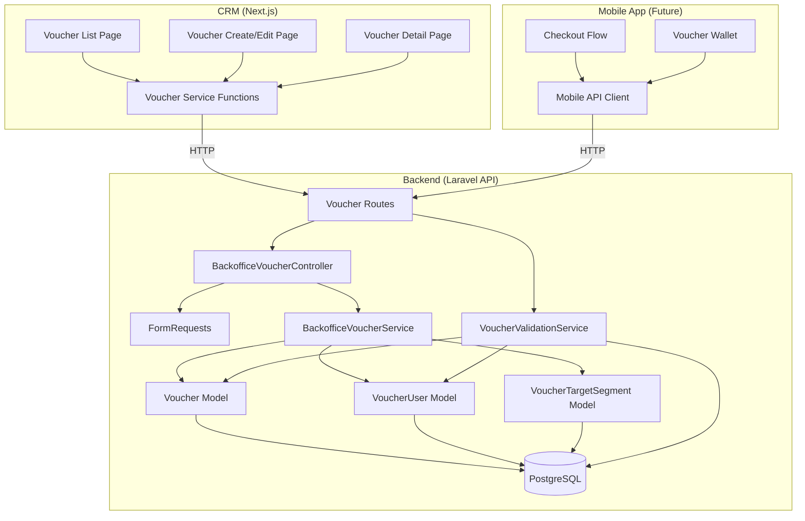
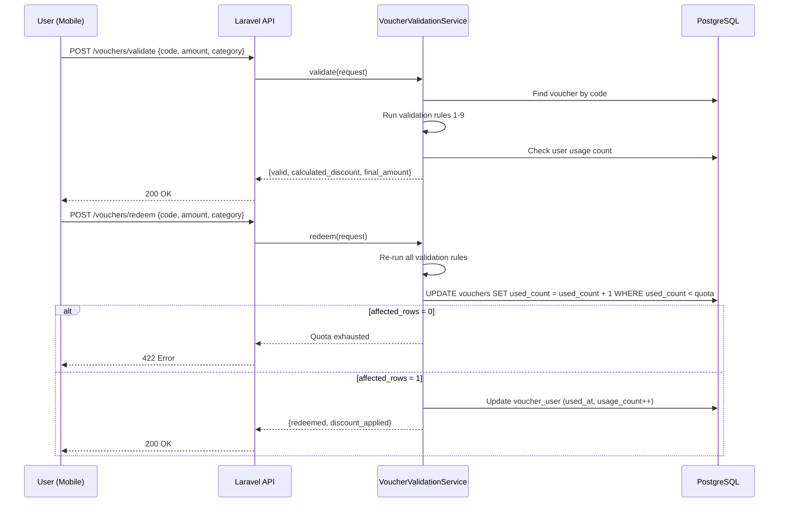
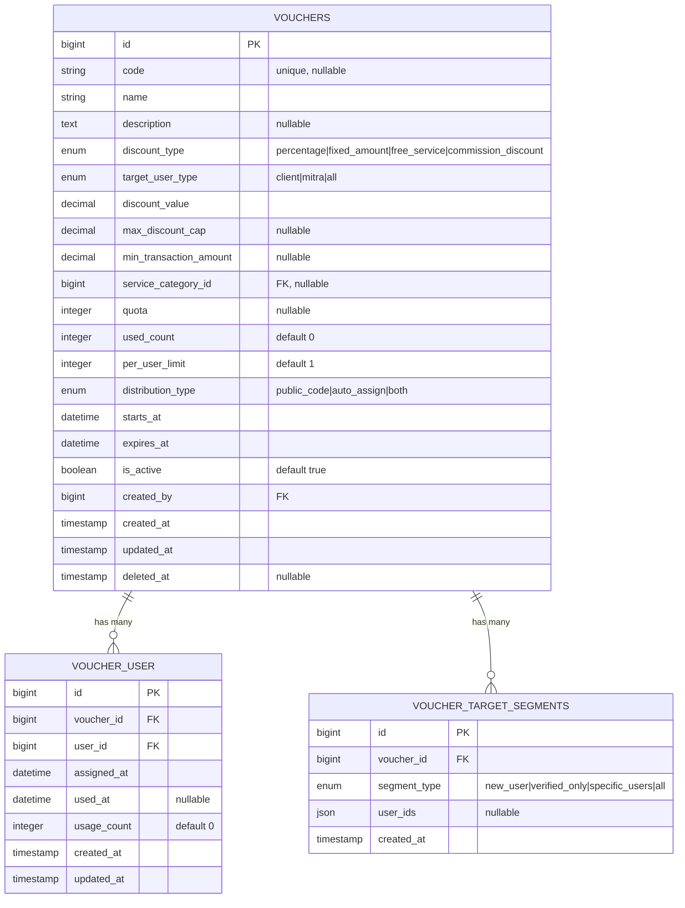

# Design Document — Voucher Management

## Overview

Voucher Management adalah fitur fullstack yang menyediakan sistem voucher fleksibel untuk marketplace layanan Lingkar. Fitur ini mencakup:

- **Backend (Laravel API)**: CRUD endpoints untuk backoffice, validation & redemption endpoints untuk mobile app, atomic quota handling.
- **CRM (Next.js)**: Halaman list voucher dengan search/filter/status badges, form create/edit dengan conditional fields berdasarkan discount type, detail page dengan usage stats dan assigned users.
- **Mobile App**: Deferred — API endpoints dibangun sekarang, dikonsumsi nanti.

Sistem mendukung empat tipe diskon:

1. **Percentage** — Diskon persentase dengan max cap (Rp).
2. **Fixed Amount** — Diskon nominal tetap (Rp).
3. **Free Service** — Gratis 1x layanan pada kategori tertentu.
4. **Commission Discount** — Pengurangan fee platform untuk mitra.

### Design Decisions

| Decision                                            | Rationale                                                                                                          |
| --------------------------------------------------- | ------------------------------------------------------------------------------------------------------------------ |
| Single `vouchers` table dengan `discount_type` enum | Semua tipe diskon berbagi mayoritas kolom, type-specific fields nullable. Lebih sederhana dari polymorphic tables. |
| `voucher_user` pivot table untuk assignment & usage | Tracking per-user usage terpisah dari global quota. Mendukung wallet dan usage history.                            |
| `voucher_target_segments` table terpisah            | Segment criteria bisa multiple per voucher, lebih fleksibel dari JSON column.                                      |
| Atomic DB increment untuk quota                     | Mencegah race condition tanpa distributed lock. Simple dan reliable.                                               |
| Soft delete untuk voucher                           | Users yang sudah memiliki voucher di wallet melihat "Tidak berlaku lagi" alih-alih voucher hilang.                 |
| Re-validate pada redeem                             | Voucher bisa di-deactivate atau expire antara validate dan redeem. Safety net.                                     |
| Sidebar rename "Content" → "Marketing"              | Banners dan Vouchers keduanya marketing tools. Grouping yang lebih logis.                                          |
| Conditional form fields di CRM                      | Mengurangi cognitive load — user hanya melihat field yang relevan untuk discount type yang dipilih.                |

## Architecture

### System Architecture



### Data Flow — Voucher Redemption



## Components and Interfaces

### Backend Components

#### 1. BackofficeVoucherController

Thin controller: validate via FormRequest → call BackofficeVoucherService → return ApiResponse.

**Endpoints:**

| Method | Path                                             | Description                          |
| ------ | ------------------------------------------------ | ------------------------------------ |
| GET    | `/api/v1/backoffice/vouchers`                    | Paginated list with filters & search |
| POST   | `/api/v1/backoffice/vouchers`                    | Create voucher                       |
| GET    | `/api/v1/backoffice/vouchers/{id}`               | Detail with usage stats              |
| PUT    | `/api/v1/backoffice/vouchers/{id}`               | Update voucher                       |
| DELETE | `/api/v1/backoffice/vouchers/{id}`               | Soft delete                          |
| PATCH  | `/api/v1/backoffice/vouchers/{id}/toggle-active` | Activate/deactivate                  |
| POST   | `/api/v1/backoffice/vouchers/{id}/assign`        | Assign to specific users             |

#### 2. VoucherController (Public/Mobile)

**Endpoints:**

| Method | Path                           | Description                         |
| ------ | ------------------------------ | ----------------------------------- |
| POST   | `/api/v1/vouchers/validate`    | Check eligibility without redeeming |
| POST   | `/api/v1/vouchers/redeem`      | Use the voucher                     |
| GET    | `/api/v1/vouchers/my-vouchers` | User's assigned vouchers (wallet)   |

#### 3. BackofficeVoucherService

```php
class BackofficeVoucherService
{
    use ApiPaginationTrait;

    public function getAllVouchers(): LengthAwarePaginator;
    public function getVoucherById(int $id): Voucher;
    public function createVoucher(array $data): Voucher;
    public function updateVoucher(Voucher $voucher, array $data): Voucher;
    public function deleteVoucher(Voucher $voucher): void;
    public function toggleActive(Voucher $voucher): Voucher;
    public function assignToUsers(Voucher $voucher, array $userIds): void;
}
```

#### 4. VoucherValidationService

```php
class VoucherValidationService
{
    public function validate(array $data, User $user): array;
    public function redeem(array $data, User $user): array;
    public function getUserVouchers(User $user): Collection;

    // Private validation chain
    private function runValidationRules(Voucher $voucher, array $data, User $user): void;
    private function calculateDiscount(Voucher $voucher, float $transactionAmount): float;
    private function atomicIncrementQuota(Voucher $voucher): bool;
}
```

#### 5. FormRequests

- **StoreVoucherRequest**: Full validation with type-specific conditional rules.
- **UpdateVoucherRequest**: Same as store but with edit restriction checks (discount_type/code immutable if used).
- **AssignVoucherRequest**: Validates user_ids array.
- **ValidateVoucherRequest**: Validates code, transaction_amount, service_category_id.
- **RedeemVoucherRequest**: Same as validate request.

### CRM Components

#### 1. Voucher Service (`src/services/backoffice/vouchers/`)

```typescript
// vouchers.types.ts
export type DiscountType =
  | "percentage"
  | "fixed_amount"
  | "free_service"
  | "commission_discount";
export type TargetUserType = "client" | "mitra" | "all";
export type DistributionType = "public_code" | "auto_assign" | "both";
export type SegmentType =
  | "new_user"
  | "verified_only"
  | "specific_users"
  | "all";

export interface IVoucher {
  id: number;
  code: string | null;
  name: string;
  description: string | null;
  discount_type: DiscountType;
  target_user_type: TargetUserType;
  discount_value: number;
  max_discount_cap: number | null;
  min_transaction_amount: number | null;
  service_category_id: number | null;
  quota: number | null;
  used_count: number;
  per_user_limit: number;
  distribution_type: DistributionType;
  starts_at: string;
  expires_at: string;
  is_active: boolean;
  created_by: number;
  created_at: string;
  updated_at: string;
}

export interface IVoucherUser {
  id: number;
  voucher_id: number;
  user_id: number;
  user_name: string;
  assigned_at: string;
  used_at: string | null;
  usage_count: number;
}

export interface IVoucherTargetSegment {
  id: number;
  voucher_id: number;
  segment_type: SegmentType;
  user_ids: number[] | null;
}

export interface IVoucherParams extends IPaginationParams {
  discount_type?: DiscountType;
  target_user_type?: TargetUserType;
  is_active?: string;
  date_from?: string;
  date_to?: string;
  search?: string;
}

// vouchers.service.ts
export const vouchersService = {
  list: (params: IVoucherParams) => api.get("/backoffice/vouchers", { params }),
  detail: (id: number) => api.get(`/backoffice/vouchers/${id}`),
  create: (data: object) => api.post("/backoffice/vouchers", data),
  update: (id: number, data: object) =>
    api.put(`/backoffice/vouchers/${id}`, data),
  delete: (id: number) => api.delete(`/backoffice/vouchers/${id}`),
  toggleActive: (id: number) =>
    api.patch(`/backoffice/vouchers/${id}/toggle-active`),
  assign: (id: number, payload: { user_ids: number[] }) =>
    api.post(`/backoffice/vouchers/${id}/assign`, payload),
};
```

#### 2. Voucher List Page (`/dashboard/vouchers/`)

Menggunakan `useTableData` hook:

- `TableCard` dengan kolom: Code, Name, Discount Type (badge), Target (badge), Status (badge), Quota (used/total), Period, Actions
- `SearchInput` untuk search by code atau name
- `FilterPopup` dengan `FilterChipGroup` untuk discount_type, target_user_type, status
- Status badge logic:
  - **Active** (success): `is_active && now between starts_at..expires_at`
  - **Inactive** (neutral): `!is_active`
  - **Expired** (error): `expires_at < now`
  - **Scheduled** (primary): `starts_at > now`
- Actions: view detail, edit, toggle active, delete (with `ConfirmDialog`)

#### 3. Voucher Create/Edit Page (`/dashboard/vouchers/create/` dan `/dashboard/vouchers/{id}/edit/`)

Form page dengan "Page + Inner Form" split pattern (React 19 compliance):

**Sections:**

1. **Basic Info**: name, code (conditional on distribution_type), description
2. **Discount Config**: discount_type selector → conditional fields (discount_value, max_discount_cap, service_category_id)
3. **Conditions & Limits**: starts_at, expires_at, quota, per_user_limit, min_transaction_amount
4. **Distribution**: distribution_type selector, code field visibility
5. **Target Segment**: target_user_type, segment_type, user picker (for specific_users)

**Conditional field visibility:**

| discount_type         | Shows                                   | Hides                                       |
| --------------------- | --------------------------------------- | ------------------------------------------- |
| `percentage`          | discount_value (%), max_discount_cap    | —                                           |
| `fixed_amount`        | discount_value (Rp)                     | max_discount_cap                            |
| `free_service`        | service_category_id (required)          | discount_value, max_discount_cap            |
| `commission_discount` | discount_value (%), forces target=mitra | max_discount_cap, target_user_type selector |

#### 4. Voucher Detail Page (`/dashboard/vouchers/{id}/`)

- `DetailCard` dengan semua voucher info (read-only)
- Usage stats summary: used_count / quota, redemption rate
- Assigned Users table: user name, assigned_at, status badge (used/unused), usage_count
- "Assign to User" button → modal with user picker

### Navigation

Sidebar restructure:

```
▼ Marketing (accordion) — renamed from "Content"
  ├── Banners
  └── Vouchers (new)
```

## Data Models

### Database Schema



### Migration — vouchers

```php
Schema::create('vouchers', function (Blueprint $table) {
    $table->id();
    $table->string('code')->unique()->nullable();
    $table->string('name');
    $table->text('description')->nullable();
    $table->enum('discount_type', ['percentage', 'fixed_amount', 'free_service', 'commission_discount']);
    $table->enum('target_user_type', ['client', 'mitra', 'all']);
    $table->decimal('discount_value', 12, 2);
    $table->decimal('max_discount_cap', 12, 2)->nullable();
    $table->decimal('min_transaction_amount', 12, 2)->nullable();
    $table->foreignId('service_category_id')->nullable()->constrained('service_categories');
    $table->integer('quota')->nullable();
    $table->integer('used_count')->default(0);
    $table->integer('per_user_limit')->default(1);
    $table->enum('distribution_type', ['public_code', 'auto_assign', 'both']);
    $table->dateTime('starts_at');
    $table->dateTime('expires_at');
    $table->boolean('is_active')->default(true);
    $table->foreignId('created_by')->constrained('users');
    $table->timestamps();
    $table->softDeletes();

    $table->index(['is_active', 'starts_at', 'expires_at']);
    $table->index(['discount_type']);
    $table->index(['target_user_type']);
});
```

### Migration — voucher_user

```php
Schema::create('voucher_user', function (Blueprint $table) {
    $table->id();
    $table->foreignId('voucher_id')->constrained('vouchers')->cascadeOnDelete();
    $table->foreignId('user_id')->constrained('users');
    $table->dateTime('assigned_at');
    $table->dateTime('used_at')->nullable();
    $table->integer('usage_count')->default(0);
    $table->timestamps();

    $table->unique(['voucher_id', 'user_id']);
});
```

### Migration — voucher_target_segments

```php
Schema::create('voucher_target_segments', function (Blueprint $table) {
    $table->id();
    $table->foreignId('voucher_id')->constrained('vouchers')->cascadeOnDelete();
    $table->enum('segment_type', ['new_user', 'verified_only', 'specific_users', 'all']);
    $table->json('user_ids')->nullable();
    $table->timestamp('created_at');
});
```

### Voucher Model

```php
class Voucher extends Model
{
    use SoftDeletes;

    protected $fillable = [
        'code', 'name', 'description', 'discount_type', 'target_user_type',
        'discount_value', 'max_discount_cap', 'min_transaction_amount',
        'service_category_id', 'quota', 'used_count', 'per_user_limit',
        'distribution_type', 'starts_at', 'expires_at', 'is_active', 'created_by',
    ];

    protected $casts = [
        'discount_value' => 'decimal:2',
        'max_discount_cap' => 'decimal:2',
        'min_transaction_amount' => 'decimal:2',
        'quota' => 'integer',
        'used_count' => 'integer',
        'per_user_limit' => 'integer',
        'is_active' => 'boolean',
        'starts_at' => 'datetime',
        'expires_at' => 'datetime',
    ];

    // Relations
    public function users() { return $this->hasMany(VoucherUser::class); }
    public function targetSegments() { return $this->hasMany(VoucherTargetSegment::class); }
    public function serviceCategory() { return $this->belongsTo(ServiceCategory::class); }
    public function creator() { return $this->belongsTo(User::class, 'created_by'); }

    // Scopes
    public function scopeActive($query) { return $query->where('is_active', true); }
    public function scopeSearch($query, ?string $search) {
        return $search ? $query->where(function ($q) use ($search) {
            $q->where('code', 'ilike', "%{$search}%")
              ->orWhere('name', 'ilike', "%{$search}%");
        }) : $query;
    }
}
```

### Atomic Quota Increment

```php
// VoucherValidationService::atomicIncrementQuota
$affected = DB::table('vouchers')
    ->where('id', $voucher->id)
    ->where(function ($query) use ($voucher) {
        $query->whereNull('quota')
              ->orWhereRaw('used_count < quota');
    })
    ->increment('used_count');

if ($affected === 0) {
    throw new VoucherQuotaExhaustedException();
}
```

## Correctness Properties

### Property 1: Voucher creation validation — type-specific constraints

_For any_ voucher creation request: if discount_type is "commission_discount", validation SHALL enforce target_user_type to be "mitra"; if discount_type is "free_service", validation SHALL require service_category_id; if discount_type is "percentage", validation SHALL require max_discount_cap and discount_value between 1-100; if distribution_type is "public_code" or "both", validation SHALL require a non-empty code.

**Validates: Requirements 2.3, 2.7, 2.8, 2.9, 2.10**

### Property 2: Voucher edit restrictions for used vouchers

_For any_ voucher with used_count > 0, update requests that attempt to change discount_type or code SHALL be rejected with a 422 error. Update requests that change other fields SHALL be accepted.

**Validates: Requirements 3.1, 3.2, 3.4**

### Property 3: Atomic quota prevents over-redemption

_For any_ voucher with a set quota, the used_count SHALL never exceed the quota value after any number of concurrent redemption attempts. If used_count equals quota, subsequent redemption attempts SHALL fail with a 422 error.

**Validates: Requirements 7.3, 7.4, 14.1, 14.2**

### Property 4: Validation rules are complete and ordered

_For any_ voucher redemption request, the VoucherValidationService SHALL execute all validation rules (active check, period check, user type match, segment match, quota check, per-user limit, min amount, category match, commission-mitra check) and reject the request if any rule fails, regardless of subsequent rule results.

**Validates: Requirements 6.3-6.11, 7.2**

### Property 5: Discount calculation correctness

_For any_ valid voucher and transaction amount: percentage discount SHALL equal min(transaction_amount × discount_value / 100, max_discount_cap); fixed_amount discount SHALL equal discount_value; the calculated discount SHALL never exceed the transaction amount.

**Validates: Requirements 7.6**

### Property 6: Soft-deleted vouchers excluded from all queries

_For any_ soft-deleted voucher, querying the backoffice list endpoint, detail endpoint, or mobile wallet endpoint SHALL NOT include that voucher in results.

**Validates: Requirements 1.6, 8.3**

### Property 7: Voucher code uniqueness (case-insensitive)

_For any_ two voucher creation requests with codes that differ only in letter casing, the second request SHALL be rejected with a 422 duplicate error.

**Validates: Requirements 2.1**

### Property 8: Date validation — starts_at before expires_at

_For any_ voucher creation or update request where starts_at is equal to or after expires_at, the request SHALL be rejected with a 422 error.

**Validates: Requirements 2.2**

### Property 9: Per-user limit enforcement

_For any_ user who has redeemed a voucher per_user_limit times, subsequent redemption attempts by that user SHALL be rejected, even if global quota is not exhausted.

**Validates: Requirements 6.8**

### Property 10: Voucher assignment duplicate prevention

_For any_ voucher already assigned to a user, a subsequent assignment request for the same voucher-user pair SHALL be rejected with a 422 error containing "User sudah memiliki voucher ini".

**Validates: Requirements 5.3**

### Property 11: Status badge derivation correctness

_For any_ voucher, the status badge SHALL be derived deterministically: if is_active is false → "Inactive"; if expires_at < now → "Expired"; if starts_at > now → "Scheduled"; otherwise → "Active". These conditions SHALL be evaluated in this priority order.

**Validates: Requirements 9.4**

### Property 12: JSON round-trip for voucher target segments

_For any_ valid voucher_target_segments data (segment_type + user_ids array), serializing to JSON and deserializing back SHALL produce an equivalent data structure.

**Validates: Requirements 14.4**

## Error Handling

### Backend Error Handling

All errors follow the existing `ApiResponse::error()` pattern:

| Scenario                           | HTTP Status | Message                                                           |
| ---------------------------------- | ----------- | ----------------------------------------------------------------- |
| Validation failure (FormRequest)   | 422         | Field-specific error messages                                     |
| Voucher not found                  | 404         | "Voucher tidak ditemukan."                                        |
| Duplicate code                     | 422         | "Kode voucher sudah digunakan."                                   |
| starts_at >= expires_at            | 422         | "Tanggal mulai harus sebelum tanggal berakhir."                   |
| Edit discount_type on used voucher | 422         | "Tipe diskon tidak dapat diubah karena voucher sudah digunakan."  |
| Edit code on used voucher          | 422         | "Kode voucher tidak dapat diubah karena voucher sudah digunakan." |
| Quota exhausted                    | 422         | "Kuota voucher sudah habis."                                      |
| Per-user limit reached             | 422         | "Anda sudah mencapai batas penggunaan voucher ini."               |
| Voucher inactive                   | 422         | "Voucher tidak aktif."                                            |
| Voucher expired                    | 422         | "Voucher sudah kadaluarsa."                                       |
| Voucher not started                | 422         | "Voucher belum berlaku."                                          |
| User type mismatch                 | 422         | "Voucher tidak berlaku untuk tipe pengguna Anda."                 |
| Min transaction not met            | 422         | "Minimum transaksi belum terpenuhi."                              |
| Category mismatch                  | 422         | "Voucher tidak berlaku untuk kategori layanan ini."               |
| Duplicate assignment               | 422         | "User sudah memiliki voucher ini."                                |

### CRM Error Handling

Following existing patterns:

- API errors caught in service functions, displayed via toast notification
- Form validation errors displayed inline per field
- Network errors show global error notification
- Delete confirmation via `useConfirmStore`

## Testing Strategy

### Backend Testing

**Property-Based Tests (PHPUnit with data providers or Eris):**

- Property 1: Type-specific validation constraints
- Property 2: Edit restrictions for used vouchers
- Property 3: Atomic quota (concurrent simulation)
- Property 4: Validation rule completeness
- Property 5: Discount calculation
- Property 7: Code uniqueness (case-insensitive)
- Property 8: Date validation
- Property 9: Per-user limit
- Property 10: Assignment duplicate prevention
- Property 12: JSON round-trip for target segments

**Integration Tests:**

- Full CRUD endpoint tests
- Validation endpoint with various scenarios
- Redemption endpoint with quota handling
- User wallet endpoint
- Filter and search combinations

### CRM Testing

**Unit Tests (Vitest):**

- Voucher service functions (mock API responses)
- Status badge derivation logic (Property 11)
- Conditional form field visibility

**Component Tests:**

- Voucher list page renders with mock data
- Filter and search functionality
- Create form conditional rendering
- Edit form with restrictions
- Detail page with usage stats

### Test File Locations

**Backend:**

- `tests/Feature/Backoffice/BackofficeVoucherTest.php` — Integration + property tests
- `tests/Feature/Voucher/VoucherValidationTest.php` — Validation & redemption tests

**CRM:**

- `src/services/backoffice/vouchers/__tests__/` — Service tests
- `src/app/(dashboard)/dashboard/vouchers/__tests__/` — Page/component tests
